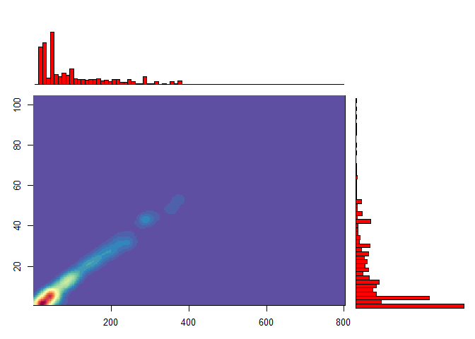
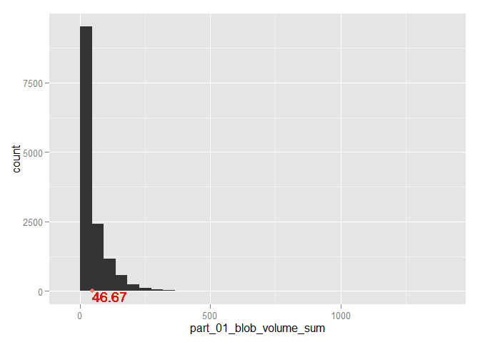

# Projekt1
Jerzy Jankowski  
29 listopada 2015  
<h2>Spis treści</h2>
<ol>
<li value="0"><a href="#zad0">Podsumowanie</a></li>
<li><a href="#zad1">Kod wyliczający wykorzystane biblioteki;</a></li>
<li><a href="#zad2">Kod zapewniający powtarzalność wyników przy każdym uruchomieniu raportu na tych samych danych;</a></li>
<li><a href="#zad3">Kod pozwalający wczytać dane z pliku;</a></li>
<li><a href="#zad4">Kod usuwający z danych wiersze posiadające wartość zmiennej res_name równą: “DA”,“DC”,“DT”, “DU”, “DG”, “DI”,“UNK”, “UNX”, “UNL”, “PR”, “PD”, “Y1”, “EU”, “N”, “15P”, “UQ”, “PX4” lub “NAN”;</a></li>
<li><a href="#zad5">Kod pozostawiający tylko unikatowe pary wartości (pdb_code, res_name)</a></li>
<li><a href="#zad6">Krótkie podsumowanie wartości w każdej kolumnie;</a></li>
<li>
<a href="#zad7">Sekcje sprawdzającą korelacje między zmiennymi; sekcja ta powinna zawierać jakąś formę graficznej prezentacji korelacji;</a>
<ul>
<li><a href="#zad7_1">Podejście 1 - atrybuty nie rozpoczynające się na "part_"</a></li>
<li><a href="#zad7_2">Podejście 2 - atrybuty rozpoczynające się na "part_00_"</a></li>
<li><a href="#zad7_3">Podejście 3 - porównanie atrybutów z dwóch poprzednich podejść</a></li>
<li><a href="#zad7_4">Podejście 4 - porównanie atrybutów rozpoczynających się na "part_00_" i "part_01_"</a></li>
</ul>
</li>
<li><a href="#zad8">Określenie ile przykładów ma każda z klas (res_name);</a></li>
<li><a href="#zad9">Wykresy rozkładów liczby atomów (local_res_atom_non_h_count) i elektronów (local_res_atom_non_h_electron_sum);</a></li>
<li><a href="#zad10">Próbę odtworzenia następującego wykresu (oś X - liczba elektronów, oś y - liczba atomów): Wykres liczby atomów i elektronów</a></li>
<li><a href="#zad11">Tabelę pokazującą 10 klas z największą niezgodnością liczby atomów (local_res_atom_non_h_count vs dict_atom_non_h_count) i tabelę pokazującą 10 klas z największą niezgodnością liczby elektronów (local_res_atom_non_h_electron_sum vs dict_atom_non_h_electron_sum;)</a></li>
<li><a href="#zad12">Sekcję pokazującą rozkład wartości wszystkich kolumn zaczynających się od part_01 z zaznaczeniem (graficznym i liczbowym) średniej wartości;</a></li>
<li><a href="#zad13">Sekcję sprawdzającą czy na podstawie wartości innych kolumn można przewidzieć liczbę elektronów i atomów oraz z jaką dokładnością można dokonać takiej predykcji; trafność regresji powinna zostać oszacowana na podstawie miar R^2 i RMSE;</a></li>
<li><a href="#zad14">Sekcję próbującą stworzyć klasyfikator przewidujący wartość atrybutu res_name (w tej sekcji należy wykorzystać wiedzę z pozostałych punktów oraz wykonać dodatkowe czynności, które mogą poprawić trafność klasyfikacji); trafność klasyfikacji powinna zostać oszacowana na danych inne niż uczące za pomocą mechanizmu (stratyfikowanej!) oceny krzyżowej lub (stratyfikowanego!) zbioru testowego.</a></li>

<h2 id="zad0">Podsumowanie</h2>
<h4>Na podstawie opisu danych</h4>
Można wywnioskować, że kolumny  zaczynające się od "part_" opisujące ten sam atrybut, ale z zamaskowanymi innymi intensywnościami (wg innego progu odcięcia) są ze sobą silnie skorelowane, dlatego też w poniższej analizie pominięto kolumny rozpoczynające się na part_0X, gdzie X to cyfra z zakresu 1-9. Zostało to także pokazane w zadaniu 7.
Na podstawie zadania 6:
Można wywnioskowa, że local_BAa, local_NPa, local_Ra, local_SRGa, local_CCSa, local_CCPa, local_ZOa, local_ZDa, local_ZD_minus_a, local_ZD_plus_a, weight_col zawierają jedynie wartości NA, natomiast kolumny:
part_00_shape_I6_scaled, part_01_shape_I6_scaled, part_02_shape_I6_scaled, ..., local_min, fo_col, fc_col, grid_space, solvent_radius, solvent_opening_radius, resolution_max_limit, part_step_FoFc_std_min, part_step_FoFc_std_max, part_step_FoFc_std_step zawierają taką samą wartość dla każdego wiersza.
Powyższe kolumny zatem nie wnoszą żadnej znaczącej wiedzy.

<h4>Na podstawie zadania 7:</h4>
Grupy silnie skorelowanych ze sobą atrybutów:
<ul>
<li>
local_res_atom_count<br/>
local_res_atom_non_h_count<br/>
local_res_atom_non_h_occupancy_sum<br/>
local_res_atom_non_h_electron_sum<br/>
local_res_atom_non_h_electron_occupancy_sum<br/>
local_res_atom_C_count<br/>
local_res_atom_N_count<br/>
local_res_atom_O_count<br/>
local_res_atom_S_count<br/>
dict_atom_non_h_count<br/>
dict_atom_non_h_electron_sum<br/>
dict_atom_C_count<br/>
dict_atom_N_count<br/>
dict_atom_O_count<br/>
dict_atom_S_count<br/>
local_volume<br/>
local_electrons<br/>
</li>
<li>
local_parts
</li>
<li>
TwoFoFc_mean<br/>
Fo_mean<br/>
FoFc_mean<br/>
</li>
<li> 
Fc_mean
</li>
<li>
solvent_mask_count<br/>
void_mask_count<br/>
modeled_mask_count<br/>
solvent_ratio<br/>
</li>
<li>
TwoFoFc_bulk_std<br/>
Fo_bulk_mean<br/>
Fc_bulk_mean<br/>
TwoFoFc_solvent_fit_normal_mean<br/>
</li>
<li>
TwoFoFc_modeled_mean<br/>
Fo_modeled_mean<br/>
Fc_modeled_mean<br/>
</li>
<li>
FoFc_bulk_mean
</li>
<li>
TwoFoFc_void_fit_binormal_scale
</li>
<li>
TwoFoFc_void_fit_binormal_mean2<br/>
TwoFoFc_void_fit_binormal_std2<br/>
</li>
<li>
local_mean<br/>
local_std<br/>
local_max<br/>
local_skewness<br/>
resolution<br/>
TwoFoFc_std<br/>
TwoFoFc_square_std<br/>
TwoFoFc_min<br/>
TwoFoFc_max<br/>
Fo_std<br/>
Fo_square_std<br/>
Fo_min<br/>
Fo_max<br/>
FoFc_std<br/>
FoFc_square_std<br/>
FoFc_min<br/>
FoFc_max<br/>
Fc_std<br/>
Fc_square_std<br/>
Fc_min<br/>
Fc_max<br/>
TwoFoFc_bulk_mean<br/>
TwoFoFc_void_mean<br/>
TwoFoFc_void_std<br/>
TwoFoFc_modeled_std<br/>
Fo_bulk_std<br/>
Fo_void_mean<br/>
Fo_void_std<br/>
Fo_modeled_std<br/>
FoFc_bulk_std<br/>
FoFc_void_mean<br/>
FoFc_void_std<br/>
FoFc_modeled_mean<br/>
FoFc_modeled_std<br/>
Fc_bulk_std<br/>
Fc_void_mean<br/>
Fc_void_std<br/>
Fc_modeled_std<br/>
TwoFoFc_void_fit_binormal_mean1<br/>
TwoFoFc_void_fit_binormal_std1<br/>
TwoFoFc_solvent_fit_normal_std<br/>
</li>
</ul>

<br/>
Można zauważyć, że część wykresu odpowiadająca za korelację atrybutów 4-36 jest bardzo podobna do korelacji atrybutów 37-69. Okazuje się, że atrybuty należące do pierwszej grupy noszą nazwy rozpoczynające się "part_00_shape_", podczas gdy nazwy atrybutów z drugiej grupy zopoczynają się na "part_00_density_", pozostałe części nazw dla odpowiednich kolumn są takie same.
Grupy silnie skorelowanych ze sobą atrybutów:
<ul>
<li>
part_00_blob_electron_sum<br/>
part_00_blob_volume_sum<br/>
part_00_shape_O3<br/>
part_00_shape_M000<br/>
part_00_shape_sqrt_E1<br/>
part_00_shape_sqrt_E2<br/>
part_00_shape_sqrt_E3<br/>
part_00_density_O3<br/>
part_00_density_M000<br/>
part_00_density_sqrt_E1<br/>
part_00_density_sqrt_E2<br/>
part_00_density_sqrt_E3<br/>
</li>
<li>
part_00_shape_O4<br/>
part_00_shape_O5<br/>
part_00_shape_FL<br/>
part_00_shape_I1<br/>
part_00_shape_I2<br/>
part_00_shape_I3<br/>
part_00_shape_I4<br/>
part_00_shape_I5<br/>
part_00_shape_I6<br/>
part_00_density_O4<br/>
part_00_density_O5<br/>
part_00_density_FL<br/>
part_00_density_I1<br/>
part_00_density_I2<br/>
part_00_density_I3<br/>
part_00_density_I4<br/>
part_00_density_I5<br/>
part_00_density_I6<br/>
</li>
<li>
part_00_shape_O3_norm<br/>
part_00_shape_O4_norm<br/>
part_00_shape_O5_norm<br/>
part_00_shape_FL_norm<br/>
part_00_shape_I1_norm<br/>
part_00_shape_I2_norm<br/>
part_00_shape_I3_norm<br/>
part_00_shape_I4_norm<br/>
part_00_shape_I5_norm<br/>
part_00_shape_I6_norm<br/>
part_00_shape_I1_scaled<br/>
part_00_shape_I2_scaled<br/>
part_00_shape_I3_scaled<br/>
part_00_shape_I4_scaled<br/>
part_00_shape_I5_scaled<br/>
part_00_shape_I6_scaled<br/>
</li>
<li>
part_00_shape_E3_E1<br/>
part_00_shape_E2_E1<br/>
part_00_shape_E3_E2<br/>
part_00_density_E3_E1<br/>
part_00_density_E2_E1<br/>
part_00_density_E3_E2<br/>
</li>
<li>
part_00_density_I1_norm<br/>
part_00_density_I2_norm<br/>
part_00_density_I3_norm<br/>
part_00_density_I4_norm<br/>
part_00_density_I5_norm<br/>
part_00_density_I6_norm<br/>
part_00_density_I1_scaled<br/>
</li>
<li>
part_00_density_I1_scaled(powtórzony zapis)<br/>
part_00_density_I2_scaled<br/>
part_00_density_I3_scaled<br/>
part_00_density_I4_scaled<br/>
part_00_density_I5_scaled<br/>
part_00_density_I6_scaled<br/>
</li>
<li>
part_00_density_O3_norm<br/>
part_00_density_O4_norm<br/>
part_00_density_O5_norm<br/>
part_00_density_FL_norm<br/>
</li>
<li>
part_00_blob_parts
</li>
</ul>

<br/>
Grupy atrybutów rozpoczynające się na "part_00_" i nie rozpoczynające się na "part_" są ze sobą bardzo słabo skorelowane. Natomiast dla grup atrybutów, których nazwy rozpoczynają się na "part_00_", "part_01_", itd. widać wyraźną analogię pomiędzy wartościami korelacji odpowiednich atrybutów Wykresy wyglądają jakby składały się z identycznych części.

<h4>Na podstawie zadania 13:</h4>
Jesteśmy w stanie z bardzo dużą dokładnością przewidzieć wartości local_res_atom_non_h_count ilocal_res_atom_non_h_electron_sum na podstawie innych kolumn. Wynika to z dużej korelacji danych.

<h4>Na podstawie zadania 14:</h4>
Udało się stworzyć klasyfikator przewidujący klasy z dużą dokładnością (0.9655).
<a href="#">Idź do góry</a>

<h2 id="zad1">Zad1</h2>Kod wyliczający wykorzystane biblioteki;

```r
library(knitr)
library(ggplot2)
library(corrplot)
library(reshape2)
library(MASS)
library(hexbin)
library(RColorBrewer)
library(dplyr)
library(corrplot)
library(caret)
library(pROC)
```
<a href="#">Idź do góry</a>

<h2 id="zad2">Zad2</h2>Kod zapewniający powtarzalność wyników przy każdym uruchomieniu raportu na tych samych danych;

```r
set.seed(47)
```

<h2 id="zad3">Zad3</h2>Kod pozwalający wczytać dane z pliku;

```r
PDBdata3 <- read.table(file="all_summary.txt", header=TRUE, sep=";")
```
<a href="#">Idź do góry</a>

<h2 id="zad4">Zad4</h2>Kod usuwający z danych wiersze posiadające wartość zmiennej res_name równą: “DA”,“DC”,“DT”, “DU”, “DG”, “DI”,“UNK”, “UNX”, “UNL”, “PR”, “PD”, “Y1”, “EU”, “N”, “15P”, “UQ”, “PX4” lub “NAN”

```r
forbiddenResNames <- c("DA","DC","DT", "DU", "DG", "DI","UNK", "UNX", "UNL", "PR", "PD", "Y1", "EU", "N", "15P", "UQ", "PX4", "NAN") 
PDBdata4 <- dplyr::filter(PDBdata3, is.na(match(res_name, forbiddenResNames)))
```
<a href="#">Idź do góry</a>

<h2 id="zad5">Zad5</h2>Kod pozostawiający tylko unikatowe pary wartości (pdb_code, res_name)

```r
PDBdata5 <- distinct(PDBdata4, diff = (paste(res_name,pdb_code))) 
PDBdata5 <- select(PDBdata5, -diff)
```
<a href="#">Idź do góry</a>

<h2 id="zad6">Zad6</h2>Krótkie podsumowanie wartości w każdej kolumnie;

```r
kable(summary(PDBdata5))
```

                title          pdb_code        res_name         res_id         chain_id      local_BAa       local_NPa        local_Ra       local_RGa       local_SRGa      local_CCSa      local_CCPa      local_ZOa       local_ZDa     local_ZD_minus_a   local_ZD_plus_a   local_res_atom_count   local_res_atom_non_h_count   local_res_atom_non_h_occupancy_sum   local_res_atom_non_h_electron_sum   local_res_atom_non_h_electron_occupancy_sum   local_res_atom_C_count   local_res_atom_N_count   local_res_atom_O_count   local_res_atom_S_count   dict_atom_non_h_count   dict_atom_non_h_electron_sum   dict_atom_C_count   dict_atom_N_count   dict_atom_O_count   dict_atom_S_count   part_00_blob_electron_sum   part_00_blob_volume_sum   part_00_blob_parts   part_00_shape_O3    part_00_shape_O4    part_00_shape_O5    part_00_shape_FL    part_00_shape_O3_norm   part_00_shape_O4_norm   part_00_shape_O5_norm   part_00_shape_FL_norm   part_00_shape_I1    part_00_shape_I2    part_00_shape_I3    part_00_shape_I4    part_00_shape_I5    part_00_shape_I6    part_00_shape_I1_norm   part_00_shape_I2_norm   part_00_shape_I3_norm   part_00_shape_I4_norm   part_00_shape_I5_norm   part_00_shape_I6_norm   part_00_shape_I1_scaled   part_00_shape_I2_scaled   part_00_shape_I3_scaled   part_00_shape_I4_scaled   part_00_shape_I5_scaled   part_00_shape_I6_scaled   part_00_shape_M000   part_00_shape_E3_E1   part_00_shape_E2_E1   part_00_shape_E3_E2   part_00_shape_sqrt_E1   part_00_shape_sqrt_E2   part_00_shape_sqrt_E3   part_00_density_O3   part_00_density_O4   part_00_density_O5   part_00_density_FL   part_00_density_O3_norm   part_00_density_O4_norm   part_00_density_O5_norm   part_00_density_FL_norm   part_00_density_I1   part_00_density_I2   part_00_density_I3   part_00_density_I4   part_00_density_I5   part_00_density_I6   part_00_density_I1_norm   part_00_density_I2_norm   part_00_density_I3_norm   part_00_density_I4_norm   part_00_density_I5_norm   part_00_density_I6_norm   part_00_density_I1_scaled   part_00_density_I2_scaled   part_00_density_I3_scaled   part_00_density_I4_scaled   part_00_density_I5_scaled   part_00_density_I6_scaled   part_00_density_M000   part_00_density_E3_E1   part_00_density_E2_E1   part_00_density_E3_E2   part_00_density_sqrt_E1   part_00_density_sqrt_E2   part_00_density_sqrt_E3   part_01_blob_electron_sum   part_01_blob_volume_sum   part_01_blob_parts   part_01_shape_O3    part_01_shape_O4    part_01_shape_O5    part_01_shape_FL    part_01_shape_O3_norm   part_01_shape_O4_norm   part_01_shape_O5_norm   part_01_shape_FL_norm   part_01_shape_I1    part_01_shape_I2    part_01_shape_I3    part_01_shape_I4    part_01_shape_I5    part_01_shape_I6    part_01_shape_I1_norm   part_01_shape_I2_norm   part_01_shape_I3_norm   part_01_shape_I4_norm   part_01_shape_I5_norm   part_01_shape_I6_norm   part_01_shape_I1_scaled   part_01_shape_I2_scaled   part_01_shape_I3_scaled   part_01_shape_I4_scaled   part_01_shape_I5_scaled   part_01_shape_I6_scaled   part_01_shape_M000   part_01_shape_E3_E1   part_01_shape_E2_E1   part_01_shape_E3_E2   part_01_shape_sqrt_E1   part_01_shape_sqrt_E2   part_01_shape_sqrt_E3   part_01_density_O3   part_01_density_O4   part_01_density_O5   part_01_density_FL   part_01_density_O3_norm   part_01_density_O4_norm   part_01_density_O5_norm   part_01_density_FL_norm   part_01_density_I1   part_01_density_I2   part_01_density_I3   part_01_density_I4   part_01_density_I5   part_01_density_I6   part_01_density_I1_norm   part_01_density_I2_norm   part_01_density_I3_norm   part_01_density_I4_norm   part_01_density_I5_norm   part_01_density_I6_norm   part_01_density_I1_scaled   part_01_density_I2_scaled   part_01_density_I3_scaled   part_01_density_I4_scaled   part_01_density_I5_scaled   part_01_density_I6_scaled   part_01_density_M000   part_01_density_E3_E1   part_01_density_E2_E1   part_01_density_E3_E2   part_01_density_sqrt_E1   part_01_density_sqrt_E2   part_01_density_sqrt_E3   part_02_blob_electron_sum   part_02_blob_volume_sum   part_02_blob_parts   part_02_shape_O3    part_02_shape_O4    part_02_shape_O5    part_02_shape_FL    part_02_shape_O3_norm   part_02_shape_O4_norm   part_02_shape_O5_norm   part_02_shape_FL_norm   part_02_shape_I1    part_02_shape_I2    part_02_shape_I3    part_02_shape_I4    part_02_shape_I5    part_02_shape_I6    part_02_shape_I1_norm   part_02_shape_I2_norm   part_02_shape_I3_norm   part_02_shape_I4_norm   part_02_shape_I5_norm   part_02_shape_I6_norm   part_02_shape_I1_scaled   part_02_shape_I2_scaled   part_02_shape_I3_scaled   part_02_shape_I4_scaled   part_02_shape_I5_scaled   part_02_shape_I6_scaled   part_02_shape_M000   part_02_shape_E3_E1   part_02_shape_E2_E1   part_02_shape_E3_E2   part_02_shape_sqrt_E1   part_02_shape_sqrt_E2   part_02_shape_sqrt_E3   part_02_density_O3   part_02_density_O4   part_02_density_O5   part_02_density_FL   part_02_density_O3_norm   part_02_density_O4_norm   part_02_density_O5_norm   part_02_density_FL_norm   part_02_density_I1   part_02_density_I2   part_02_density_I3   part_02_density_I4   part_02_density_I5   part_02_density_I6   part_02_density_I1_norm   part_02_density_I2_norm   part_02_density_I3_norm   part_02_density_I4_norm   part_02_density_I5_norm   part_02_density_I6_norm   part_02_density_I1_scaled   part_02_density_I2_scaled   part_02_density_I3_scaled   part_02_density_I4_scaled   part_02_density_I5_scaled   part_02_density_I6_scaled   part_02_density_M000   part_02_density_E3_E1   part_02_density_E2_E1   part_02_density_E3_E2   part_02_density_sqrt_E1   part_02_density_sqrt_E2   part_02_density_sqrt_E3   part_03_blob_electron_sum   part_03_blob_volume_sum   part_03_blob_parts   part_03_shape_O3    part_03_shape_O4    part_03_shape_O5    part_03_shape_FL    part_03_shape_O3_norm   part_03_shape_O4_norm   part_03_shape_O5_norm   part_03_shape_FL_norm   part_03_shape_I1    part_03_shape_I2    part_03_shape_I3    part_03_shape_I4    part_03_shape_I5    part_03_shape_I6    part_03_shape_I1_norm   part_03_shape_I2_norm   part_03_shape_I3_norm   part_03_shape_I4_norm   part_03_shape_I5_norm   part_03_shape_I6_norm   part_03_shape_I1_scaled   part_03_shape_I2_scaled   part_03_shape_I3_scaled   part_03_shape_I4_scaled   part_03_shape_I5_scaled   part_03_shape_I6_scaled   part_03_shape_M000   part_03_shape_E3_E1   part_03_shape_E2_E1   part_03_shape_E3_E2   part_03_shape_sqrt_E1   part_03_shape_sqrt_E2   part_03_shape_sqrt_E3   part_03_density_O3   part_03_density_O4   part_03_density_O5   part_03_density_FL   part_03_density_O3_norm   part_03_density_O4_norm   part_03_density_O5_norm   part_03_density_FL_norm   part_03_density_I1   part_03_density_I2   part_03_density_I3   part_03_density_I4   part_03_density_I5   part_03_density_I6   part_03_density_I1_norm   part_03_density_I2_norm   part_03_density_I3_norm   part_03_density_I4_norm   part_03_density_I5_norm   part_03_density_I6_norm   part_03_density_I1_scaled   part_03_density_I2_scaled   part_03_density_I3_scaled   part_03_density_I4_scaled   part_03_density_I5_scaled   part_03_density_I6_scaled   part_03_density_M000   part_03_density_E3_E1   part_03_density_E2_E1   part_03_density_E3_E2   part_03_density_sqrt_E1   part_03_density_sqrt_E2   part_03_density_sqrt_E3   part_04_blob_electron_sum   part_04_blob_volume_sum   part_04_blob_parts   part_04_shape_O3    part_04_shape_O4    part_04_shape_O5    part_04_shape_FL    part_04_shape_O3_norm   part_04_shape_O4_norm   part_04_shape_O5_norm   part_04_shape_FL_norm   part_04_shape_I1    part_04_shape_I2    part_04_shape_I3    part_04_shape_I4    part_04_shape_I5    part_04_shape_I6    part_04_shape_I1_norm   part_04_shape_I2_norm   part_04_shape_I3_norm   part_04_shape_I4_norm   part_04_shape_I5_norm   part_04_shape_I6_norm   part_04_shape_I1_scaled   part_04_shape_I2_scaled   part_04_shape_I3_scaled   part_04_shape_I4_scaled   part_04_shape_I5_scaled   part_04_shape_I6_scaled   part_04_shape_M000   part_04_shape_E3_E1   part_04_shape_E2_E1   part_04_shape_E3_E2   part_04_shape_sqrt_E1   part_04_shape_sqrt_E2   part_04_shape_sqrt_E3   part_04_density_O3   part_04_density_O4   part_04_density_O5   part_04_density_FL   part_04_density_O3_norm   part_04_density_O4_norm   part_04_density_O5_norm   part_04_density_FL_norm   part_04_density_I1   part_04_density_I2   part_04_density_I3   part_04_density_I4   part_04_density_I5   part_04_density_I6   part_04_density_I1_norm   part_04_density_I2_norm   part_04_density_I3_norm   part_04_density_I4_norm   part_04_density_I5_norm   part_04_density_I6_norm   part_04_density_I1_scaled   part_04_density_I2_scaled   part_04_density_I3_scaled   part_04_density_I4_scaled   part_04_density_I5_scaled   part_04_density_I6_scaled   part_04_density_M000   part_04_density_E3_E1   part_04_density_E2_E1   part_04_density_E3_E2   part_04_density_sqrt_E1   part_04_density_sqrt_E2   part_04_density_sqrt_E3   part_05_blob_electron_sum   part_05_blob_volume_sum   part_05_blob_parts   part_05_shape_O3    part_05_shape_O4    part_05_shape_O5    part_05_shape_FL    part_05_shape_O3_norm   part_05_shape_O4_norm   part_05_shape_O5_norm   part_05_shape_FL_norm   part_05_shape_I1    part_05_shape_I2    part_05_shape_I3    part_05_shape_I4    part_05_shape_I5    part_05_shape_I6    part_05_shape_I1_norm   part_05_shape_I2_norm   part_05_shape_I3_norm   part_05_shape_I4_norm   part_05_shape_I5_norm   part_05_shape_I6_norm   part_05_shape_I1_scaled   part_05_shape_I2_scaled   part_05_shape_I3_scaled   part_05_shape_I4_scaled   part_05_shape_I5_scaled   part_05_shape_I6_scaled   part_05_shape_M000   part_05_shape_E3_E1   part_05_shape_E2_E1   part_05_shape_E3_E2   part_05_shape_sqrt_E1   part_05_shape_sqrt_E2   part_05_shape_sqrt_E3   part_05_density_O3   part_05_density_O4   part_05_density_O5   part_05_density_FL   part_05_density_O3_norm   part_05_density_O4_norm   part_05_density_O5_norm   part_05_density_FL_norm   part_05_density_I1   part_05_density_I2   part_05_density_I3   part_05_density_I4   part_05_density_I5   part_05_density_I6   part_05_density_I1_norm   part_05_density_I2_norm   part_05_density_I3_norm   part_05_density_I4_norm   part_05_density_I5_norm   part_05_density_I6_norm   part_05_density_I1_scaled   part_05_density_I2_scaled   part_05_density_I3_scaled   part_05_density_I4_scaled   part_05_density_I5_scaled   part_05_density_I6_scaled   part_05_density_M000   part_05_density_E3_E1   part_05_density_E2_E1   part_05_density_E3_E2   part_05_density_sqrt_E1   part_05_density_sqrt_E2   part_05_density_sqrt_E3   part_06_blob_electron_sum   part_06_blob_volume_sum   part_06_blob_parts   part_06_shape_O3    part_06_shape_O4    part_06_shape_O5    part_06_shape_FL    part_06_shape_O3_norm   part_06_shape_O4_norm   part_06_shape_O5_norm   part_06_shape_FL_norm   part_06_shape_I1    part_06_shape_I2    part_06_shape_I3    part_06_shape_I4    part_06_shape_I5    part_06_shape_I6    part_06_shape_I1_norm   part_06_shape_I2_norm   part_06_shape_I3_norm   part_06_shape_I4_norm   part_06_shape_I5_norm   part_06_shape_I6_norm   part_06_shape_I1_scaled   part_06_shape_I2_scaled   part_06_shape_I3_scaled   part_06_shape_I4_scaled   part_06_shape_I5_scaled   part_06_shape_I6_scaled   part_06_shape_M000   part_06_shape_E3_E1   part_06_shape_E2_E1   part_06_shape_E3_E2   part_06_shape_sqrt_E1   part_06_shape_sqrt_E2   part_06_shape_sqrt_E3   part_06_density_O3   part_06_density_O4   part_06_density_O5   part_06_density_FL   part_06_density_O3_norm   part_06_density_O4_norm   part_06_density_O5_norm   part_06_density_FL_norm   part_06_density_I1   part_06_density_I2   part_06_density_I3   part_06_density_I4   part_06_density_I5   part_06_density_I6   part_06_density_I1_norm   part_06_density_I2_norm   part_06_density_I3_norm   part_06_density_I4_norm   part_06_density_I5_norm   part_06_density_I6_norm   part_06_density_I1_scaled   part_06_density_I2_scaled   part_06_density_I3_scaled   part_06_density_I4_scaled   part_06_density_I5_scaled   part_06_density_I6_scaled   part_06_density_M000   part_06_density_E3_E1   part_06_density_E2_E1   part_06_density_E3_E2   part_06_density_sqrt_E1   part_06_density_sqrt_E2   part_06_density_sqrt_E3   part_07_blob_electron_sum   part_07_blob_volume_sum   part_07_blob_parts   part_07_shape_O3    part_07_shape_O4    part_07_shape_O5    part_07_shape_FL    part_07_shape_O3_norm   part_07_shape_O4_norm   part_07_shape_O5_norm   part_07_shape_FL_norm   part_07_shape_I1    part_07_shape_I2    part_07_shape_I3    part_07_shape_I4    part_07_shape_I5    part_07_shape_I6    part_07_shape_I1_norm   part_07_shape_I2_norm   part_07_shape_I3_norm   part_07_shape_I4_norm   part_07_shape_I5_norm   part_07_shape_I6_norm   part_07_shape_I1_scaled   part_07_shape_I2_scaled   part_07_shape_I3_scaled   part_07_shape_I4_scaled   part_07_shape_I5_scaled   part_07_shape_I6_scaled   part_07_shape_M000   part_07_shape_E3_E1   part_07_shape_E2_E1   part_07_shape_E3_E2   part_07_shape_sqrt_E1   part_07_shape_sqrt_E2   part_07_shape_sqrt_E3   part_07_density_O3   part_07_density_O4   part_07_density_O5   part_07_density_FL   part_07_density_O3_norm   part_07_density_O4_norm   part_07_density_O5_norm   part_07_density_FL_norm   part_07_density_I1   part_07_density_I2   part_07_density_I3   part_07_density_I4   part_07_density_I5   part_07_density_I6   part_07_density_I1_norm   part_07_density_I2_norm   part_07_density_I3_norm   part_07_density_I4_norm   part_07_density_I5_norm   part_07_density_I6_norm   part_07_density_I1_scaled   part_07_density_I2_scaled   part_07_density_I3_scaled   part_07_density_I4_scaled   part_07_density_I5_scaled   part_07_density_I6_scaled   part_07_density_M000   part_07_density_E3_E1   part_07_density_E2_E1   part_07_density_E3_E2   part_07_density_sqrt_E1   part_07_density_sqrt_E2   part_07_density_sqrt_E3   part_08_blob_electron_sum   part_08_blob_volume_sum   part_08_blob_parts   part_08_shape_O3   part_08_shape_O4    part_08_shape_O5    part_08_shape_FL    part_08_shape_O3_norm   part_08_shape_O4_norm   part_08_shape_O5_norm   part_08_shape_FL_norm   part_08_shape_I1    part_08_shape_I2    part_08_shape_I3    part_08_shape_I4    part_08_shape_I5    part_08_shape_I6    part_08_shape_I1_norm   part_08_shape_I2_norm   part_08_shape_I3_norm   part_08_shape_I4_norm   part_08_shape_I5_norm   part_08_shape_I6_norm   part_08_shape_I1_scaled   part_08_shape_I2_scaled   part_08_shape_I3_scaled   part_08_shape_I4_scaled   part_08_shape_I5_scaled   part_08_shape_I6_scaled   part_08_shape_M000   part_08_shape_E3_E1   part_08_shape_E2_E1   part_08_shape_E3_E2   part_08_shape_sqrt_E1   part_08_shape_sqrt_E2   part_08_shape_sqrt_E3   part_08_density_O3   part_08_density_O4   part_08_density_O5   part_08_density_FL   part_08_density_O3_norm   part_08_density_O4_norm   part_08_density_O5_norm   part_08_density_FL_norm   part_08_density_I1   part_08_density_I2   part_08_density_I3   part_08_density_I4   part_08_density_I5   part_08_density_I6   part_08_density_I1_norm   part_08_density_I2_norm   part_08_density_I3_norm   part_08_density_I4_norm   part_08_density_I5_norm   part_08_density_I6_norm   part_08_density_I1_scaled   part_08_density_I2_scaled   part_08_density_I3_scaled   part_08_density_I4_scaled   part_08_density_I5_scaled   part_08_density_I6_scaled   part_08_density_M000   part_08_density_E3_E1   part_08_density_E2_E1   part_08_density_E3_E2   part_08_density_sqrt_E1   part_08_density_sqrt_E2   part_08_density_sqrt_E3   part_09_blob_electron_sum   part_09_blob_volume_sum   part_09_blob_parts   part_09_shape_O3   part_09_shape_O4    part_09_shape_O5    part_09_shape_FL    part_09_shape_O3_norm   part_09_shape_O4_norm   part_09_shape_O5_norm   part_09_shape_FL_norm   part_09_shape_I1    part_09_shape_I2    part_09_shape_I3    part_09_shape_I4    part_09_shape_I5    part_09_shape_I6    part_09_shape_I1_norm   part_09_shape_I2_norm   part_09_shape_I3_norm   part_09_shape_I4_norm   part_09_shape_I5_norm   part_09_shape_I6_norm   part_09_shape_I1_scaled   part_09_shape_I2_scaled   part_09_shape_I3_scaled   part_09_shape_I4_scaled   part_09_shape_I5_scaled   part_09_shape_I6_scaled   part_09_shape_M000   part_09_shape_E3_E1   part_09_shape_E2_E1   part_09_shape_E3_E2   part_09_shape_sqrt_E1   part_09_shape_sqrt_E2   part_09_shape_sqrt_E3   part_09_density_O3   part_09_density_O4   part_09_density_O5   part_09_density_FL   part_09_density_O3_norm   part_09_density_O4_norm   part_09_density_O5_norm   part_09_density_FL_norm   part_09_density_I1   part_09_density_I2   part_09_density_I3   part_09_density_I4   part_09_density_I5   part_09_density_I6   part_09_density_I1_norm   part_09_density_I2_norm   part_09_density_I3_norm   part_09_density_I4_norm   part_09_density_I5_norm   part_09_density_I6_norm   part_09_density_I1_scaled   part_09_density_I2_scaled   part_09_density_I3_scaled   part_09_density_I4_scaled   part_09_density_I5_scaled   part_09_density_I6_scaled   part_09_density_M000   part_09_density_E3_E1   part_09_density_E2_E1   part_09_density_E3_E2   part_09_density_sqrt_E1   part_09_density_sqrt_E2   part_09_density_sqrt_E3    local_volume      local_electrons     local_mean        local_std        local_min     local_max      local_skewness    local_parts        fo_col          fc_col      weight_col       grid_space   solvent_radius   solvent_opening_radius   resolution_max_limit     resolution     TwoFoFc_mean         TwoFoFc_std       TwoFoFc_square_std    TwoFoFc_min       TwoFoFc_max         Fo_mean               Fo_std        Fo_square_std          Fo_min            Fo_max          FoFc_mean             FoFc_std        FoFc_square_std        FoFc_min            FoFc_max           Fc_mean               Fc_std         Fc_square_std          Fc_min            Fc_max        solvent_mask_count   void_mask_count    modeled_mask_count   solvent_ratio    TwoFoFc_bulk_mean   TwoFoFc_bulk_std   TwoFoFc_void_mean    TwoFoFc_void_std   TwoFoFc_modeled_mean   TwoFoFc_modeled_std    Fo_bulk_mean       Fo_bulk_std       Fo_void_mean       Fo_void_std      Fo_modeled_mean     Fo_modeled_std    FoFc_bulk_mean     FoFc_bulk_std     FoFc_void_mean      FoFc_void_std     FoFc_modeled_mean   FoFc_modeled_std    Fc_bulk_mean       Fc_bulk_std       Fc_void_mean        Fc_void_std      Fc_modeled_mean     Fc_modeled_std    TwoFoFc_void_fit_binormal_mean1   TwoFoFc_void_fit_binormal_std1   TwoFoFc_void_fit_binormal_mean2   TwoFoFc_void_fit_binormal_std2   TwoFoFc_void_fit_binormal_scale   TwoFoFc_solvent_fit_normal_mean   TwoFoFc_solvent_fit_normal_std   part_step_FoFc_std_min   part_step_FoFc_std_max   part_step_FoFc_std_step 
---  ---------------------  --------------  --------------  --------------  -------------  --------------  --------------  --------------  --------------  --------------  --------------  --------------  --------------  --------------  -----------------  ----------------  ---------------------  ---------------------------  -----------------------------------  ----------------------------------  --------------------------------------------  -----------------------  -----------------------  -----------------------  -----------------------  ----------------------  -----------------------------  ------------------  ------------------  ------------------  ------------------  --------------------------  ------------------------  -------------------  ------------------  ------------------  ------------------  ------------------  ----------------------  ----------------------  ----------------------  ----------------------  ------------------  ------------------  ------------------  ------------------  ------------------  ------------------  ----------------------  ----------------------  ----------------------  ----------------------  ----------------------  ----------------------  ------------------------  ------------------------  ------------------------  ------------------------  ------------------------  ------------------------  -------------------  --------------------  --------------------  --------------------  ----------------------  ----------------------  ----------------------  -------------------  -------------------  -------------------  -------------------  ------------------------  ------------------------  ------------------------  ------------------------  -------------------  -------------------  -------------------  -------------------  -------------------  -------------------  ------------------------  ------------------------  ------------------------  ------------------------  ------------------------  ------------------------  --------------------------  --------------------------  --------------------------  --------------------------  --------------------------  --------------------------  ---------------------  ----------------------  ----------------------  ----------------------  ------------------------  ------------------------  ------------------------  --------------------------  ------------------------  -------------------  ------------------  ------------------  ------------------  ------------------  ----------------------  ----------------------  ----------------------  ----------------------  ------------------  ------------------  ------------------  ------------------  ------------------  ------------------  ----------------------  ----------------------  ----------------------  ----------------------  ----------------------  ----------------------  ------------------------  ------------------------  ------------------------  ------------------------  ------------------------  ------------------------  -------------------  --------------------  --------------------  --------------------  ----------------------  ----------------------  ----------------------  -------------------  -------------------  -------------------  -------------------  ------------------------  ------------------------  ------------------------  ------------------------  -------------------  -------------------  -------------------  -------------------  -------------------  -------------------  ------------------------  ------------------------  ------------------------  ------------------------  ------------------------  ------------------------  --------------------------  --------------------------  --------------------------  --------------------------  --------------------------  --------------------------  ---------------------  ----------------------  ----------------------  ----------------------  ------------------------  ------------------------  ------------------------  --------------------------  ------------------------  -------------------  ------------------  ------------------  ------------------  ------------------  ----------------------  ----------------------  ----------------------  ----------------------  ------------------  ------------------  ------------------  ------------------  ------------------  ------------------  ----------------------  ----------------------  ----------------------  ----------------------  ----------------------  ----------------------  ------------------------  ------------------------  ------------------------  ------------------------  ------------------------  ------------------------  -------------------  --------------------  --------------------  --------------------  ----------------------  ----------------------  ----------------------  -------------------  -------------------  -------------------  -------------------  ------------------------  ------------------------  ------------------------  ------------------------  -------------------  -------------------  -------------------  -------------------  -------------------  -------------------  ------------------------  ------------------------  ------------------------  ------------------------  ------------------------  ------------------------  --------------------------  --------------------------  --------------------------  --------------------------  --------------------------  --------------------------  ---------------------  ----------------------  ----------------------  ----------------------  ------------------------  ------------------------  ------------------------  --------------------------  ------------------------  -------------------  ------------------  ------------------  ------------------  ------------------  ----------------------  ----------------------  ----------------------  ----------------------  ------------------  ------------------  ------------------  ------------------  ------------------  ------------------  ----------------------  ----------------------  ----------------------  ----------------------  ----------------------  ----------------------  ------------------------  ------------------------  ------------------------  ------------------------  ------------------------  ------------------------  -------------------  --------------------  --------------------  --------------------  ----------------------  ----------------------  ----------------------  -------------------  -------------------  -------------------  -------------------  ------------------------  ------------------------  ------------------------  ------------------------  -------------------  -------------------  -------------------  -------------------  -------------------  -------------------  ------------------------  ------------------------  ------------------------  ------------------------  ------------------------  ------------------------  --------------------------  --------------------------  --------------------------  --------------------------  --------------------------  --------------------------  ---------------------  ----------------------  ----------------------  ----------------------  ------------------------  ------------------------  ------------------------  --------------------------  ------------------------  -------------------  ------------------  ------------------  ------------------  ------------------  ----------------------  ----------------------  ----------------------  ----------------------  ------------------  ------------------  ------------------  ------------------  ------------------  ------------------  ----------------------  ----------------------  ----------------------  ----------------------  ----------------------  ----------------------  ------------------------  ------------------------  ------------------------  ------------------------  ------------------------  ------------------------  -------------------  --------------------  --------------------  --------------------  ----------------------  ----------------------  ----------------------  -------------------  -------------------  -------------------  -------------------  ------------------------  ------------------------  ------------------------  ------------------------  -------------------  -------------------  -------------------  -------------------  -------------------  -------------------  ------------------------  ------------------------  ------------------------  ------------------------  ------------------------  ------------------------  --------------------------  --------------------------  --------------------------  --------------------------  --------------------------  --------------------------  ---------------------  ----------------------  ----------------------  ----------------------  ------------------------  ------------------------  ------------------------  --------------------------  ------------------------  -------------------  ------------------  ------------------  ------------------  ------------------  ----------------------  ----------------------  ----------------------  ----------------------  ------------------  ------------------  ------------------  ------------------  ------------------  ------------------  ----------------------  ----------------------  ----------------------  ----------------------  ----------------------  ----------------------  ------------------------  ------------------------  ------------------------  ------------------------  ------------------------  ------------------------  -------------------  --------------------  --------------------  --------------------  ----------------------  ----------------------  ----------------------  -------------------  -------------------  -------------------  -------------------  ------------------------  ------------------------  ------------------------  ------------------------  -------------------  -------------------  -------------------  -------------------  -------------------  -------------------  ------------------------  ------------------------  ------------------------  ------------------------  ------------------------  ------------------------  --------------------------  --------------------------  --------------------------  --------------------------  --------------------------  --------------------------  ---------------------  ----------------------  ----------------------  ----------------------  ------------------------  ------------------------  ------------------------  --------------------------  ------------------------  -------------------  ------------------  ------------------  ------------------  ------------------  ----------------------  ----------------------  ----------------------  ----------------------  ------------------  ------------------  ------------------  ------------------  ------------------  ------------------  ----------------------  ----------------------  ----------------------  ----------------------  ----------------------  ----------------------  ------------------------  ------------------------  ------------------------  ------------------------  ------------------------  ------------------------  -------------------  --------------------  --------------------  --------------------  ----------------------  ----------------------  ----------------------  -------------------  -------------------  -------------------  -------------------  ------------------------  ------------------------  ------------------------  ------------------------  -------------------  -------------------  -------------------  -------------------  -------------------  -------------------  ------------------------  ------------------------  ------------------------  ------------------------  ------------------------  ------------------------  --------------------------  --------------------------  --------------------------  --------------------------  --------------------------  --------------------------  ---------------------  ----------------------  ----------------------  ----------------------  ------------------------  ------------------------  ------------------------  --------------------------  ------------------------  -------------------  ------------------  ------------------  ------------------  ------------------  ----------------------  ----------------------  ----------------------  ----------------------  ------------------  ------------------  ------------------  ------------------  ------------------  ------------------  ----------------------  ----------------------  ----------------------  ----------------------  ----------------------  ----------------------  ------------------------  ------------------------  ------------------------  ------------------------  ------------------------  ------------------------  -------------------  --------------------  --------------------  --------------------  ----------------------  ----------------------  ----------------------  -------------------  -------------------  -------------------  -------------------  ------------------------  ------------------------  ------------------------  ------------------------  -------------------  -------------------  -------------------  -------------------  -------------------  -------------------  ------------------------  ------------------------  ------------------------  ------------------------  ------------------------  ------------------------  --------------------------  --------------------------  --------------------------  --------------------------  --------------------------  --------------------------  ---------------------  ----------------------  ----------------------  ----------------------  ------------------------  ------------------------  ------------------------  --------------------------  ------------------------  -------------------  -----------------  ------------------  ------------------  ------------------  ----------------------  ----------------------  ----------------------  ----------------------  ------------------  ------------------  ------------------  ------------------  ------------------  ------------------  ----------------------  ----------------------  ----------------------  ----------------------  ----------------------  ----------------------  ------------------------  ------------------------  ------------------------  ------------------------  ------------------------  ------------------------  -------------------  --------------------  --------------------  --------------------  ----------------------  ----------------------  ----------------------  -------------------  -------------------  -------------------  -------------------  ------------------------  ------------------------  ------------------------  ------------------------  -------------------  -------------------  -------------------  -------------------  -------------------  -------------------  ------------------------  ------------------------  ------------------------  ------------------------  ------------------------  ------------------------  --------------------------  --------------------------  --------------------------  --------------------------  --------------------------  --------------------------  ---------------------  ----------------------  ----------------------  ----------------------  ------------------------  ------------------------  ------------------------  --------------------------  ------------------------  -------------------  -----------------  ------------------  ------------------  ------------------  ----------------------  ----------------------  ----------------------  ----------------------  ------------------  ------------------  ------------------  ------------------  ------------------  ------------------  ----------------------  ----------------------  ----------------------  ----------------------  ----------------------  ----------------------  ------------------------  ------------------------  ------------------------  ------------------------  ------------------------  ------------------------  -------------------  --------------------  --------------------  --------------------  ----------------------  ----------------------  ----------------------  -------------------  -------------------  -------------------  -------------------  ------------------------  ------------------------  ------------------------  ------------------------  -------------------  -------------------  -------------------  -------------------  -------------------  -------------------  ------------------------  ------------------------  ------------------------  ------------------------  ------------------------  ------------------------  --------------------------  --------------------------  --------------------------  --------------------------  --------------------------  --------------------------  ---------------------  ----------------------  ----------------------  ----------------------  ------------------------  ------------------------  ------------------------  -----------------  ----------------  ----------------  ---------------  ------------  ---------------  ---------------  ---------------  -------------  --------------  -------------  -------------  ---------------  -----------------------  ---------------------  --------------  -------------------  -----------------  -------------------  ----------------  ----------------  -------------------  ----------------  -----------------  ----------------  ----------------  -------------------  -----------------  ------------------  ------------------  -----------------  -------------------  -----------------  -----------------  ----------------  ----------------  -------------------  -----------------  -------------------  ---------------  ------------------  -----------------  -------------------  -----------------  ---------------------  --------------------  -----------------  ----------------  -----------------  ----------------  ------------------  ----------------  -----------------  ----------------  ------------------  ----------------  ------------------  -----------------  -----------------  ----------------  ------------------  ----------------  ------------------  ----------------  --------------------------------  -------------------------------  --------------------------------  -------------------------------  --------------------------------  --------------------------------  -------------------------------  -----------------------  -----------------------  ------------------------
     110l BME 901 A:    1   3ag4   :   16   SO4    : 1183   301    :  430   A      :8630   Min.   : NA     Min.   : NA     Min.   : NA     Min.   : NA     Min.   : NA     Min.   : NA     Min.   : NA     Min.   : NA     Min.   : NA     Min.   : NA        Min.   : NA       Min.   :  1.00         Min.   :  1.00               Min.   :  0.00                       Min.   :  3.0                       Min.   :  0.00                                Min.   : 0.000           Min.   : 0.00            Min.   : 0.000           Min.   :0.0000           Min.   :  1.00          Min.   :  3.0                  Min.   : 0.00       Min.   : 0.000      Min.   : 0.000      Min.   :0.0000      Min.   :  0.000             Min.   :   0.00           Min.   :0.0000       Min.   :    24253   Min.   :1.952e+08   Min.   :5.160e+11   Min.   :3.330e+06   Min.   :0.2312          Min.   :0.0178          Min.   :0.0005          Min.   :0.0000          Min.   :6.875e+05   Min.   :1.246e+11   Min.   :9.688e+10   Min.   :1.335e+06   Min.   :4.728e+03   Min.   :5.618e+09   Min.   : 0.0637         Min.   : 0.0011         Min.   :  0.0008        Min.   :0.0000          Min.   :0.0000          Min.   : 0.0049         Min.   :0.0001            Min.   :0.0000            Min.   :0.0000            Min.   :0.0000            Min.   :0e+00             Min.   :0                 Min.   :  1023       Min.   :0.0005        Min.   :0.0142        Min.   :0.0042        Min.   : 2.930          Min.   : 1.793          Min.   : 0.498          Min.   :     1527    Min.   :7.096e+05    Min.   :1.011e+08    Min.   :9.595e+05    Min.   :0.0593            Min.   :0.0012            Min.   :0.0000            Min.   : 0.0000           Min.   :6.548e+04    Min.   :9.611e+08    Min.   :1.275e+09    Min.   :4.130e+05    Min.   :2.366e+04    Min.   :3.899e+07    Min.   : 0.0048           Min.   :  0.0000          Min.   :   0.0000         Min.   : 0.0000           Min.   : 0.0000           Min.   :  0.0001          Min.   :0.0000              Min.   :0.0000              Min.   :0.0000              Min.   :0.0000              Min.   :0.0000              Min.   :0.0000              Min.   :   47          Min.   :0.0007          Min.   :0.0133          Min.   :0.0052          Min.   : 2.499            Min.   : 1.769            Min.   : 0.4972           Min.   :  0.000             Min.   :   0.00           Min.   :0.0000       Min.   :    24186   Min.   :1.947e+08   Min.   :5.217e+11   Min.   :2.023e+06   Min.   :0.2313          Min.   :0.0178          Min.   :0.0005          Min.   :0.0000          Min.   :6.807e+05   Min.   :1.231e+11   Min.   :9.354e+10   Min.   :8.184e+05   Min.   :3.360e+03   Min.   :5.502e+09   Min.   : 0.0637         Min.   : 0.0011         Min.   :  0.0008        Min.   :0.0000          Min.   :0.0000          Min.   : 0.0049         Min.   :0.0001            Min.   :0.0000            Min.   :0.000             Min.   :0.0000            Min.   :0.000             Min.   :0                 Min.   :  1023       Min.   :0.0005        Min.   :0.0127        Min.   :0.0044        Min.   : 2.898          Min.   : 1.947          Min.   : 0.4978         Min.   :    1038     Min.   :3.280e+05    Min.   :3.182e+07    Min.   :3.230e+05    Min.   :0.0592            Min.   :0.0012            Min.   :0.0000            Min.   : 0.0000           Min.   :3.748e+04    Min.   :3.151e+08    Min.   :4.195e+08    Min.   :1.414e+05    Min.   :1.786e+04    Min.   :1.512e+07    Min.   : 0.0048           Min.   :  0.0000          Min.   :   0.000          Min.   : 0.0000           Min.   : 0.0000           Min.   :  0.0001          Min.   :0.0000              Min.   :0.0000              Min.   :0.0000              Min.   :0.0000              Min.   :0.0000              Min.   :0.0000              Min.   :   37.76       Min.   :0.0007          Min.   :0.0122          Min.   :0.0054          Min.   : 2.496            Min.   : 1.877            Min.   : 0.4971           Min.   :  0.00              Min.   :   0.000          Min.   :0.0000       Min.   :    24331   Min.   :1.955e+08   Min.   :5.180e+11   Min.   :2.142e+06   Min.   :0.2312          Min.   :0.0178          Min.   :0.0005          Min.   : 0.0000         Min.   :6.937e+05   Min.   :1.254e+11   Min.   :1.013e+11   Min.   :8.662e+05   Min.   :3.121e+03   Min.   :5.751e+09   Min.   : 0.0637         Min.   : 0.0011         Min.   :  0.0008        Min.   : 0.0000         Min.   : 0.0000         Min.   : 0.0049         Min.   :0.0001            Min.   :0.0000            Min.   :0.0000            Min.   :0.0000            Min.   :0.0000            Min.   :0                 Min.   :  1023       Min.   :0.0006        Min.   :0.0138        Min.   :0.0047        Min.   : 2.917          Min.   : 1.914          Min.   : 0.4957         Min.   :    4269     Min.   :5.654e+06    Min.   :2.385e+09    Min.   :1.443e+06    Min.   :0.0588            Min.   :0.0011            Min.   :0.0000            Min.   :  0.0000          Min.   :1.324e+05    Min.   :3.851e+09    Min.   :4.897e+09    Min.   :6.988e+05    Min.   :1.294e+04    Min.   :2.080e+08    Min.   : 0.0047           Min.   :  0.0000          Min.   :   0.000          Min.   :  0.0000          Min.   :  0.0000          Min.   :  0.0001          Min.   :0.0000              Min.   :0.0000              Min.   :0.0000              Min.   :0.0000              Min.   :0.0000              Min.   :0.0000              Min.   :  177.5        Min.   :0.0008          Min.   :0.0138          Min.   :0.0058          Min.   : 2.487            Min.   : 1.857            Min.   : 0.4957           Min.   :  0.0               Min.   :  0.00            Min.   :0.0000       Min.   :    24164   Min.   :1.941e+08   Min.   :5.143e+11   Min.   :6.027e+06   Min.   :0.231           Min.   :0.018           Min.   :0.000           Min.   : 0.000          Min.   :6.790e+05   Min.   :1.225e+11   Min.   :9.315e+10   Min.   :2.433e+06   Min.   :1.301e+03   Min.   :5.484e+09   Min.   : 0.064          Min.   : 0.001          Min.   :  0.001         Min.   : 0.000          Min.   : 0.000          Min.   : 0.005          Min.   :0.000             Min.   :0.000             Min.   :0.00              Min.   :0.000             Min.   :0.000             Min.   :0                 Min.   :  1023       Min.   :0.001         Min.   :0.012         Min.   :0.005         Min.   : 2.884          Min.   : 1.817          Min.   : 0.493          Min.   :    4027     Min.   :5.262e+06    Min.   :2.243e+09    Min.   :1.389e+06    Min.   : 0.058            Min.   : 0.001            Min.   :0.000             Min.   :  0.000           Min.   :1.186e+05    Min.   :3.489e+09    Min.   :3.239e+09    Min.   :5.853e+05    Min.   :1.301e+04    Min.   :1.669e+08    Min.   :  0.005           Min.   :   0.000          Min.   :    0.00          Min.   :  0.000           Min.   :  0.000           Min.   :   0.000          Min.   :0.000               Min.   :0.000               Min.   : 0.000              Min.   :0.00                Min.   :0.000               Min.   :0.000               Min.   :  168          Min.   :0.001           Min.   :0.011           Min.   :0.006           Min.   : 2.473            Min.   : 1.773            Min.   : 0.494            Min.   :  0.000             Min.   :  0.0             Min.   :0.0000       Min.   :    24198   Min.   :1.946e+08   Min.   :5.198e+11   Min.   :7.913e+06   Min.   :0.231           Min.   :0.018           Min.   :0.000           Min.   : 0.000          Min.   :6.817e+05   Min.   :1.231e+11   Min.   :9.400e+10   Min.   :3.183e+06   Min.   :3.774e+03   Min.   :5.528e+09   Min.   : 0.064          Min.   :  0.001         Min.   :   0.001        Min.   : 0.000          Min.   : 0.000          Min.   :  0.005         Min.   :0.000             Min.   :0.000             Min.   :0.000             Min.   :0.000             Min.   :0.000             Min.   :0                 Min.   : 1023        Min.   :0.001         Min.   :0.009         Min.   :0.010         Min.   : 2.869          Min.   : 1.644          Min.   : 0.496          Min.   :    6632     Min.   :1.333e+07    Min.   :7.807e+09    Min.   :1.426e+06    Min.   : 0.058            Min.   : 0.001            Min.   :0.000             Min.   :   0.000          Min.   :2.208e+05    Min.   :1.088e+10    Min.   :1.331e+10    Min.   :5.746e+05    Min.   :3.000e+00    Min.   :5.871e+08    Min.   :  0.005           Min.   :   0.000          Min.   :     0.00         Min.   :   0.000          Min.   :   0.000          Min.   :   0.000          Min.   :0.000               Min.   :0.000               Min.   :0.000               Min.   :0.000               Min.   :0.000               Min.   :0.000               Min.   :  260.4        Min.   :0.001           Min.   :0.008           Min.   :0.011           Min.   : 2.577            Min.   : 1.617            Min.   : 0.497            Min.   :  0.000             Min.   :  0.000           Min.   :0.00         Min.   :    24236   Min.   :1.956e+08   Min.   :5.224e+11   Min.   :4.696e+06   Min.   :0.231           Min.   :0.018           Min.   :0.000           Min.   :  0.000         Min.   :6.861e+05   Min.   :1.254e+11   Min.   :9.477e+10   Min.   :1.895e+06   Min.   :5.507e+03   Min.   :5.553e+09   Min.   : 0.064          Min.   : 0.001          Min.   :   0.001        Min.   :  0.000         Min.   :  0.000         Min.   :  0.005         Min.   :0.000             Min.   :0.000             Min.   :0.000             Min.   :0.000             Min.   :0.000             Min.   :0                 Min.   : 1023        Min.   :0.001         Min.   :0.008         Min.   :0.011         Min.   : 2.866          Min.   : 2.056          Min.   : 0.496          Min.   :    6155     Min.   :1.161e+07    Min.   :6.600e+09    Min.   :8.006e+05    Min.   : 0.058            Min.   :0.001             Min.   :0.000             Min.   :   0.000          Min.   :1.955e+05    Min.   :9.552e+09    Min.   :8.451e+09    Min.   :3.227e+05    Min.   :8.210e+02    Min.   :4.207e+08    Min.   :  0.005           Min.   :  0.000           Min.   :     0.0          Min.   :   0.000          Min.   :   0.000          Min.   :    0.000         Min.   :0.000               Min.   :0.000               Min.   : 0.000              Min.   :0.000               Min.   :0.000               Min.   :0.000               Min.   :  234.8        Min.   :0.001           Min.   :0.008           Min.   :0.013           Min.   : 2.538            Min.   : 1.980            Min.   : 0.496            Min.   :  0.00              Min.   :  0.00            Min.   :0.0000       Min.   :    24358   Min.   :1.971e+08   Min.   :5.177e+11   Min.   :7.396e+06   Min.   : 0.231          Min.   :0.018           Min.   :0.000           Min.   : 0.000          Min.   :6.850e+05   Min.   :1.250e+11   Min.   :9.408e+10   Min.   :2.975e+06   Min.   :4.763e+03   Min.   :5.566e+09   Min.   :  0.064         Min.   :   0.001        Min.   :    0.001       Min.   :  0.000         Min.   :  0.000         Min.   :   0.005        Min.   :0.000             Min.   :0.000             Min.   :0.000             Min.   :0.00              Min.   :0.000             Min.   :0                 Min.   : 1023        Min.   :0.001         Min.   :0.008         Min.   :0.012         Min.   : 2.853          Min.   : 2.037          Min.   : 0.496          Min.   :    6900     Min.   :1.522e+07    Min.   :1.075e+10    Min.   :2.231e+06    Min.   : 0.057            Min.   :0.001             Min.   :0.000             Min.   :  0.000           Min.   :2.044e+05    Min.   :1.033e+10    Min.   :1.034e+10    Min.   :8.939e+05    Min.   :2.507e+03    Min.   :5.106e+08    Min.   :  0.004           Min.   :    0.000         Min.   :     0.00         Min.   :  0.000           Min.   :  0.000           Min.   :   0.000          Min.   :0.000               Min.   :0.000               Min.   :0.000               Min.   :0.000               Min.   :0.00                Min.   :0.000               Min.   :  292.1        Min.   :0.001           Min.   :0.007           Min.   :0.014           Min.   : 2.523            Min.   : 1.955            Min.   : 0.496            Min.   :  0.000             Min.   :  0.000           Min.   :0.0000       Min.   :    24313   Min.   :1.960e+08   Min.   :5.149e+11   Min.   :5.901e+06   Min.   :0.231           Min.   :0.018           Min.   :0.000           Min.   :  0.000         Min.   :6.911e+05   Min.   :1.255e+11   Min.   :9.856e+10   Min.   :2.436e+06   Min.   :2.860e+03   Min.   :5.679e+09   Min.   :  0.064         Min.   :  0.001         Min.   :    0.001       Min.   :  0.000         Min.   :  0.000         Min.   :  0.005         Min.   :0.000             Min.   :0.000             Min.   :0.000             Min.   :0.000             Min.   :0.000             Min.   :0                 Min.   : 1023        Min.   :0.006         Min.   :0.007         Min.   :0.018         Min.   : 2.930          Min.   : 1.947          Min.   : 1.077          Min.   :    7722     Min.   :1.917e+07    Min.   :1.546e+10    Min.   :2.261e+06    Min.   :0.057             Min.   :0.001             Min.   :0.000             Min.   :  0.000           Min.   :2.348e+05    Min.   :1.442e+10    Min.   :1.161e+10    Min.   :9.168e+05    Min.   :6.445e+03    Min.   :6.453e+08    Min.   : 0.004            Min.   :  0.000           Min.   :   0.000          Min.   :  0.000           Min.   :  0.000           Min.   :  0.000           Min.   :0.000               Min.   :0.000               Min.   :0.000               Min.   :0.000               Min.   :0.000               Min.   :0                   Min.   :  291.9        Min.   :0.005           Min.   :0.007           Min.   :0.018           Min.   : 2.610            Min.   : 1.921            Min.   : 1.063            Min.   :  0.000             Min.   :  0.000           Min.   :0.0000       Min.   :   24284   Min.   :1.955e+08   Min.   :5.167e+11   Min.   :4.143e+06   Min.   :0.231           Min.   :0.018           Min.   :0.000           Min.   : 0.000          Min.   :6.883e+05   Min.   :1.246e+11   Min.   :9.780e+10   Min.   :1.767e+06   Min.   :5.470e+02   Min.   :5.625e+09   Min.   : 0.064          Min.   : 0.001          Min.   :  0.001         Min.   : 0.000          Min.   : 0.000          Min.   : 0.005          Min.   :0.000             Min.   :0.000             Min.   :0.000             Min.   :0.000             Min.   :0.000             Min.   :0                 Min.   : 1023        Min.   :0.005         Min.   :0.010         Min.   :0.020         Min.   : 2.942          Min.   : 2.154          Min.   : 1.051          Min.   :    6023     Min.   :1.180e+07    Min.   :7.555e+09    Min.   :1.376e+06    Min.   :0.057             Min.   :0.001             Min.   :0.000             Min.   : 0.000            Min.   :1.750e+05    Min.   :7.599e+09    Min.   :7.022e+09    Min.   :5.570e+05    Min.   :8.525e+03    Min.   :3.736e+08    Min.   : 0.004            Min.   :  0.000           Min.   :   0.000          Min.   : 0.000            Min.   : 0.000            Min.   :  0.000           Min.   :0.000               Min.   :0.000               Min.   :0.000               Min.   :0.000               Min.   :0.00                Min.   :0                   Min.   :  256.5        Min.   :0.004           Min.   :0.010           Min.   :0.020           Min.   : 2.620            Min.   : 2.106            Min.   : 1.041            Min.   :  0.000             Min.   :  0.000           Min.   :0.0000       Min.   :   24584   Min.   :1.970e+08   Min.   :5.129e+11   Min.   :4.052e+06   Min.   :0.231           Min.   :0.018           Min.   :0.000           Min.   : 0.000          Min.   :7.117e+05   Min.   :1.303e+11   Min.   :1.047e+11   Min.   :1.669e+06   Min.   :3.899e+03   Min.   :5.953e+09   Min.   : 0.064          Min.   :  0.001         Min.   :   0.001        Min.   : 0.000          Min.   : 0.000          Min.   :  0.005         Min.   :0.000             Min.   :0.000             Min.   :0.000             Min.   :0.000             Min.   :0.00              Min.   :0                 Min.   : 1023        Min.   :0.004         Min.   :0.011         Min.   :0.025         Min.   : 2.949          Min.   : 2.144          Min.   : 1.060          Min.   :    7987     Min.   :2.102e+07    Min.   :1.388e+10    Min.   :1.586e+06    Min.   : 0.056            Min.   : 0.001            Min.   :0.000             Min.   :  0.000           Min.   :2.621e+05    Min.   :1.642e+10    Min.   :1.529e+10    Min.   :6.442e+05    Min.   :1.606e+04    Min.   :7.249e+08    Min.   :  0.004           Min.   :   0.000          Min.   :    0.000         Min.   : 0.000            Min.   : 0.000            Min.   :  0.000           Min.   :0.000               Min.   :0.000               Min.   :0.000               Min.   :0.000               Min.   :0.000               Min.   :0.000               Min.   :  297.4        Min.   :0.004           Min.   :0.010           Min.   :0.025           Min.   : 2.598            Min.   : 2.108            Min.   : 1.045            Min.   :   64.77   Min.   :  0.000   Min.   :0.00000   Min.   :0.0000   Min.   :0     Min.   : 0.000   Min.   :0.0000   Min.   :0.0000   DELFWT:14132   PHDELWT:14132   Mode:logical   Min.   :0.2    Min.   :1.9      Min.   :1.4              Min.   :2              Min.   :0.800   Min.   :-2.992e-06   Min.   :0.009962   Min.   :0.0003424    Min.   :-2.3692   Min.   : 0.2245   Min.   :-3.028e-06   Min.   :0.01847   Min.   :0.003589   Min.   :-3.3935   Min.   : 0.2999   Min.   :-2.206e-06   Min.   :0.009009   Min.   :0.0001201   Min.   :-26.24490   Min.   : 0.07625   Min.   :-7.867e-07   Min.   :0.005332   Min.   :0.000403   Min.   :-3.2550   Min.   : 0.2407   Min.   :       0     Min.   :    5472   Min.   :   15008     Min.   :0.0000   Min.   :-0.30666    Min.   :0.00930    Min.   :-0.2850280   Min.   :0.02783    Min.   :6.595e-05      Min.   :0.03485       Min.   :-0.08705   Min.   :0.01120   Min.   :-0.24222   Min.   :0.03827   Min.   :-0.003379   Min.   :0.05494   Min.   :-0.08982   Min.   :0.00893   Min.   :-0.095296   Min.   :0.01336   Min.   :-0.11559    Min.   :0.01705    Min.   :-0.21683   Min.   :0.00345   Min.   :-0.239831   Min.   :0.01529   Min.   :-0.005495   Min.   :0.02092   Min.   :-0.66520                  Min.   :0.01075                  Min.   :0.000e+00                 Min.   :0.000e+00                Min.   :-11.2668                  Min.   :-0.31511                  Min.   :0.00918                  Min.   :2.5              Min.   :7.1              Min.   :0.5             
     111l CL 173 A :    1   3abl   :   15   ZN     :  849   1      :  424   B      :2905   1st Qu.: NA     1st Qu.: NA     1st Qu.: NA     1st Qu.: NA     1st Qu.: NA     1st Qu.: NA     1st Qu.: NA     1st Qu.: NA     1st Qu.: NA     1st Qu.: NA        1st Qu.: NA       1st Qu.:  1.00         1st Qu.:  1.00               1st Qu.:  1.00                       1st Qu.: 30.0                       1st Qu.: 30.00                                1st Qu.: 0.000           1st Qu.: 0.00            1st Qu.: 0.000           1st Qu.:0.0000           1st Qu.:  1.00          1st Qu.: 30.0                  1st Qu.: 0.00       1st Qu.: 0.000      1st Qu.: 0.000      1st Qu.:0.0000      1st Qu.:  9.469             1st Qu.:  14.44           1st Qu.:1.0000       1st Qu.:   106958   1st Qu.:2.876e+09   1st Qu.:2.121e+13   1st Qu.:4.427e+10   1st Qu.:0.3173          1st Qu.:0.0275          1st Qu.:0.0007          1st Qu.:0.0021          1st Qu.:8.630e+06   1st Qu.:1.181e+13   1st Qu.:2.797e+13   1st Qu.:2.340e+10   1st Qu.:5.138e+09   1st Qu.:4.161e+11   1st Qu.: 0.1478         1st Qu.: 0.0037         1st Qu.:  0.0082        1st Qu.:0.0011          1st Qu.:0.0002          1st Qu.: 0.0202         1st Qu.:0.0007            1st Qu.:0.0000            1st Qu.:0.0000            1st Qu.:0.0000            1st Qu.:0e+00             1st Qu.:0                 1st Qu.:  1900       1st Qu.:0.0715        1st Qu.:0.1974        1st Qu.:0.3046        1st Qu.: 5.594          1st Qu.: 3.546          1st Qu.: 2.654          1st Qu.:    62839    1st Qu.:1.048e+09    1st Qu.:4.744e+12    1st Qu.:1.340e+10    1st Qu.:0.3736            1st Qu.:0.0376            1st Qu.:0.0011            1st Qu.: 0.0033           1st Qu.:4.534e+06    1st Qu.:3.276e+12    1st Qu.:7.603e+12    1st Qu.:7.514e+09    1st Qu.:2.054e+09    1st Qu.:1.222e+11    1st Qu.: 0.2201           1st Qu.:  0.0084          1st Qu.:   0.0169         1st Qu.: 0.0020           1st Qu.: 0.0006           1st Qu.:  0.0343          1st Qu.:0.0014              1st Qu.:0.0000              1st Qu.:0.0000              1st Qu.:0.0000              1st Qu.:0.0000              1st Qu.:0.0000              1st Qu.: 1263          1st Qu.:0.0678          1st Qu.:0.1912          1st Qu.:0.2997          1st Qu.: 5.086            1st Qu.: 3.263            1st Qu.: 2.4659           1st Qu.:  8.581             1st Qu.:  12.77           1st Qu.:1.0000       1st Qu.:    99934   1st Qu.:2.480e+09   1st Qu.:1.702e+13   1st Qu.:3.533e+10   1st Qu.:0.3104          1st Qu.:0.0267          1st Qu.:0.0007          1st Qu.:0.0019          1st Qu.:7.759e+06   1st Qu.:9.470e+12   1st Qu.:2.146e+13   1st Qu.:1.857e+10   1st Qu.:3.874e+09   1st Qu.:3.399e+11   1st Qu.: 0.1405         1st Qu.: 0.0034         1st Qu.:  0.0072        1st Qu.:0.0010          1st Qu.:0.0002          1st Qu.: 0.0184         1st Qu.:0.0007            1st Qu.:0.0000            1st Qu.:0.000             1st Qu.:0.0000            1st Qu.:0.000             1st Qu.:0                 1st Qu.:  1829       1st Qu.:0.0687        1st Qu.:0.1929        1st Qu.:0.2994        1st Qu.: 5.444          1st Qu.: 3.499          1st Qu.: 2.6289         1st Qu.:   61609     1st Qu.:1.002e+09    1st Qu.:4.474e+12    1st Qu.:1.122e+10    1st Qu.:0.3578            1st Qu.:0.0353            1st Qu.:0.0010            1st Qu.: 0.0027           1st Qu.:4.245e+06    1st Qu.:2.887e+12    1st Qu.:6.328e+12    1st Qu.:6.274e+09    1st Qu.:1.645e+09    1st Qu.:1.122e+11    1st Qu.: 0.1991           1st Qu.:  0.0072          1st Qu.:   0.014          1st Qu.: 0.0015           1st Qu.: 0.0004           1st Qu.:  0.0295          1st Qu.:0.0013              1st Qu.:0.0000              1st Qu.:0.0000              1st Qu.:0.0000              1st Qu.:0.0000              1st Qu.:0.0000              1st Qu.: 1279.76       1st Qu.:0.0653          1st Qu.:0.1865          1st Qu.:0.2938          1st Qu.: 4.912            1st Qu.: 3.223            1st Qu.: 2.4489           1st Qu.:  5.98              1st Qu.:   9.488          1st Qu.:1.0000       1st Qu.:    87509   1st Qu.:1.981e+09   1st Qu.:1.221e+13   1st Qu.:2.353e+10   1st Qu.:0.2974          1st Qu.:0.0255          1st Qu.:0.0006          1st Qu.: 0.0016         1st Qu.:6.300e+06   1st Qu.:6.696e+12   1st Qu.:1.390e+13   1st Qu.:1.204e+10   1st Qu.:2.229e+09   1st Qu.:2.418e+11   1st Qu.: 0.1256         1st Qu.: 0.0030         1st Qu.:  0.0053        1st Qu.: 0.0008         1st Qu.: 0.0001         1st Qu.: 0.0154         1st Qu.:0.0007            1st Qu.:0.0000            1st Qu.:0.0000            1st Qu.:0.0000            1st Qu.:0.0000            1st Qu.:0                 1st Qu.:  1721       1st Qu.:0.0625        1st Qu.:0.1858        1st Qu.:0.2851        1st Qu.: 5.152          1st Qu.: 3.424          1st Qu.: 2.6169         1st Qu.:   60814     1st Qu.:9.935e+08    1st Qu.:4.544e+12    1st Qu.:8.991e+09    1st Qu.:0.3269            1st Qu.:0.0304            1st Qu.:0.0008            1st Qu.:  0.0017          1st Qu.:3.855e+06    1st Qu.:2.554e+12    1st Qu.:4.996e+12    1st Qu.:4.610e+09    1st Qu.:1.031e+09    1st Qu.:9.700e+10    1st Qu.: 0.1632           1st Qu.:  0.0050          1st Qu.:   0.009          1st Qu.:  0.0009          1st Qu.:  0.0002          1st Qu.:  0.0213          1st Qu.:0.0011              1st Qu.:0.0000              1st Qu.:0.0000              1st Qu.:0.0000              1st Qu.:0.0000              1st Qu.:0.0000              1st Qu.: 1345.6        1st Qu.:0.0602          1st Qu.:0.1798          1st Qu.:0.2815          1st Qu.: 4.652            1st Qu.: 3.168            1st Qu.: 2.4482           1st Qu.:  0.0               1st Qu.:  0.00            1st Qu.:0.0000       1st Qu.:    80446   1st Qu.:1.677e+09   1st Qu.:9.703e+12   1st Qu.:1.576e+10   1st Qu.:0.286           1st Qu.:0.024           1st Qu.:0.001           1st Qu.: 0.001          1st Qu.:5.225e+06   1st Qu.:4.915e+12   1st Qu.:9.243e+12   1st Qu.:7.840e+09   1st Qu.:1.139e+09   1st Qu.:1.751e+11   1st Qu.: 0.113          1st Qu.: 0.003          1st Qu.:  0.004         1st Qu.: 0.001          1st Qu.: 0.000          1st Qu.: 0.013          1st Qu.:0.001             1st Qu.:0.000             1st Qu.:0.00              1st Qu.:0.000             1st Qu.:0.000             1st Qu.:0                 1st Qu.:  1641       1st Qu.:0.058         1st Qu.:0.178         1st Qu.:0.276         1st Qu.: 4.844          1st Qu.: 3.364          1st Qu.: 2.599          1st Qu.:   60306     1st Qu.:9.973e+08    1st Qu.:4.631e+12    1st Qu.:6.872e+09    1st Qu.: 0.297            1st Qu.: 0.025            1st Qu.:0.001             1st Qu.:  0.001           1st Qu.:3.494e+06    1st Qu.:2.266e+12    1st Qu.:3.813e+12    1st Qu.:3.509e+09    1st Qu.:5.793e+08    1st Qu.:8.407e+10    1st Qu.:  0.131           1st Qu.:   0.003          1st Qu.:    0.01          1st Qu.:  0.001           1st Qu.:  0.000           1st Qu.:   0.016          1st Qu.:0.001               1st Qu.:0.000               1st Qu.: 0.000              1st Qu.:0.00                1st Qu.:0.000               1st Qu.:0.000               1st Qu.: 1421          1st Qu.:0.057           1st Qu.:0.173           1st Qu.:0.273           1st Qu.: 4.382            1st Qu.: 3.117            1st Qu.: 2.435            1st Qu.:  0.000             1st Qu.:  0.0             1st Qu.:0.0000       1st Qu.:    71079   1st Qu.:1.326e+09   1st Qu.:6.878e+12   1st Qu.:1.046e+10   1st Qu.:0.279           1st Qu.:0.024           1st Qu.:0.001           1st Qu.: 0.001          1st Qu.:4.357e+06   1st Qu.:3.416e+12   1st Qu.:6.267e+12   1st Qu.:4.954e+09   1st Qu.:6.858e+08   1st Qu.:1.308e+11   1st Qu.: 0.105          1st Qu.:  0.002         1st Qu.:   0.003        1st Qu.: 0.000          1st Qu.: 0.000          1st Qu.:  0.011         1st Qu.:0.001             1st Qu.:0.000             1st Qu.:0.000             1st Qu.:0.000             1st Qu.:0.000             1st Qu.:0                 1st Qu.: 1532        1st Qu.:0.055         1st Qu.:0.174         1st Qu.:0.267         1st Qu.: 4.606          1st Qu.: 3.294          1st Qu.: 2.562          1st Qu.:   59308     1st Qu.:9.687e+08    1st Qu.:4.582e+12    1st Qu.:5.444e+09    1st Qu.: 0.275            1st Qu.: 0.022            1st Qu.:0.001             1st Qu.:   0.001          1st Qu.:3.176e+06    1st Qu.:1.856e+12    1st Qu.:2.981e+12    1st Qu.:2.664e+09    1st Qu.:3.907e+08    1st Qu.:7.490e+10    1st Qu.:  0.111           1st Qu.:   0.002          1st Qu.:     0.00         1st Qu.:   0.000          1st Qu.:   0.000          1st Qu.:   0.012          1st Qu.:0.001               1st Qu.:0.000               1st Qu.:0.000               1st Qu.:0.000               1st Qu.:0.000               1st Qu.:0.000               1st Qu.: 1439.6        1st Qu.:0.054           1st Qu.:0.168           1st Qu.:0.265           1st Qu.: 4.201            1st Qu.: 3.066            1st Qu.: 2.413            1st Qu.:  0.000             1st Qu.:  0.000           1st Qu.:0.00         1st Qu.:    63638   1st Qu.:1.119e+09   1st Qu.:5.454e+12   1st Qu.:7.214e+09   1st Qu.:0.273           1st Qu.:0.023           1st Qu.:0.001           1st Qu.:  0.001         1st Qu.:3.620e+06   1st Qu.:2.433e+12   1st Qu.:4.051e+12   1st Qu.:3.319e+09   1st Qu.:3.608e+08   1st Qu.:9.492e+10   1st Qu.: 0.099          1st Qu.: 0.002          1st Qu.:   0.003        1st Qu.:  0.000         1st Qu.:  0.000         1st Qu.:  0.010         1st Qu.:0.001             1st Qu.:0.000             1st Qu.:0.000             1st Qu.:0.000             1st Qu.:0.000             1st Qu.:0                 1st Qu.: 1461        1st Qu.:0.054         1st Qu.:0.169         1st Qu.:0.273         1st Qu.: 4.408          1st Qu.: 3.226          1st Qu.: 2.530          1st Qu.:   58067     1st Qu.:9.551e+08    1st Qu.:4.472e+12    1st Qu.:4.431e+09    1st Qu.: 0.253            1st Qu.:0.019             1st Qu.:0.000             1st Qu.:   0.001          1st Qu.:2.854e+06    1st Qu.:1.644e+12    1st Qu.:2.343e+12    1st Qu.:2.080e+09    1st Qu.:2.396e+08    1st Qu.:6.389e+10    1st Qu.:  0.094           1st Qu.:  0.002           1st Qu.:     0.0          1st Qu.:   0.000          1st Qu.:   0.000          1st Qu.:    0.009         1st Qu.:0.001               1st Qu.:0.000               1st Qu.: 0.000              1st Qu.:0.000               1st Qu.:0.000               1st Qu.:0.000               1st Qu.: 1473.5        1st Qu.:0.053           1st Qu.:0.163           1st Qu.:0.271           1st Qu.: 4.032            1st Qu.: 3.000            1st Qu.: 2.393            1st Qu.:  0.00              1st Qu.:  0.00            1st Qu.:0.0000       1st Qu.:    57285   1st Qu.:9.262e+08   1st Qu.:4.274e+12   1st Qu.:4.645e+09   1st Qu.: 0.266          1st Qu.:0.022           1st Qu.:0.001           1st Qu.: 0.001          1st Qu.:2.981e+06   1st Qu.:1.764e+12   1st Qu.:2.516e+12   1st Qu.:2.130e+09   1st Qu.:2.076e+08   1st Qu.:6.809e+10   1st Qu.:  0.093         1st Qu.:   0.002        1st Qu.:    0.002       1st Qu.:  0.000         1st Qu.:  0.000         1st Qu.:   0.009        1st Qu.:0.001             1st Qu.:0.000             1st Qu.:0.000             1st Qu.:0.00              1st Qu.:0.000             1st Qu.:0                 1st Qu.: 1401        1st Qu.:0.056         1st Qu.:0.166         1st Qu.:0.287         1st Qu.: 4.190          1st Qu.: 3.164          1st Qu.: 2.517          1st Qu.:   56014     1st Qu.:9.081e+08    1st Qu.:4.089e+12    1st Qu.:3.213e+09    1st Qu.: 0.234            1st Qu.:0.017             1st Qu.:0.000             1st Qu.:  0.000           1st Qu.:2.507e+06    1st Qu.:1.371e+12    1st Qu.:1.719e+12    1st Qu.:1.521e+09    1st Qu.:1.409e+08    1st Qu.:5.238e+10    1st Qu.:  0.080           1st Qu.:    0.001         1st Qu.:     0.00         1st Qu.:  0.000           1st Qu.:  0.000           1st Qu.:   0.007          1st Qu.:0.001               1st Qu.:0.000               1st Qu.:0.000               1st Qu.:0.000               1st Qu.:0.00                1st Qu.:0.000               1st Qu.: 1485.3        1st Qu.:0.056           1st Qu.:0.162           1st Qu.:0.288           1st Qu.: 3.841            1st Qu.: 2.954            1st Qu.: 2.384            1st Qu.:  0.000             1st Qu.:  0.000           1st Qu.:0.0000       1st Qu.:    51008   1st Qu.:7.495e+08   1st Qu.:3.256e+12   1st Qu.:2.976e+09   1st Qu.:0.259           1st Qu.:0.021           1st Qu.:0.001           1st Qu.:  0.000         1st Qu.:2.419e+06   1st Qu.:1.272e+12   1st Qu.:1.559e+12   1st Qu.:1.351e+09   1st Qu.:1.110e+08   1st Qu.:4.633e+10   1st Qu.:  0.087         1st Qu.:  0.002         1st Qu.:    0.002       1st Qu.:  0.000         1st Qu.:  0.000         1st Qu.:  0.008         1st Qu.:0.001             1st Qu.:0.000             1st Qu.:0.000             1st Qu.:0.000             1st Qu.:0.000             1st Qu.:0                 1st Qu.: 1348        1st Qu.:0.061         1st Qu.:0.171         1st Qu.:0.321         1st Qu.: 3.990          1st Qu.: 3.089          1st Qu.: 2.522          1st Qu.:   53459     1st Qu.:8.456e+08    1st Qu.:3.990e+12    1st Qu.:2.255e+09    1st Qu.:0.220             1st Qu.:0.015             1st Qu.:0.000             1st Qu.:  0.000           1st Qu.:2.225e+06    1st Qu.:1.118e+12    1st Qu.:1.272e+12    1st Qu.:1.056e+09    1st Qu.:8.450e+07    1st Qu.:4.341e+10    1st Qu.: 0.069            1st Qu.:  0.001           1st Qu.:   0.001          1st Qu.:  0.000           1st Qu.:  0.000           1st Qu.:  0.006           1st Qu.:0.000               1st Qu.:0.000               1st Qu.:0.000               1st Qu.:0.000               1st Qu.:0.000               1st Qu.:0                   1st Qu.: 1511.6        1st Qu.:0.061           1st Qu.:0.165           1st Qu.:0.318           1st Qu.: 3.670            1st Qu.: 2.887            1st Qu.: 2.384            1st Qu.:  0.000             1st Qu.:  0.000           1st Qu.:0.0000       1st Qu.:   46145   1st Qu.:6.309e+08   1st Qu.:2.522e+12   1st Qu.:1.987e+09   1st Qu.:0.255           1st Qu.:0.021           1st Qu.:0.001           1st Qu.: 0.000          1st Qu.:2.023e+06   1st Qu.:9.101e+11   1st Qu.:1.081e+12   1st Qu.:8.812e+08   1st Qu.:6.662e+07   1st Qu.:3.486e+10   1st Qu.: 0.082          1st Qu.: 0.002          1st Qu.:  0.002         1st Qu.: 0.000          1st Qu.: 0.000          1st Qu.: 0.007          1st Qu.:0.001             1st Qu.:0.000             1st Qu.:0.000             1st Qu.:0.000             1st Qu.:0.000             1st Qu.:0                 1st Qu.: 1298        1st Qu.:0.071         1st Qu.:0.170         1st Qu.:0.371         1st Qu.: 3.840          1st Qu.: 3.024          1st Qu.: 2.518          1st Qu.:   52102     1st Qu.:8.038e+08    1st Qu.:3.678e+12    1st Qu.:1.671e+09    1st Qu.:0.211             1st Qu.:0.013             1st Qu.:0.000             1st Qu.: 0.000            1st Qu.:2.021e+06    1st Qu.:9.610e+11    1st Qu.:1.025e+12    1st Qu.:7.524e+08    1st Qu.:5.455e+07    1st Qu.:3.837e+10    1st Qu.: 0.062            1st Qu.:  0.001           1st Qu.:   0.001          1st Qu.: 0.000            1st Qu.: 0.000            1st Qu.:  0.005           1st Qu.:0.000               1st Qu.:0.000               1st Qu.:0.000               1st Qu.:0.000               1st Qu.:0.00                1st Qu.:0                   1st Qu.: 1531.5        1st Qu.:0.071           1st Qu.:0.162           1st Qu.:0.369           1st Qu.: 3.547            1st Qu.: 2.827            1st Qu.: 2.378            1st Qu.:  0.000             1st Qu.:  0.000           1st Qu.:0.0000       1st Qu.:   43744   1st Qu.:5.732e+08   1st Qu.:2.284e+12   1st Qu.:1.446e+09   1st Qu.:0.251           1st Qu.:0.020           1st Qu.:0.001           1st Qu.: 0.000          1st Qu.:1.885e+06   1st Qu.:8.044e+11   1st Qu.:8.956e+11   1st Qu.:6.424e+08   1st Qu.:4.822e+07   1st Qu.:3.039e+10   1st Qu.: 0.080          1st Qu.:  0.002         1st Qu.:   0.002        1st Qu.: 0.000          1st Qu.: 0.000          1st Qu.:  0.007         1st Qu.:0.001             1st Qu.:0.000             1st Qu.:0.000             1st Qu.:0.000             1st Qu.:0.00              1st Qu.:0                 1st Qu.: 1283        1st Qu.:0.083         1st Qu.:0.164         1st Qu.:0.415         1st Qu.: 3.771          1st Qu.: 2.979          1st Qu.: 2.513          1st Qu.:   50807     1st Qu.:7.782e+08    1st Qu.:3.589e+12    1st Qu.:1.327e+09    1st Qu.: 0.205            1st Qu.: 0.013            1st Qu.:0.000             1st Qu.:  0.000           1st Qu.:1.936e+06    1st Qu.:8.855e+11    1st Qu.:9.161e+11    1st Qu.:6.017e+08    1st Qu.:4.189e+07    1st Qu.:3.637e+10    1st Qu.:  0.058           1st Qu.:   0.001          1st Qu.:    0.001         1st Qu.: 0.000            1st Qu.: 0.000            1st Qu.:  0.004           1st Qu.:0.000               1st Qu.:0.000               1st Qu.:0.000               1st Qu.:0.000               1st Qu.:0.000               1st Qu.:0.000               1st Qu.: 1565.5        1st Qu.:0.082           1st Qu.:0.156           1st Qu.:0.416           1st Qu.: 3.502            1st Qu.: 2.793            1st Qu.: 2.379            1st Qu.:  222.94   1st Qu.:  9.469   1st Qu.:0.02630   1st Qu.:0.1127   1st Qu.:0     1st Qu.: 0.819   1st Qu.:0.1811   1st Qu.:1.0000   NA             NA              NA's:14132     1st Qu.:0.2    1st Qu.:1.9      1st Qu.:1.4              1st Qu.:2              1st Qu.:1.800   1st Qu.:-7.560e-11   1st Qu.:0.209427   1st Qu.:0.1013822    1st Qu.:-1.1336   1st Qu.: 1.7394   1st Qu.:-6.600e-11   1st Qu.:0.20189   1st Qu.:0.103773   1st Qu.:-1.0312   1st Qu.: 1.6707   1st Qu.:-1.104e-10   1st Qu.:0.099798   1st Qu.:0.0220144   1st Qu.: -0.89931   1st Qu.: 1.29550   1st Qu.:-3.450e-11   1st Qu.:0.188691   1st Qu.:0.094683   1st Qu.:-0.9041   1st Qu.: 1.5904   1st Qu.:  303069     1st Qu.:  316088   1st Qu.:  522748     1st Qu.:0.2312   1st Qu.:-0.00873    1st Qu.:0.08642    1st Qu.:-0.1686900   1st Qu.:0.16439    1st Qu.:7.875e-02      1st Qu.:0.28159       1st Qu.:-0.00762   1st Qu.:0.05653   1st Qu.:-0.15855   1st Qu.:0.14448   1st Qu.: 0.073746   1st Qu.:0.28148   1st Qu.:-0.00317   1st Qu.:0.08416   1st Qu.:-0.028594   1st Qu.:0.10356   1st Qu.: 0.00600    1st Qu.:0.11254    1st Qu.:-0.00675   1st Qu.:0.03232   1st Qu.:-0.143829   1st Qu.:0.12733   1st Qu.: 0.066065   1st Qu.:0.26695   1st Qu.:-0.33681                  1st Qu.:0.12728                  1st Qu.:0.000e+00                 1st Qu.:0.000e+00                1st Qu.:  0.3844                  1st Qu.:-0.00788                  1st Qu.:0.08475                  1st Qu.:2.5              1st Qu.:7.1              1st Qu.:0.5             
     115l BME 901 A:    1   3abk   :   14   GOL    :  778   501    :  417   C      : 795   Median : NA     Median : NA     Median : NA     Median : NA     Median : NA     Median : NA     Median : NA     Median : NA     Median : NA     Median : NA        Median : NA       Median :  7.00         Median :  7.00               Median :  7.00                       Median : 55.0                       Median : 52.00                                Median : 3.000           Median : 0.00            Median : 3.000           Median :0.0000           Median :  7.00          Median : 56.0                  Median : 3.00       Median : 0.000      Median : 3.000      Median :0.0000      Median : 18.614             Median :  27.30           Median :1.0000       Median :   392324   Median :3.374e+10   Median :7.154e+14   Median :1.747e+12   Median :0.4826          Median :0.0508          Median :0.0012          Median :0.0129          Median :6.683e+07   Median :5.855e+14   Median :2.106e+15   Median :1.004e+12   Median :3.677e+11   Median :1.259e+13   Median : 0.3602         Median : 0.0167         Median :  0.0633        Median :0.0074          Median :0.0026          Median : 0.0873         Median :0.0014            Median :0.0000            Median :0.0000            Median :0.0000            Median :0e+00             Median :0                 Median :  3580       Median :0.1328        Median :0.3432        Median :0.5061        Median : 8.634          Median : 4.749          Median : 3.275          Median :   201961    Median :8.933e+09    Median :1.036e+14    Median :4.992e+11    Median :0.6608            Median :0.0950            Median :0.0030            Median : 0.0331           Median :3.292e+07    Median :1.356e+14    Median :5.501e+14    Median :3.324e+11    Median :1.688e+11    Median :3.315e+12    Median : 0.7094           Median :  0.0617          Median :   0.2383         Median : 0.0212           Median : 0.0092           Median :  0.2346          Median :0.0035              Median :0.0000              Median :0.0000              Median :0.0000              Median :0.0000              Median :0.0000              Median : 2421          Median :0.1277          Median :0.3387          Median :0.5086          Median : 8.278            Median : 4.407            Median : 3.0316           Median : 17.561             Median :  24.51           Median :1.0000       Median :   371987   Median :3.003e+10   Median :5.893e+14   Median :1.510e+12   Median :0.4898          Median :0.0516          Median :0.0012          Median :0.0133          Median :6.310e+07   Median :4.979e+14   Median :1.913e+15   Median :8.845e+11   Median :3.127e+11   Median :1.150e+13   Median : 0.3698         Median : 0.0172         Median :  0.0669        Median :0.0077          Median :0.0028          Median : 0.0905         Median :0.0014            Median :0.0000            Median :0.000             Median :0.0000            Median :0.000             Median :0                 Median :  3438       Median :0.1310        Median :0.3406        Median :0.5083        Median : 8.615          Median : 4.687          Median : 3.2292         Median :  202072     Median :8.784e+09    Median :9.831e+13    Median :4.894e+11    Median :0.6567            Median :0.0935            Median :0.0029            Median : 0.0320           Median :3.248e+07    Median :1.308e+14    Median :5.311e+14    Median :3.206e+11    Median :1.575e+11    Median :3.324e+12    Median : 0.6992           Median :  0.0591          Median :   0.234          Median : 0.0207           Median : 0.0089           Median :  0.2290          Median :0.0035              Median :0.0000              Median :0.0000              Median :0.0000              Median :0.0000              Median :0.0000              Median : 2417.00       Median :0.1259          Median :0.3374          Median :0.5097          Median : 8.306            Median : 4.348            Median : 2.9975           Median : 14.92              Median :  18.472          Median :1.0000       Median :   353222   Median :2.632e+10   Median :4.586e+14   Median :1.271e+12   Median :0.5084          Median :0.0541          Median :0.0013          Median : 0.0147         Median :5.957e+07   Median :4.354e+14   Median :1.765e+15   Median :7.309e+11   Median :2.667e+11   Median :1.056e+13   Median : 0.3991         Median : 0.0192         Median :  0.0794        Median : 0.0086         Median : 0.0031         Median : 0.1038         Median :0.0016            Median :0.0000            Median :0.0000            Median :0.0000            Median :0.0000            Median :0                 Median :  3199       Median :0.1240        Median :0.3398        Median :0.5108        Median : 8.686          Median : 4.593          Median : 3.1510         Median :  217227     Median :9.850e+09    Median :1.054e+14    Median :5.136e+11    Median :0.6472            Median :0.0889            Median :0.0027            Median :  0.0303          Median :3.677e+07    Median :1.554e+14    Median :7.150e+14    Median :3.379e+11    Median :1.608e+11    Median :4.074e+12    Median : 0.6657           Median :  0.0525          Median :   0.219          Median :  0.0196          Median :  0.0080          Median :  0.2166          Median :0.0034              Median :0.0000              Median :0.0000              Median :0.0000              Median :0.0000              Median :0.0000              Median : 2471.8        Median :0.1191          Median :0.3397          Median :0.5135          Median : 8.412            Median : 4.310            Median : 2.9366           Median : 12.2               Median : 13.93            Median :1.0000       Median :   332182   Median :2.274e+10   Median :3.814e+14   Median :1.155e+12   Median :0.523           Median :0.056           Median :0.001           Median : 0.016          Median :5.614e+07   Median :3.576e+14   Median :1.544e+15   Median :6.599e+11   Median :2.269e+11   Median :9.433e+12   Median : 0.420          Median : 0.021          Median :  0.089         Median : 0.009          Median : 0.003          Median : 0.114          Median :0.002             Median :0.000             Median :0.00              Median :0.000             Median :0.000             Median :0                 Median :  2992       Median :0.121         Median :0.346         Median :0.518         Median : 8.678          Median : 4.500          Median : 3.088          Median :  228546     Median :1.021e+10    Median :1.089e+14    Median :5.777e+11    Median : 0.628            Median : 0.084            Median :0.002             Median :  0.028           Median :3.763e+07    Median :1.593e+14    Median :7.299e+14    Median :3.627e+11    Median :1.751e+11    Median :4.446e+12    Median :  0.630           Median :   0.047          Median :    0.20          Median :  0.018           Median :  0.008           Median :   0.200          Median :0.003               Median :0.000               Median : 0.000              Median :0.00                Median :0.000               Median :0.000               Median : 2517          Median :0.117           Median :0.347           Median :0.521           Median : 8.473            Median : 4.238            Median : 2.885            Median :  9.215             Median : 10.6             Median :1.0000       Median :   280935   Median :1.629e+10   Median :2.224e+14   Median :7.137e+11   Median :0.525           Median :0.056           Median :0.001           Median : 0.015          Median :4.370e+07   Median :2.246e+14   Median :9.829e+14   Median :4.405e+11   Median :1.563e+11   Median :6.147e+12   Median : 0.429          Median :  0.021         Median :   0.091        Median : 0.009          Median : 0.003          Median :  0.116         Median :0.002             Median :0.000             Median :0.000             Median :0.000             Median :0.000             Median :0                 Median : 2709        Median :0.119         Median :0.350         Median :0.527         Median : 8.460          Median : 4.360          Median : 3.012          Median :  208895     Median :8.384e+09    Median :8.358e+13    Median :4.365e+11    Median : 0.594            Median : 0.076            Median :0.002             Median :   0.024          Median :3.302e+07    Median :1.173e+14    Median :6.077e+14    Median :2.828e+11    Median :1.362e+11    Median :3.757e+12    Median :  0.569           Median :   0.040          Median :     0.16         Median :   0.015          Median :   0.006          Median :   0.172          Median :0.003               Median :0.000               Median :0.000               Median :0.000               Median :0.000               Median :0.000               Median : 2479.6        Median :0.114           Median :0.348           Median :0.533           Median : 8.245            Median : 4.104            Median : 2.825            Median :  3.495             Median :  8.224           Median :1.00         Median :   235095   Median :1.149e+10   Median :1.206e+14   Median :4.385e+11   Median :0.516           Median :0.053           Median :0.001           Median :  0.014         Median :3.362e+07   Median :1.342e+14   Median :5.714e+14   Median :2.675e+11   Median :9.867e+10   Median :4.056e+12   Median : 0.406          Median : 0.019          Median :   0.081        Median :  0.008         Median :  0.003         Median :  0.108         Median :0.002             Median :0.000             Median :0.000             Median :0.000             Median :0.000             Median :0                 Median : 2462        Median :0.121         Median :0.350         Median :0.548         Median : 8.105          Median : 4.177          Median : 2.942          Median :  191922     Median :7.194e+09    Median :6.487e+13    Median :3.234e+11    Median : 0.545            Median :0.066             Median :0.002             Median :   0.017          Median :2.862e+07    Median :8.374e+13    Median :4.300e+14    Median :2.165e+11    Median :1.037e+11    Median :3.022e+12    Median :  0.481           Median :  0.030           Median :     0.1          Median :   0.011          Median :   0.005          Median :    0.129         Median :0.003               Median :0.000               Median : 0.000              Median :0.000               Median :0.000               Median :0.000               Median : 2418.0        Median :0.117           Median :0.351           Median :0.556           Median : 7.926            Median : 3.941            Median : 2.760            Median :  0.00              Median :  0.00            Median :0.0000       Median :   185677   Median :7.099e+09   Median :6.726e+13   Median :2.095e+11   Median : 0.485          Median :0.048           Median :0.001           Median : 0.010          Median :2.342e+07   Median :6.457e+13   Median :2.739e+14   Median :1.217e+11   Median :4.539e+10   Median :2.319e+12   Median :  0.353         Median :   0.014        Median :    0.061       Median :  0.006         Median :  0.002         Median :   0.090        Median :0.002             Median :0.000             Median :0.000             Median :0.00              Median :0.000             Median :0                 Median : 2232        Median :0.129         Median :0.370         Median :0.585         Median : 7.658          Median : 3.950          Median : 2.899          Median :  165427     Median :5.518e+09    Median :4.585e+13    Median :1.829e+11    Median : 0.475            Median :0.051             Median :0.001             Median :  0.009           Median :2.158e+07    Median :4.817e+13    Median :2.463e+14    Median :1.245e+11    Median :5.890e+10    Median :1.962e+12    Median :  0.357           Median :    0.017         Median :     0.06         Median :  0.006           Median :  0.003           Median :   0.085          Median :0.002               Median :0.000               Median :0.000               Median :0.000               Median :0.00                Median :0.000               Median : 2389.9        Median :0.126           Median :0.372           Median :0.594           Median : 7.482            Median : 3.700            Median : 2.717            Median :  0.000             Median :  0.000           Median :0.0000       Median :   150813   Median :4.832e+09   Median :3.949e+13   Median :8.898e+10   Median :0.441           Median :0.042           Median :0.001           Median :  0.006         Median :1.700e+07   Median :3.448e+13   Median :1.447e+14   Median :5.238e+10   Median :2.114e+10   Median :1.353e+12   Median :  0.298         Median :  0.010         Median :    0.043       Median :  0.003         Median :  0.001         Median :  0.067         Median :0.002             Median :0.000             Median :0.000             Median :0.000             Median :0.000             Median :0                 Median : 2070        Median :0.145         Median :0.394         Median :0.637         Median : 7.263          Median : 3.706          Median : 2.857          Median :  144521     Median :4.340e+09    Median :3.527e+13    Median :9.948e+10    Median :0.414             Median :0.040             Median :0.001             Median :  0.004           Median :1.634e+07    Median :2.840e+13    Median :1.462e+14    Median :6.826e+10    Median :3.280e+10    Median :1.242e+12    Median : 0.255            Median :  0.009           Median :   0.029          Median :  0.003           Median :  0.001           Median :  0.052           Median :0.002               Median :0.000               Median :0.000               Median :0.000               Median :0.000               Median :0                   Median : 2363.1        Median :0.140           Median :0.400           Median :0.654           Median : 7.036            Median : 3.471            Median : 2.681            Median :  0.000             Median :  0.000           Median :0.0000       Median :  127679   Median :3.534e+09   Median :2.584e+13   Median :4.158e+10   Median :0.407           Median :0.036           Median :0.001           Median : 0.003          Median :1.275e+07   Median :1.843e+13   Median :8.248e+13   Median :2.365e+10   Median :9.899e+09   Median :8.806e+11   Median : 0.254          Median : 0.008          Median :  0.031         Median : 0.002          Median : 0.001          Median : 0.052          Median :0.001             Median :0.000             Median :0.000             Median :0.000             Median :0.000             Median :0                 Median : 1916        Median :0.158         Median :0.414         Median :0.684         Median : 6.899          Median : 3.489          Median : 2.817          Median :  127405     Median :3.506e+09    Median :2.632e+13    Median :5.500e+10    Median :0.371             Median :0.030             Median :0.001             Median : 0.002            Median :1.319e+07    Median :1.688e+13    Median :9.255e+13    Median :3.616e+10    Median :1.775e+10    Median :8.919e+11    Median : 0.198            Median :  0.005           Median :   0.017          Median : 0.001            Median : 0.001            Median :  0.037           Median :0.001               Median :0.000               Median :0.000               Median :0.000               Median :0.00                Median :0                   Median : 2328.1        Median :0.156           Median :0.421           Median :0.700           Median : 6.616            Median : 3.275            Median : 2.650            Median :  0.000             Median :  0.000           Median :0.0000       Median :  116713   Median :2.822e+09   Median :1.990e+13   Median :2.428e+10   Median :0.392           Median :0.034           Median :0.001           Median : 0.002          Median :1.118e+07   Median :1.360e+13   Median :6.380e+13   Median :1.480e+10   Median :5.684e+09   Median :7.004e+11   Median : 0.234          Median :  0.006         Median :   0.027        Median : 0.001          Median : 0.000          Median :  0.046         Median :0.001             Median :0.000             Median :0.000             Median :0.000             Median :0.00              Median :0                 Median : 1847        Median :0.167         Median :0.413         Median :0.722         Median : 6.706          Median : 3.360          Median : 2.773          Median :  124612     Median :3.209e+09    Median :2.297e+13    Median :3.406e+10    Median : 0.347            Median : 0.026            Median :0.001             Median :  0.001           Median :1.204e+07    Median :1.361e+13    Median :7.942e+13    Median :2.196e+10    Median :1.126e+10    Median :7.923e+11    Median :  0.175           Median :   0.004          Median :    0.014         Median : 0.001            Median : 0.000            Median :  0.030           Median :0.001               Median :0.000               Median :0.000               Median :0.000               Median :0.000               Median :0.000               Median : 2294.0        Median :0.166           Median :0.422           Median :0.734           Median : 6.407            Median : 3.166            Median : 2.618            Median :  414.56   Median : 18.614   Median :0.03704   Median :0.1532   Median :0     Median : 1.281   Median :0.2529   Median :1.0000   NA             NA              NA             Median :0.2    Median :1.9      Median :1.4              Median :2              Median :2.040   Median : 1.046e-10   Median :0.273372   Median :0.1720145    Median :-0.9347   Median : 2.5344   Median : 1.430e-10   Median :0.26292   Median :0.177083   Median :-0.8379   Median : 2.4168   Median : 6.200e-12   Median :0.130447   Median :0.0413683   Median : -0.71010   Median : 1.93808   Median : 1.402e-10   Median :0.245466   Median :0.163666   Median :-0.7254   Median : 2.3201   Median :  717445     Median :  514708   Median :  885746     Median :0.3320   Median :-0.00457    Median :0.11254    Median :-0.1453470   Median :0.19674    Median :8.654e-02      Median :0.35584       Median :-0.00383   Median :0.07331   Median :-0.13823   Median :0.17009   Median : 0.082145   Median :0.35579   Median :-0.00132   Median :0.10912   Median :-0.018357   Median :0.13054   Median : 0.01149    Median :0.14498    Median :-0.00305   Median :0.04169   Median :-0.126363   Median :0.15054   Median : 0.074527   Median :0.33948   Median :-0.30237                  Median :0.14707                  Median :0.000e+00                 Median :0.000e+00                Median :  0.4401                  Median :-0.00367                  Median :0.11066                  Median :2.5              Median :7.1              Median :0.5             
     115l CL 173 A :    1   2afh   :   11   CA     :  661   401    :  395   D      : 552   Mean   :NaN     Mean   :NaN     Mean   :NaN     Mean   :NaN     Mean   :NaN     Mean   :NaN     Mean   :NaN     Mean   :NaN     Mean   :NaN     Mean   :NaN        Mean   :NaN       Mean   : 13.59         Mean   : 13.43               Mean   : 13.05                       Mean   :101.5                       Mean   : 98.33                                Mean   : 7.332           Mean   : 1.35            Mean   : 3.817           Mean   :0.2208           Mean   : 13.74          Mean   :103.8                  Mean   : 7.47       Mean   : 1.357      Mean   : 3.979      Mean   :0.2213      Mean   : 31.535             Mean   :  51.45           Mean   :0.9725       Mean   :  3091661   Mean   :1.622e+13   Mean   :1.938e+20   Mean   :2.123e+16   Mean   :0.5752          Mean   :0.0782          Mean   :0.0026          Mean   :0.0651          Mean   :4.023e+09   Mean   :1.143e+20   Mean   :6.415e+20   Mean   :1.253e+16   Mean   :6.720e+15   Mean   :1.592e+17   Mean   : 0.6958         Mean   : 0.1159         Mean   :  1.0010        Mean   :0.0416          Mean   :0.0260          Mean   : 0.4266         Mean   :0.0022            Mean   :0.0000            Mean   :0.0000            Mean   :0.0000            Mean   :0e+00             Mean   :0                 Mean   :  6622       Mean   :0.2174        Mean   :0.4061        Mean   :0.5133        Mean   :10.851          Mean   : 5.807          Mean   : 3.682          Mean   :  1670086    Mean   :3.188e+12    Mean   :4.092e+18    Mean   :3.482e+15    Mean   :0.7665            Mean   :0.1466            Mean   :0.0071            Mean   : 0.2521           Mean   :2.036e+09    Mean   :1.025e+19    Mean   :7.811e+19    Mean   :2.193e+15    Mean   :1.334e+15    Mean   :2.463e+16    Mean   : 1.4490           Mean   :  0.6412          Mean   :   6.6229         Mean   : 0.1849           Mean   : 0.1401           Mean   :  1.4628          Mean   :0.0078              Mean   :0.0000              Mean   :0.0004              Mean   :0.0001              Mean   :0.0001              Mean   :0.0000              Mean   : 4059          Mean   :0.2206          Mean   :0.4058          Mean   :0.5151          Mean   :10.400            Mean   : 5.487            Mean   : 3.4481           Mean   : 29.751             Mean   :  46.67           Mean   :0.9522       Mean   :  2894498   Mean   :1.384e+13   Mean   :1.558e+20   Mean   :1.829e+16   Mean   :0.5905          Mean   :0.0823          Mean   :0.0028          Mean   :0.0756          Mean   :3.739e+09   Mean   :9.661e+19   Mean   :5.336e+20   Mean   :1.094e+16   Mean   :6.034e+15   Mean   :1.347e+17   Mean   : 0.7492         Mean   : 0.1351         Mean   :  1.2288        Mean   :0.0491          Mean   :0.0315          Mean   : 0.4913         Mean   :0.0024            Mean   :0.0000            Mean   :0.000             Mean   :0.0000            Mean   :0.000             Mean   :0                 Mean   :  6285       Mean   :0.2203        Mean   :0.4073        Mean   :0.5139        Mean   :10.825          Mean   : 5.750          Mean   : 3.6288         Mean   : 1627744     Mean   :2.936e+12    Mean   :3.562e+18    Mean   :3.237e+15    Mean   :0.7698            Mean   :0.1473            Mean   :0.0071            Mean   : 0.2734           Mean   :1.973e+09    Mean   :9.264e+18    Mean   :7.123e+19    Mean   :2.063e+15    Mean   :1.281e+15    Mean   :2.274e+16    Mean   : 1.4893           Mean   :  0.6688          Mean   :   7.645          Mean   : 0.2013           Mean   : 0.1533           Mean   :  1.5884          Mean   :0.0079              Mean   :0.0000              Mean   :0.0004              Mean   :0.0001              Mean   :0.0001              Mean   :0.0000              Mean   : 4006.64       Mean   :0.2236          Mean   :0.4073          Mean   :0.5159          Mean   :10.396            Mean   : 5.447            Mean   : 3.4090           Mean   : 25.29              Mean   :  36.283          Mean   :0.8789       Mean   :  2498087   Mean   :9.441e+12   Mean   :9.121e+19   Mean   :1.266e+16   Mean   :0.6297          Mean   :0.0941          Mean   :0.0033          Mean   : 0.1094         Mean   :3.159e+09   Mean   :6.363e+19   Mean   :3.286e+20   Mean   :7.812e+15   Mean   :4.583e+15   Mean   :8.826e+16   Mean   : 0.8958         Mean   : 0.2128         Mean   :  2.0358        Mean   : 0.0736         Mean   : 0.0498         Mean   : 0.6871         Mean   :0.0030            Mean   :0.0000            Mean   :0.0000            Mean   :0.0000            Mean   :0.0000            Mean   :0                 Mean   :  5623       Mean   :0.2274        Mean   :0.4111        Mean   :0.5145        Mean   :10.830          Mean   : 5.664          Mean   : 3.5406         Mean   : 1535388     Mean   :2.373e+12    Mean   :2.490e+18    Mean   :2.667e+15    Mean   :0.7767            Mean   :0.1502            Mean   :0.0071            Mean   :  0.3481          Mean   :1.830e+09    Mean   :7.042e+18    Mean   :5.556e+19    Mean   :1.749e+15    Mean   :1.137e+15    Mean   :1.846e+16    Mean   : 1.5867           Mean   :  0.8918          Mean   :  10.868          Mean   :  0.2686          Mean   :  0.2157          Mean   :  1.8945          Mean   :0.0081              Mean   :0.0000              Mean   :0.0005              Mean   :0.0001              Mean   :0.0001              Mean   :0.0000              Mean   : 3919.5        Mean   :0.2311          Mean   :0.4116          Mean   :0.5172          Mean   :10.432            Mean   : 5.387            Mean   : 3.3448           Mean   : 21.1               Mean   : 28.00            Mean   :0.7844       Mean   :  2143093   Mean   :6.474e+12   Mean   :5.200e+19   Mean   :9.143e+15   Mean   :0.664           Mean   :0.105           Mean   :0.004           Mean   : 0.147          Mean   :2.643e+09   Mean   :4.120e+19   Mean   :2.049e+20   Mean   :5.802e+15   Mean   :3.575e+15   Mean   :5.861e+16   Mean   : 1.043          Mean   : 0.320          Mean   :  3.088         Mean   : 0.100          Mean   : 0.068          Mean   : 0.928          Mean   :0.004             Mean   :0.000             Mean   :0.00              Mean   :0.000             Mean   :0.000             Mean   :0                 Mean   :  5042       Mean   :0.236         Mean   :0.417         Mean   :0.518         Mean   :10.758          Mean   : 5.557          Mean   : 3.458          Mean   : 1416666     Mean   :1.856e+12    Mean   :1.666e+18    Mean   :2.191e+15    Mean   : 0.780            Mean   : 0.153            Mean   :0.007             Mean   :  0.434           Mean   :1.652e+09    Mean   :5.106e+18    Mean   :4.232e+19    Mean   :1.487e+15    Mean   :1.019e+15    Mean   :1.456e+16    Mean   :  1.669           Mean   :   1.234          Mean   :   19.76          Mean   :  0.334           Mean   :  0.268           Mean   :   2.430          Mean   :0.009               Mean   :0.000               Mean   : 0.002              Mean   :0.00                Mean   :0.000               Mean   :0.000               Mean   : 3800          Mean   :0.240           Mean   :0.418           Mean   :0.522           Mean   :10.377            Mean   : 5.298            Mean   : 3.279            Mean   : 17.299             Mean   : 21.4             Mean   :0.6916       Mean   :  1793267   Mean   :4.402e+12   Mean   :2.929e+19   Mean   :6.519e+15   Mean   :0.689           Mean   :0.113           Mean   :0.004           Mean   : 0.191          Mean   :2.154e+09   Mean   :2.754e+19   Mean   :1.289e+20   Mean   :4.253e+15   Mean   :2.743e+15   Mean   :3.912e+16   Mean   : 1.176          Mean   :  0.461         Mean   :   5.020        Mean   : 0.136          Mean   : 0.099          Mean   :  1.241         Mean   :0.004             Mean   :0.000             Mean   :0.000             Mean   :0.000             Mean   :0.000             Mean   :0                 Mean   : 4477        Mean   :0.242         Mean   :0.422         Mean   :0.522         Mean   :10.534          Mean   : 5.386          Mean   : 3.353          Mean   : 1256622     Mean   :1.367e+12    Mean   :1.039e+18    Mean   :1.695e+15    Mean   : 0.771            Mean   : 0.148            Mean   :0.007             Mean   :   0.541          Mean   :1.425e+09    Mean   :3.628e+18    Mean   :3.046e+19    Mean   :1.206e+15    Mean   :8.804e+14    Mean   :1.084e+16    Mean   :  1.688           Mean   :   1.227          Mean   :    25.74         Mean   :   0.456          Mean   :   0.400          Mean   :   2.607          Mean   :0.008               Mean   :0.000               Mean   :0.001               Mean   :0.000               Mean   :0.000               Mean   :0.000               Mean   : 3618.9        Mean   :0.246           Mean   :0.423           Mean   :0.526           Mean   :10.167            Mean   : 5.141            Mean   : 3.188            Mean   : 13.862             Mean   : 16.100           Mean   :0.59         Mean   :  1489327   Mean   :2.966e+12   Mean   :1.528e+19   Mean   :4.724e+15   Mean   :0.699           Mean   :0.116           Mean   :0.004           Mean   :  0.253         Mean   :1.726e+09   Mean   :1.838e+19   Mean   :8.501e+19   Mean   :3.188e+15   Mean   :2.164e+15   Mean   :2.655e+16   Mean   : 1.268          Mean   : 0.495          Mean   :   7.081        Mean   :  0.193         Mean   :  0.153         Mean   :  1.495         Mean   :0.005             Mean   :0.000             Mean   :0.000             Mean   :0.000             Mean   :0.000             Mean   :0                 Mean   : 4002        Mean   :0.251         Mean   :0.427         Mean   :0.532         Mean   :10.218          Mean   : 5.179          Mean   : 3.254          Mean   : 1092621     Mean   :9.870e+11    Mean   :6.227e+17    Mean   :1.339e+15    Mean   : 0.753            Mean   :0.141             Mean   :0.006             Mean   :   1.045          Mean   :1.196e+09    Mean   :2.495e+18    Mean   :2.148e+19    Mean   :9.911e+14    Mean   :7.593e+14    Mean   :7.930e+15    Mean   :  1.737           Mean   :  0.956           Mean   :    73.8          Mean   :   0.958          Mean   :   0.900          Mean   :    3.705         Mean   :0.009               Mean   :0.000               Mean   : 0.009              Mean   :0.001               Mean   :0.001               Mean   :0.000               Mean   : 3446.0        Mean   :0.256           Mean   :0.428           Mean   :0.537           Mean   : 9.854            Mean   : 4.944            Mean   : 3.097            Mean   : 10.88              Mean   : 11.94            Mean   :0.4852       Mean   :  1222842   Mean   :2.019e+12   Mean   :8.302e+18   Mean   :3.378e+15   Mean   : 0.687          Mean   :0.112           Mean   :0.004           Mean   : 0.278          Mean   :1.350e+09   Mean   :1.269e+19   Mean   :5.687e+19   Mean   :2.295e+15   Mean   :1.573e+15   Mean   :1.828e+16   Mean   :  1.299         Mean   :   1.250        Mean   :   12.227       Mean   :  0.224         Mean   :  0.187         Mean   :   1.879        Mean   :0.005             Mean   :0.000             Mean   :0.000             Mean   :0.00              Mean   :0.000             Mean   :0                 Mean   : 3606        Mean   :0.266         Mean   :0.437         Mean   :0.550         Mean   : 9.751          Mean   : 4.941          Mean   : 3.170          Mean   :  926558     Mean   :6.708e+11    Mean   :3.182e+17    Mean   :9.803e+14    Mean   : 0.717            Mean   :0.129             Mean   :0.005             Mean   :  0.478           Mean   :9.550e+08    Mean   :1.601e+18    Mean   :1.355e+19    Mean   :7.529e+14    Mean   :6.013e+14    Mean   :5.339e+15    Mean   :  1.628           Mean   :    3.869         Mean   :    31.36         Mean   :  0.415           Mean   :  0.372           Mean   :   2.996          Mean   :0.008               Mean   :0.000               Mean   :0.002               Mean   :0.000               Mean   :0.00                Mean   :0.000               Mean   : 3285.4        Mean   :0.271           Mean   :0.439           Mean   :0.555           Mean   : 9.395            Mean   : 4.716            Mean   : 3.018            Mean   :  8.499             Mean   :  8.825           Mean   :0.3972       Mean   :   980603   Mean   :1.345e+12   Mean   :4.072e+18   Mean   :2.389e+15   Mean   :0.650           Mean   :0.103           Mean   :0.004           Mean   :  0.315         Mean   :1.037e+09   Mean   :8.459e+18   Mean   :3.897e+19   Mean   :1.649e+15   Mean   :1.156e+15   Mean   :1.262e+16   Mean   :  1.182         Mean   :  0.447         Mean   :    9.429       Mean   :  0.263         Mean   :  0.229         Mean   :  1.570         Mean   :0.005             Mean   :0.000             Mean   :0.000             Mean   :0.000             Mean   :0.000             Mean   :0                 Mean   : 3254        Mean   :0.285         Mean   :0.451         Mean   :0.577         Mean   : 9.133          Mean   : 4.684          Mean   : 3.096          Mean   :  761473     Mean   :4.467e+11    Mean   :1.706e+17    Mean   :6.972e+14    Mean   :0.659             Mean   :0.114             Mean   :0.005             Mean   :  0.406           Mean   :7.320e+08    Mean   :1.082e+18    Mean   :9.105e+18    Mean   :5.415e+14    Mean   :4.377e+14    Mean   :3.615e+15    Mean   : 1.407            Mean   :  0.689           Mean   :  11.904          Mean   :  0.343           Mean   :  0.300           Mean   :  2.001           Mean   :0.007               Mean   :0.000               Mean   :0.000               Mean   :0.000               Mean   :0.000               Mean   :0                   Mean   : 3133.6        Mean   :0.290           Mean   :0.453           Mean   :0.582           Mean   : 8.797            Mean   : 4.464            Mean   : 2.948            Mean   :  6.594             Mean   :  6.491           Mean   :0.3167       Mean   :  770168   Mean   :8.672e+11   Mean   :1.746e+18   Mean   :1.586e+15   Mean   :0.599           Mean   :0.088           Mean   :0.003           Mean   : 0.201          Mean   :7.658e+08   Mean   :5.362e+18   Mean   :2.466e+19   Mean   :1.111e+15   Mean   :7.948e+14   Mean   :8.283e+15   Mean   : 0.996          Mean   : 0.314          Mean   :  5.072         Mean   : 0.157          Mean   : 0.128          Mean   : 1.152          Mean   :0.004             Mean   :0.000             Mean   :0.000             Mean   :0.000             Mean   :0.000             Mean   :0                 Mean   : 2951        Mean   :0.302         Mean   :0.462         Mean   :0.604         Mean   : 8.469          Mean   : 4.391          Mean   : 3.013          Mean   :  607846     Mean   :2.916e+11    Mean   :8.687e+16    Mean   :4.451e+14    Mean   :0.596             Mean   :0.097             Mean   :0.004             Mean   : 0.321            Mean   :5.321e+08    Mean   :7.080e+17    Mean   :5.720e+18    Mean   :3.426e+14    Mean   :2.742e+14    Mean   :2.388e+15    Mean   : 1.205            Mean   :  0.627           Mean   :   8.923          Mean   : 0.262            Mean   : 0.223            Mean   :  1.636           Mean   :0.006               Mean   :0.000               Mean   :0.000               Mean   :0.000               Mean   :0.00                Mean   :0                   Mean   : 2997.7        Mean   :0.306           Mean   :0.463           Mean   :0.610           Mean   : 8.159            Mean   : 4.179            Mean   : 2.866            Mean   :  5.125             Mean   :  4.805           Mean   :0.2491       Mean   :  615842   Mean   :5.264e+11   Mean   :5.428e+17   Mean   :1.288e+15   Mean   :0.564           Mean   :0.077           Mean   :0.003           Mean   : 0.197          Mean   :5.785e+08   Mean   :3.064e+18   Mean   :1.607e+19   Mean   :8.853e+14   Mean   :6.166e+14   Mean   :5.382e+15   Mean   : 0.908          Mean   :  0.327         Mean   :   6.447        Mean   : 0.167          Mean   : 0.147          Mean   :  1.216         Mean   :0.004             Mean   :0.000             Mean   :0.000             Mean   :0.000             Mean   :0.00              Mean   :0                 Mean   : 2720        Mean   :0.314         Mean   :0.464         Mean   :0.631         Mean   : 7.959          Mean   : 4.151          Mean   : 2.954          Mean   :  498566     Mean   :1.960e+11    Mean   :4.007e+16    Mean   :3.507e+14    Mean   : 0.550            Mean   : 0.085            Mean   :0.004             Mean   :  0.349           Mean   :4.013e+08    Mean   :4.416e+17    Mean   :4.001e+18    Mean   :2.741e+14    Mean   :2.230e+14    Mean   :1.661e+15    Mean   :  1.116           Mean   :   1.051          Mean   :   14.992         Mean   : 0.297            Mean   : 0.262            Mean   :  1.927           Mean   :0.006               Mean   :0.000               Mean   :0.001               Mean   :0.000               Mean   :0.000               Mean   :0.000               Mean   : 2900.9        Mean   :0.318           Mean   :0.465           Mean   :0.637           Mean   : 7.671            Mean   : 3.948            Mean   : 2.810            Mean   :  937.24   Mean   : 31.535   Mean   :0.04484   Mean   :0.1815   Mean   :0     Mean   : 1.690   Mean   :0.3039   Mean   :0.9725   NA             NA              NA             Mean   :0.2    Mean   :1.9      Mean   :1.4              Mean   :2              Mean   :2.128   Mean   :-7.000e-11   Mean   :0.275025   Mean   :0.1927164    Mean   :-0.9678   Mean   : 2.7854   Mean   : 2.942e-09   Mean   :0.26458   Mean   :0.197404   Mean   :-0.8724   Mean   : 2.5077   Mean   :-5.264e-10   Mean   :0.133948   Mean   :0.0575110   Mean   : -0.75040   Mean   : 2.38074   Mean   : 4.934e-10   Mean   :0.247163   Mean   :0.182585   Mean   :-0.7575   Mean   : 2.4045   Mean   : 1615555     Mean   :  745313   Mean   : 1369266     Mean   :0.3389   Mean   :-0.00593    Mean   :0.11494    Mean   :-0.1417209   Mean   :0.19472    Mean   :8.550e-02      Mean   :0.35322       Mean   :-0.00488   Mean   :0.07565   Mean   :-0.13486   Mean   :0.16813   Mean   : 0.081655   Mean   :0.35238   Mean   :-0.00190   Mean   :0.11144   Mean   :-0.018502   Mean   :0.13226   Mean   : 0.01071    Mean   :0.14801    Mean   :-0.00403   Mean   :0.04446   Mean   :-0.123219   Mean   :0.14792   Mean   : 0.074781   Mean   :0.33536   Mean   :-0.28451                  Mean   :0.15577                  Mean   :1.348e+73                 Mean   :6.825e+71                Mean   :  0.4472                  Mean   :-0.00524                  Mean   :0.11325                  Mean   :2.5              Mean   :7.1              Mean   :0.5             
     123l BME 901 A:    1   3a0b   :   11   MG     :  402   201    :  306   E      : 221   3rd Qu.: NA     3rd Qu.: NA     3rd Qu.: NA     3rd Qu.: NA     3rd Qu.: NA     3rd Qu.: NA     3rd Qu.: NA     3rd Qu.: NA     3rd Qu.: NA     3rd Qu.: NA        3rd Qu.: NA       3rd Qu.: 21.00         3rd Qu.: 20.00               3rd Qu.: 20.00                       3rd Qu.:145.0                       3rd Qu.:139.15                                3rd Qu.:10.000           3rd Qu.: 2.00            3rd Qu.: 5.000           3rd Qu.:0.0000           3rd Qu.: 21.00          3rd Qu.:151.0                  3rd Qu.:10.00       3rd Qu.: 2.000      3rd Qu.: 6.000      3rd Qu.:0.0000      3rd Qu.: 41.434             3rd Qu.:  67.06           3rd Qu.:1.0000       3rd Qu.:  2563883   3rd Qu.:1.258e+12   3rd Qu.:1.241e+17   3rd Qu.:2.287e+14   3rd Qu.:0.7365          3rd Qu.:0.0992          3rd Qu.:0.0028          3rd Qu.:0.0521          3rd Qu.:1.197e+09   3rd Qu.:1.535e+17   3rd Qu.:7.688e+17   3rd Qu.:1.300e+14   3rd Qu.:5.116e+13   3rd Qu.:1.647e+15   3rd Qu.: 0.8471         3rd Qu.: 0.0720         3rd Qu.:  0.4041        3rd Qu.:0.0306          3rd Qu.:0.0150          3rd Qu.: 0.3408         3rd Qu.:0.0026            3rd Qu.:0.0000            3rd Qu.:0.0000            3rd Qu.:0.0000            3rd Qu.:0e+00             3rd Qu.:0                 3rd Qu.:  8604       3rd Qu.:0.2864        3rd Qu.:0.5983        3rd Qu.:0.7264        3rd Qu.:14.739          3rd Qu.: 7.444          3rd Qu.: 4.313          3rd Qu.:  1405891    3rd Qu.:3.835e+11    3rd Qu.:2.108e+16    3rd Qu.:7.100e+13    3rd Qu.:1.0132            3rd Qu.:0.1898            3rd Qu.:0.0074            3rd Qu.: 0.1622           3rd Qu.:6.281e+08    3rd Qu.:4.085e+16    3rd Qu.:2.124e+17    3rd Qu.:4.662e+13    3rd Qu.:2.294e+13    3rd Qu.:4.635e+14    3rd Qu.: 1.6894           3rd Qu.:  0.2874          3rd Qu.:   1.6383         3rd Qu.: 0.1056           3rd Qu.: 0.0611           3rd Qu.:  0.9441          3rd Qu.:0.0077              3rd Qu.:0.0000              3rd Qu.:0.0000              3rd Qu.:0.0000              3rd Qu.:0.0000              3rd Qu.:0.0000              3rd Qu.: 5322          3rd Qu.:0.3017          3rd Qu.:0.6051          3rd Qu.:0.7363          3rd Qu.:14.368            3rd Qu.: 7.143            3rd Qu.: 4.0015           3rd Qu.: 39.384             3rd Qu.:  61.21           3rd Qu.:1.0000       3rd Qu.:  2444647   3rd Qu.:1.136e+12   3rd Qu.:1.036e+17   3rd Qu.:2.211e+14   3rd Qu.:0.7633          3rd Qu.:0.1046          3rd Qu.:0.0029          3rd Qu.:0.0576          3rd Qu.:1.145e+09   3rd Qu.:1.387e+17   3rd Qu.:7.039e+17   3rd Qu.:1.258e+14   3rd Qu.:4.840e+13   3rd Qu.:1.513e+15   3rd Qu.: 0.9138         3rd Qu.: 0.0810         3rd Qu.:  0.4712        3rd Qu.:0.0344          3rd Qu.:0.0168          3rd Qu.: 0.3852         3rd Qu.:0.0029            3rd Qu.:0.0000            3rd Qu.:0.000             3rd Qu.:0.0000            3rd Qu.:0.000             3rd Qu.:0                 3rd Qu.:  8213       3rd Qu.:0.2989        3rd Qu.:0.6085        3rd Qu.:0.7338        3rd Qu.:14.839          3rd Qu.: 7.393          3rd Qu.: 4.2305         3rd Qu.: 1411425     3rd Qu.:3.754e+11    3rd Qu.:1.981e+16    3rd Qu.:7.614e+13    3rd Qu.:1.0250            3rd Qu.:0.1896            3rd Qu.:0.0073            3rd Qu.: 0.1652           3rd Qu.:6.229e+08    3rd Qu.:4.167e+16    3rd Qu.:2.155e+17    3rd Qu.:4.987e+13    3rd Qu.:2.406e+13    3rd Qu.:4.685e+14    3rd Qu.: 1.7199           3rd Qu.:  0.2869          3rd Qu.:   1.696          3rd Qu.: 0.1089           3rd Qu.: 0.0639           3rd Qu.:  0.9822          3rd Qu.:0.0078              3rd Qu.:0.0000              3rd Qu.:0.0000              3rd Qu.:0.0000              3rd Qu.:0.0000              3rd Qu.:0.0000              3rd Qu.: 5277.11       3rd Qu.:0.3139          3rd Qu.:0.6152          3rd Qu.:0.7444          3rd Qu.:14.466            3rd Qu.: 7.099            3rd Qu.: 3.9472           3rd Qu.: 34.14              3rd Qu.:  47.706          3rd Qu.:1.0000       3rd Qu.:  2198054   3rd Qu.:9.254e+11   3rd Qu.:7.874e+16   3rd Qu.:1.902e+14   3rd Qu.:0.8274          3rd Qu.:0.1201          3rd Qu.:0.0033          3rd Qu.: 0.0759         3rd Qu.:1.030e+09   3rd Qu.:1.117e+17   3rd Qu.:5.691e+17   3rd Qu.:1.103e+14   3rd Qu.:4.242e+13   3rd Qu.:1.216e+15   3rd Qu.: 1.0766         3rd Qu.: 0.1077         3rd Qu.:  0.6657        3rd Qu.: 0.0462         3rd Qu.: 0.0222         3rd Qu.: 0.5005         3rd Qu.:0.0035            3rd Qu.:0.0000            3rd Qu.:0.0000            3rd Qu.:0.0000            3rd Qu.:0.0000            3rd Qu.:0                 3rd Qu.:  7378       3rd Qu.:0.3368        3rd Qu.:0.6307        3rd Qu.:0.7479        3rd Qu.:15.036          3rd Qu.: 7.290          3rd Qu.: 4.1043         3rd Qu.: 1379860     3rd Qu.:3.597e+11    3rd Qu.:1.752e+16    3rd Qu.:8.023e+13    3rd Qu.:1.0468            3rd Qu.:0.1909            3rd Qu.:0.0069            3rd Qu.:  0.1823          3rd Qu.:6.298e+08    3rd Qu.:3.960e+16    3rd Qu.:2.164e+17    3rd Qu.:5.226e+13    3rd Qu.:2.598e+13    3rd Qu.:4.794e+14    3rd Qu.: 1.7974           3rd Qu.:  0.3002          3rd Qu.:   1.901          3rd Qu.:  0.1243          3rd Qu.:  0.0725          3rd Qu.:  1.0608          3rd Qu.:0.0079              3rd Qu.:0.0000              3rd Qu.:0.0000              3rd Qu.:0.0000              3rd Qu.:0.0000              3rd Qu.:0.0000              3rd Qu.: 5181.2        3rd Qu.:0.3548          3rd Qu.:0.6380          3rd Qu.:0.7573          3rd Qu.:14.648            3rd Qu.: 7.018            3rd Qu.: 3.8449           3rd Qu.: 28.5               3rd Qu.: 36.67            3rd Qu.:1.0000       3rd Qu.:  1985591   3rd Qu.:7.154e+11   3rd Qu.:4.886e+16   3rd Qu.:1.600e+14   3rd Qu.:0.884           3rd Qu.:0.134           3rd Qu.:0.004           3rd Qu.: 0.097          3rd Qu.:9.385e+08   3rd Qu.:8.713e+16   3rd Qu.:5.017e+17   3rd Qu.:9.193e+13   3rd Qu.:3.750e+13   3rd Qu.:1.022e+15   3rd Qu.: 1.213          3rd Qu.: 0.133          3rd Qu.:  0.881         3rd Qu.: 0.058          3rd Qu.: 0.029          3rd Qu.: 0.610          3rd Qu.:0.004             3rd Qu.:0.000             3rd Qu.:0.00              3rd Qu.:0.000             3rd Qu.:0.000             3rd Qu.:0                 3rd Qu.:  6578       3rd Qu.:0.378         3rd Qu.:0.659         3rd Qu.:0.762         3rd Qu.:15.087          3rd Qu.: 7.121          3rd Qu.: 3.971          3rd Qu.: 1320446     3rd Qu.:3.169e+11    3rd Qu.:1.409e+16    3rd Qu.:7.506e+13    3rd Qu.: 1.068            3rd Qu.: 0.189            3rd Qu.:0.007             3rd Qu.:  0.193           3rd Qu.:6.024e+08    3rd Qu.:3.541e+16    3rd Qu.:2.111e+17    3rd Qu.:4.923e+13    3rd Qu.:2.523e+13    3rd Qu.:4.485e+14    3rd Qu.:  1.859           3rd Qu.:   0.305          3rd Qu.:    2.03          3rd Qu.:  0.132           3rd Qu.:  0.079           3rd Qu.:   1.123          3rd Qu.:0.008               3rd Qu.:0.000               3rd Qu.: 0.000              3rd Qu.:0.00                3rd Qu.:0.000               3rd Qu.:0.000               3rd Qu.: 5018          3rd Qu.:0.400           3rd Qu.:0.667           3rd Qu.:0.773           3rd Qu.:14.673            3rd Qu.: 6.898            3rd Qu.: 3.738            3rd Qu.: 23.645             3rd Qu.: 27.2             3rd Qu.:1.0000       3rd Qu.:  1660848   3rd Qu.:4.777e+11   3rd Qu.:2.560e+16   3rd Qu.:9.978e+13   3rd Qu.:0.913           3rd Qu.:0.139           3rd Qu.:0.004           3rd Qu.: 0.109          3rd Qu.:7.484e+08   3rd Qu.:5.254e+16   3rd Qu.:3.179e+17   3rd Qu.:6.074e+13   3rd Qu.:2.617e+13   3rd Qu.:6.772e+14   3rd Qu.: 1.309          3rd Qu.:  0.153         3rd Qu.:   1.000        3rd Qu.: 0.069          3rd Qu.: 0.035          3rd Qu.:  0.675         3rd Qu.:0.005             3rd Qu.:0.000             3rd Qu.:0.000             3rd Qu.:0.000             3rd Qu.:0.000             3rd Qu.:0                 3rd Qu.: 5715        3rd Qu.:0.414         3rd Qu.:0.674         3rd Qu.:0.778         3rd Qu.:14.650          3rd Qu.: 6.874          3rd Qu.: 3.811          3rd Qu.: 1199231     3rd Qu.:2.535e+11    3rd Qu.:9.606e+15    3rd Qu.:5.416e+13    3rd Qu.: 1.080            3rd Qu.: 0.185            3rd Qu.:0.006             3rd Qu.:   0.198          3rd Qu.:5.172e+08    3rd Qu.:2.475e+16    3rd Qu.:1.516e+17    3rd Qu.:3.561e+13    3rd Qu.:1.979e+13    3rd Qu.:3.399e+14    3rd Qu.:  1.916           3rd Qu.:   0.292          3rd Qu.:     2.22         3rd Qu.:   0.136          3rd Qu.:   0.085          3rd Qu.:   1.187          3rd Qu.:0.008               3rd Qu.:0.000               3rd Qu.:0.000               3rd Qu.:0.000               3rd Qu.:0.000               3rd Qu.:0.000               3rd Qu.: 4716.6        3rd Qu.:0.431           3rd Qu.:0.681           3rd Qu.:0.785           3rd Qu.:14.332            3rd Qu.: 6.642            3rd Qu.: 3.601            3rd Qu.: 19.464             3rd Qu.: 19.824           3rd Qu.:1.00         3rd Qu.:  1371273   3rd Qu.:3.140e+11   3rd Qu.:1.314e+16   3rd Qu.:5.502e+13   3rd Qu.:0.921           3rd Qu.:0.139           3rd Qu.:0.004           3rd Qu.:  0.116         3rd Qu.:5.617e+08   3rd Qu.:2.766e+16   3rd Qu.:1.793e+17   3rd Qu.:3.384e+13   3rd Qu.:1.651e+13   3rd Qu.:4.296e+14   3rd Qu.: 1.350          3rd Qu.: 0.161          3rd Qu.:   1.109        3rd Qu.:  0.074         3rd Qu.:  0.039         3rd Qu.:  0.710         3rd Qu.:0.005             3rd Qu.:0.000             3rd Qu.:0.000             3rd Qu.:0.000             3rd Qu.:0.000             3rd Qu.:0                 3rd Qu.: 5064        3rd Qu.:0.455         3rd Qu.:0.694         3rd Qu.:0.791         3rd Qu.:14.138          3rd Qu.: 6.550          3rd Qu.: 3.655          3rd Qu.: 1031112     3rd Qu.:1.790e+11    3rd Qu.:5.742e+15    3rd Qu.:3.455e+13    3rd Qu.: 1.052            3rd Qu.:0.176             3rd Qu.:0.006             3rd Qu.:   0.191          3rd Qu.:3.961e+08    3rd Qu.:1.451e+16    3rd Qu.:9.160e+16    3rd Qu.:2.328e+13    3rd Qu.:1.350e+13    3rd Qu.:2.183e+14    3rd Qu.:  1.817           3rd Qu.:  0.266           3rd Qu.:     2.1          3rd Qu.:   0.136          3rd Qu.:   0.089          3rd Qu.:    1.124         3rd Qu.:0.008               3rd Qu.:0.000               3rd Qu.: 0.000              3rd Qu.:0.000               3rd Qu.:0.000               3rd Qu.:0.000               3rd Qu.: 4449.9        3rd Qu.:0.468           3rd Qu.:0.697           3rd Qu.:0.799           3rd Qu.:13.871            3rd Qu.: 6.336            3rd Qu.: 3.466            3rd Qu.: 15.80              3rd Qu.: 14.36            3rd Qu.:1.0000       3rd Qu.:  1107271   3rd Qu.:2.027e+11   3rd Qu.:7.000e+15   3rd Qu.:3.081e+13   3rd Qu.: 0.883          3rd Qu.:0.130           3rd Qu.:0.003           3rd Qu.: 0.105          3rd Qu.:3.914e+08   3rd Qu.:1.424e+16   3rd Qu.:8.976e+16   3rd Qu.:1.922e+13   3rd Qu.:9.001e+12   3rd Qu.:2.430e+14   3rd Qu.:  1.261         3rd Qu.:   0.133        3rd Qu.:    0.979       3rd Qu.:  0.068         3rd Qu.:  0.038         3rd Qu.:   0.652        3rd Qu.:0.005             3rd Qu.:0.000             3rd Qu.:0.000             3rd Qu.:0.00              3rd Qu.:0.000             3rd Qu.:0                 3rd Qu.: 4507        3rd Qu.:0.495         3rd Qu.:0.715         3rd Qu.:0.808         3rd Qu.:13.334          3rd Qu.: 6.186          3rd Qu.: 3.528          3rd Qu.:  866913     3rd Qu.:1.323e+11    3rd Qu.:3.651e+15    3rd Qu.:2.025e+13    3rd Qu.: 1.002            3rd Qu.:0.162             3rd Qu.:0.005             3rd Qu.:  0.171           3rd Qu.:2.906e+08    3rd Qu.:8.087e+15    3rd Qu.:4.935e+16    3rd Qu.:1.365e+13    3rd Qu.:7.566e+12    3rd Qu.:1.366e+14    3rd Qu.:  1.708           3rd Qu.:    0.224         3rd Qu.:     1.79         3rd Qu.:  0.129           3rd Qu.:  0.076           3rd Qu.:   0.981          3rd Qu.:0.008               3rd Qu.:0.000               3rd Qu.:0.000               3rd Qu.:0.000               3rd Qu.:0.00                3rd Qu.:0.000               3rd Qu.: 4279.1        3rd Qu.:0.511           3rd Qu.:0.721           3rd Qu.:0.816           3rd Qu.:13.031            3rd Qu.: 5.983            3rd Qu.: 3.340            3rd Qu.: 12.412             3rd Qu.: 10.976           3rd Qu.:1.0000       3rd Qu.:   814855   3rd Qu.:1.176e+11   3rd Qu.:3.385e+15   3rd Qu.:1.206e+13   3rd Qu.:0.801           3rd Qu.:0.114           3rd Qu.:0.003           3rd Qu.:  0.080         3rd Qu.:2.398e+08   3rd Qu.:5.767e+15   3rd Qu.:3.260e+16   3rd Qu.:7.591e+12   3rd Qu.:3.179e+12   3rd Qu.:1.042e+14   3rd Qu.:  1.050         3rd Qu.:  0.095         3rd Qu.:    0.639       3rd Qu.:  0.053         3rd Qu.:  0.026         3rd Qu.:  0.471         3rd Qu.:0.005             3rd Qu.:0.000             3rd Qu.:0.000             3rd Qu.:0.000             3rd Qu.:0.000             3rd Qu.:0                 3rd Qu.: 4013        3rd Qu.:0.537         3rd Qu.:0.740         3rd Qu.:0.826         3rd Qu.:11.845          3rd Qu.: 5.824          3rd Qu.: 3.387          3rd Qu.:  690176     3rd Qu.:8.212e+10    3rd Qu.:1.911e+15    3rd Qu.:9.179e+12    3rd Qu.:0.903             3rd Qu.:0.139             3rd Qu.:0.004             3rd Qu.:  0.127           3rd Qu.:1.923e+08    3rd Qu.:3.656e+15    3rd Qu.:2.131e+16    3rd Qu.:5.996e+12    3rd Qu.:3.316e+12    3rd Qu.:6.995e+13    3rd Qu.: 1.407            3rd Qu.:  0.158           3rd Qu.:   1.187          3rd Qu.:  0.091           3rd Qu.:  0.054           3rd Qu.:  0.741           3rd Qu.:0.007               3rd Qu.:0.000               3rd Qu.:0.000               3rd Qu.:0.000               3rd Qu.:0.000               3rd Qu.:0                   3rd Qu.: 4036.0        3rd Qu.:0.554           3rd Qu.:0.747           3rd Qu.:0.834           3rd Qu.:11.634            3rd Qu.: 5.615            3rd Qu.: 3.204            3rd Qu.:  8.015             3rd Qu.:  8.848           3rd Qu.:1.0000       3rd Qu.:  572611   3rd Qu.:6.305e+10   3rd Qu.:1.417e+15   3rd Qu.:4.757e+12   3rd Qu.:0.703           3rd Qu.:0.089           3rd Qu.:0.002           3rd Qu.: 0.052          3rd Qu.:1.303e+08   3rd Qu.:1.804e+15   3rd Qu.:8.163e+15   3rd Qu.:2.646e+12   3rd Qu.:1.042e+12   3rd Qu.:3.926e+13   3rd Qu.: 0.809          3rd Qu.: 0.056          3rd Qu.:  0.372         3rd Qu.: 0.032          3rd Qu.: 0.017          3rd Qu.: 0.319          3rd Qu.:0.004             3rd Qu.:0.000             3rd Qu.:0.000             3rd Qu.:0.000             3rd Qu.:0.000             3rd Qu.:0                 3rd Qu.: 3556        3rd Qu.:0.566         3rd Qu.:0.758         3rd Qu.:0.838         3rd Qu.:10.520          3rd Qu.: 5.438          3rd Qu.: 3.241          3rd Qu.:  522346     3rd Qu.:4.874e+10    3rd Qu.:9.783e+14    3rd Qu.:4.184e+12    3rd Qu.:0.754             3rd Qu.:0.099             3rd Qu.:0.003             3rd Qu.: 0.065            3rd Qu.:1.118e+08    3rd Qu.:1.395e+15    3rd Qu.:5.903e+15    3rd Qu.:2.501e+12    3rd Qu.:1.071e+12    3rd Qu.:2.916e+13    3rd Qu.: 0.982            3rd Qu.:  0.077           3rd Qu.:   0.550          3rd Qu.: 0.047            3rd Qu.: 0.026            3rd Qu.:  0.410           3rd Qu.:0.005               3rd Qu.:0.000               3rd Qu.:0.000               3rd Qu.:0.000               3rd Qu.:0.00                3rd Qu.:0                   3rd Qu.: 3776.1        3rd Qu.:0.584           3rd Qu.:0.761           3rd Qu.:0.846           3rd Qu.:10.263            3rd Qu.: 5.200            3rd Qu.: 3.063            3rd Qu.:  0.000             3rd Qu.:  0.000           3rd Qu.:0.0000       3rd Qu.:  407467   3rd Qu.:3.338e+10   3rd Qu.:6.203e+14   3rd Qu.:2.083e+12   3rd Qu.:0.620           3rd Qu.:0.072           3rd Qu.:0.002           3rd Qu.: 0.033          3rd Qu.:7.534e+07   3rd Qu.:6.485e+14   3rd Qu.:2.948e+15   3rd Qu.:1.143e+12   3rd Qu.:3.898e+11   3rd Qu.:1.651e+13   3rd Qu.: 0.593          3rd Qu.:  0.036         3rd Qu.:   0.198        3rd Qu.: 0.019          3rd Qu.: 0.009          3rd Qu.:  0.198         3rd Qu.:0.003             3rd Qu.:0.000             3rd Qu.:0.000             3rd Qu.:0.000             3rd Qu.:0.00              3rd Qu.:0                 3rd Qu.: 3176        3rd Qu.:0.586         3rd Qu.:0.769         3rd Qu.:0.853         3rd Qu.: 9.419          3rd Qu.: 4.989          3rd Qu.: 3.140          3rd Qu.:  389669     3rd Qu.:3.000e+10    3rd Qu.:4.772e+14    3rd Qu.:1.779e+12    3rd Qu.: 0.608            3rd Qu.: 0.074            3rd Qu.:0.002             3rd Qu.:  0.032           3rd Qu.:6.932e+07    3rd Qu.:5.867e+14    3rd Qu.:2.249e+15    3rd Qu.:1.103e+12    3rd Qu.:4.860e+11    3rd Qu.:1.376e+13    3rd Qu.:  0.583           3rd Qu.:   0.038          3rd Qu.:    0.192         3rd Qu.: 0.020            3rd Qu.: 0.011            3rd Qu.:  0.195           3rd Qu.:0.004               3rd Qu.:0.000               3rd Qu.:0.000               3rd Qu.:0.000               3rd Qu.:0.000               3rd Qu.:0.000               3rd Qu.: 3583.6        3rd Qu.:0.599           3rd Qu.:0.773           3rd Qu.:0.859           3rd Qu.: 9.171            3rd Qu.: 4.796            3rd Qu.: 2.962            3rd Qu.: 1140.48   3rd Qu.: 41.434   3rd Qu.:0.05407   3rd Qu.:0.2123   3rd Qu.:0     3rd Qu.: 2.098   3rd Qu.:0.3560   3rd Qu.:1.0000   NA             NA              NA             3rd Qu.:0.2    3rd Qu.:1.9      3rd Qu.:1.4              3rd Qu.:2              3rd Qu.:2.401   3rd Qu.: 4.709e-10   3rd Qu.:0.337722   3rd Qu.:0.2628045    3rd Qu.:-0.7773   3rd Qu.: 3.4233   3rd Qu.: 6.750e-10   3rd Qu.:0.32442   3rd Qu.:0.269623   3rd Qu.:-0.6866   3rd Qu.: 3.1626   3rd Qu.: 1.301e-10   3rd Qu.:0.164254   3rd Qu.:0.0715205   3rd Qu.: -0.55303   3rd Qu.: 2.95817   3rd Qu.: 4.920e-10   3rd Qu.:0.304156   3rd Qu.:0.251224   3rd Qu.:-0.5877   3rd Qu.: 3.0455   3rd Qu.: 1632553     3rd Qu.:  847645   3rd Qu.: 1577760     3rd Qu.:0.4363   3rd Qu.:-0.00172    3rd Qu.:0.14024    3rd Qu.:-0.1177243   3rd Qu.:0.22674    3rd Qu.:9.420e-02      3rd Qu.:0.42618       3rd Qu.:-0.00113   3rd Qu.:0.09062   3rd Qu.:-0.11395   3rd Qu.:0.19424   3rd Qu.: 0.091062   3rd Qu.:0.42462   3rd Qu.:-0.00012   3rd Qu.:0.13623   3rd Qu.:-0.007293   3rd Qu.:0.15861   3rd Qu.: 0.01579    3rd Qu.:0.17967    3rd Qu.:-0.00043   3rd Qu.:0.05314   3rd Qu.:-0.106279   3rd Qu.:0.17112   3rd Qu.: 0.084687   3rd Qu.:0.40525   3rd Qu.:-0.23695                  3rd Qu.:0.17675                  3rd Qu.:0.000e+00                 3rd Qu.:0.000e+00                3rd Qu.:  0.5041                  3rd Qu.:-0.00096                  3rd Qu.:0.13851                  3rd Qu.:2.5              3rd Qu.:7.1              3rd Qu.:0.5             
     123l CL 173 A :    1   3g6e   :   11   (Other):10021   500    :  228   H      : 153   Max.   : NA     Max.   : NA     Max.   : NA     Max.   : NA     Max.   : NA     Max.   : NA     Max.   : NA     Max.   : NA     Max.   : NA     Max.   : NA        Max.   : NA       Max.   :178.00         Max.   :104.00               Max.   :104.00                       Max.   :800.0                       Max.   :800.00                                Max.   :81.000           Max.   :15.00            Max.   :55.000           Max.   :9.0000           Max.   :128.00          Max.   :866.0                  Max.   :81.00       Max.   :20.000      Max.   :55.000      Max.   :9.0000      Max.   :320.010             Max.   :1467.68           Max.   :3.0000       Max.   :531191023   Max.   :6.478e+16   Max.   :2.263e+24   Max.   :1.007e+20   Max.   :2.8594          Max.   :0.8164          Max.   :0.0560          Max.   :7.4135          Max.   :2.280e+12   Max.   :9.980e+23   Max.   :3.152e+24   Max.   :5.832e+19   Max.   :3.005e+19   Max.   :5.869e+20   Max.   :14.2814         Max.   :44.5807         Max.   :179.6831        Max.   :4.1117          Max.   :3.5597          Max.   :32.0411         Max.   :0.0778            Max.   :0.0014            Max.   :0.0056            Max.   :0.0014            Max.   :8e-04             Max.   :0                 Max.   :183460       Max.   :0.9517        Max.   :0.9949        Max.   :1.0000        Max.   :57.618          Max.   :23.513          Max.   :19.245          Max.   :103498612    Max.   :2.493e+15    Max.   :1.713e+22    Max.   :4.246e+18    Max.   :6.2210            Max.   :3.2789            Max.   :0.4408            Max.   :56.1583           Max.   :5.444e+11    Max.   :3.703e+22    Max.   :2.191e+23    Max.   :2.480e+18    Max.   :1.500e+18    Max.   :3.396e+19    Max.   :55.3711           Max.   :671.2784          Max.   :2712.8508         Max.   :54.3712           Max.   :53.1798           Max.   :257.4787          Max.   :1.0142              Max.   :0.0892              Max.   :0.9735              Max.   :0.1136              Max.   :0.1108              Max.   :0.0036              Max.   :40001          Max.   :0.9577          Max.   :0.9973          Max.   :1.0000          Max.   :57.158            Max.   :23.337            Max.   :18.8283           Max.   :308.854             Max.   :1364.02           Max.   :3.0000       Max.   :488904295   Max.   :5.504e+16   Max.   :1.774e+24   Max.   :8.822e+19   Max.   :3.2426          Max.   :0.8686          Max.   :0.0658          Max.   :8.7118          Max.   :2.080e+12   Max.   :8.316e+23   Max.   :2.328e+24   Max.   :5.101e+19   Max.   :2.620e+19   Max.   :4.918e+20   Max.   :15.7489         Max.   :17.9810         Max.   :216.0913        Max.   :5.7801          Max.   :4.1458          Max.   :35.0370         Max.   :0.0797            Max.   :0.0012            Max.   :0.005             Max.   :0.0016            Max.   :0.001             Max.   :0                 Max.   :170502       Max.   :0.9550        Max.   :0.9933        Max.   :1.0000        Max.   :57.498          Max.   :23.530          Max.   :19.1324         Max.   :98387452     Max.   :2.257e+15    Max.   :1.476e+22    Max.   :3.925e+18    Max.   :6.8569            Max.   :3.2948            Max.   :0.4961            Max.   :71.1604           Max.   :4.837e+11    Max.   :3.307e+22    Max.   :1.741e+23    Max.   :2.292e+18    Max.   :1.423e+18    Max.   :2.699e+19    Max.   :69.6222           Max.   :249.4129          Max.   :4234.377          Max.   :69.3275           Max.   :68.1055           Max.   :353.0231          Max.   :0.6962              Max.   :0.1087              Max.   :0.3068              Max.   :0.0309              Max.   :0.0301              Max.   :0.0052              Max.   :38606.79       Max.   :0.9601          Max.   :0.9942          Max.   :1.0000          Max.   :56.999            Max.   :23.302            Max.   :18.7365           Max.   :285.05              Max.   :1126.792          Max.   :6.0000       Max.   :393595202   Max.   :3.603e+16   Max.   :9.429e+23   Max.   :6.152e+19   Max.   :4.1657          Max.   :1.2761          Max.   :0.1188          Max.   :15.0771         Max.   :1.635e+12   Max.   :5.176e+23   Max.   :1.283e+24   Max.   :3.555e+19   Max.   :1.823e+19   Max.   :3.091e+20   Max.   :25.9777         Max.   :60.5935         Max.   :617.9170        Max.   :16.9693         Max.   :19.4099         Max.   :76.7622         Max.   :0.1386            Max.   :0.0017            Max.   :0.0176            Max.   :0.0066            Max.   :0.0076            Max.   :0                 Max.   :140849       Max.   :0.9807        Max.   :1.0000        Max.   :0.9975        Max.   :57.058          Max.   :23.104          Max.   :18.8476         Max.   :85505656     Max.   :1.717e+15    Max.   :9.809e+21    Max.   :3.126e+18    Max.   :8.0310            Max.   :5.9281            Max.   :0.7223            Max.   :175.3947          Max.   :3.525e+11    Max.   :2.426e+22    Max.   :8.098e+22    Max.   :1.825e+18    Max.   :1.225e+18    Max.   :1.436e+19    Max.   :93.9830           Max.   :662.4172          Max.   :8293.848          Max.   :174.6308          Max.   :174.1215          Max.   :562.7741          Max.   :0.7774              Max.   :0.0311              Max.   :0.5675              Max.   :0.0891              Max.   :0.0928              Max.   :0.0014              Max.   :35631.8        Max.   :0.9870          Max.   :1.0000          Max.   :0.9981          Max.   :56.374            Max.   :22.701            Max.   :18.4920           Max.   :259.2               Max.   :912.68            Max.   :8.0000       Max.   :308821123   Max.   :2.259e+16   Max.   :4.715e+23   Max.   :4.159e+19   Max.   :4.964           Max.   :2.782           Max.   :0.279           Max.   :16.600          Max.   :1.252e+12   Max.   :3.069e+23   Max.   :7.404e+23   Max.   :2.404e+19   Max.   :1.234e+19   Max.   :1.832e+20   Max.   :27.950          Max.   :87.376          Max.   :627.766         Max.   :12.672          Max.   :11.434          Max.   :92.899          Max.   :0.117             Max.   :0.002             Max.   :0.01              Max.   :0.004             Max.   :0.003             Max.   :0                 Max.   :114085       Max.   :0.972         Max.   :1.000         Max.   :0.997         Max.   :56.054          Max.   :22.190          Max.   :18.573          Max.   :72213243     Max.   :1.241e+15    Max.   :6.053e+21    Max.   :2.396e+18    Max.   :13.448            Max.   :19.719            Max.   :2.609             Max.   :611.380           Max.   :2.923e+11    Max.   :1.683e+22    Max.   :5.210e+22    Max.   :1.399e+18    Max.   :1.016e+18    Max.   :9.946e+18    Max.   :276.318           Max.   :2741.695          Max.   :63118.30          Max.   :466.450           Max.   :369.830           Max.   :2877.496          Max.   :4.533               Max.   :0.738               Max.   :16.988              Max.   :0.98                Max.   :0.777               Max.   :0.013               Max.   :32406          Max.   :0.979           Max.   :1.000           Max.   :0.999           Max.   :55.183            Max.   :22.311            Max.   :18.240            Max.   :242.292             Max.   :734.9             Max.   :6.0000       Max.   :243030424   Max.   :1.407e+16   Max.   :2.311e+23   Max.   :2.710e+19   Max.   :6.215           Max.   :2.838           Max.   :0.408           Max.   :50.977          Max.   :9.772e+11   Max.   :1.880e+23   Max.   :4.504e+23   Max.   :1.585e+19   Max.   :8.347e+18   Max.   :1.119e+20   Max.   :51.132          Max.   :191.662         Max.   :2122.910        Max.   :50.723          Max.   :50.553          Max.   :182.251         Max.   :0.199             Max.   :0.004             Max.   :0.031             Max.   :0.008             Max.   :0.008             Max.   :0                 Max.   :91862        Max.   :0.967         Max.   :1.000         Max.   :1.000         Max.   :50.403          Max.   :22.264          Max.   :18.180          Max.   :60618204     Max.   :8.775e+14    Max.   :3.583e+21    Max.   :1.761e+18    Max.   :14.157            Max.   :10.311            Max.   :2.323             Max.   :1309.539          Max.   :2.437e+11    Max.   :1.178e+22    Max.   :3.483e+22    Max.   :1.037e+18    Max.   :7.782e+17    Max.   :6.932e+18    Max.   :327.414           Max.   :2492.875          Max.   :103155.64         Max.   :1303.359          Max.   :1299.239          Max.   :3605.319          Max.   :2.772               Max.   :0.035               Max.   :7.392               Max.   :1.015               Max.   :1.012               Max.   :0.002               Max.   :30286.4        Max.   :0.977           Max.   :1.000           Max.   :1.000           Max.   :49.514            Max.   :22.358            Max.   :17.884            Max.   :240.712             Max.   :573.448           Max.   :6.00         Max.   :184531954   Max.   :8.164e+15   Max.   :1.012e+23   Max.   :1.692e+19   Max.   :7.021           Max.   :3.351           Max.   :0.373           Max.   :193.305         Max.   :7.452e+11   Max.   :1.104e+23   Max.   :2.633e+23   Max.   :1.011e+19   Max.   :5.568e+18   Max.   :6.424e+19   Max.   :84.196          Max.   :88.967          Max.   :6898.659        Max.   :192.202         Max.   :191.467         Max.   :462.156         Max.   :0.354             Max.   :0.002             Max.   :0.122             Max.   :0.052             Max.   :0.052             Max.   :0                 Max.   :71681        Max.   :0.972         Max.   :1.000         Max.   :1.000         Max.   :41.957          Max.   :22.471          Max.   :17.579          Max.   :49064625     Max.   :5.773e+14    Max.   :1.892e+21    Max.   :1.231e+18    Max.   :19.611            Max.   :6.290             Max.   :0.719             Max.   :4345.452          Max.   :1.979e+11    Max.   :7.841e+21    Max.   :2.082e+22    Max.   :7.361e+17    Max.   :6.431e+17    Max.   :4.524e+18    Max.   :662.334           Max.   :473.929           Max.   :427358.8          Max.   :4322.121          Max.   :4306.567          Max.   :10158.080         Max.   :7.758               Max.   :0.016               Max.   :58.633              Max.   :5.479               Max.   :5.459               Max.   :0.016               Max.   :30089.0        Max.   :0.982           Max.   :1.000           Max.   :1.000           Max.   :41.755            Max.   :22.507            Max.   :17.352            Max.   :238.48              Max.   :450.09            Max.   :6.0000       Max.   :141422172   Max.   :4.800e+15   Max.   :4.536e+22   Max.   :1.039e+19   Max.   :12.078          Max.   :2.802           Max.   :0.231           Max.   :93.727          Max.   :5.683e+11   Max.   :6.499e+22   Max.   :1.532e+23   Max.   :6.245e+18   Max.   :3.483e+18   Max.   :3.737e+19   Max.   :157.219         Max.   :3703.779        Max.   :23597.343       Max.   :116.724         Max.   :132.056         Max.   :1460.896        Max.   :0.886             Max.   :0.118             Max.   :0.749             Max.   :0.03              Max.   :0.031             Max.   :0                 Max.   :56261        Max.   :0.973         Max.   :1.000         Max.   :1.000         Max.   :46.014          Max.   :22.362          Max.   :17.225          Max.   :39694362     Max.   :3.776e+14    Max.   :9.941e+20    Max.   :8.397e+17    Max.   :17.590            Max.   :6.303             Max.   :0.983             Max.   :274.406           Max.   :1.595e+11    Max.   :5.145e+21    Max.   :1.208e+22    Max.   :5.500e+17    Max.   :5.643e+17    Max.   :2.939e+18    Max.   :337.296           Max.   :17045.143         Max.   :108788.98         Max.   :285.981           Max.   :293.698           Max.   :4567.181          Max.   :2.779               Max.   :1.157               Max.   :7.385               Max.   :0.214               Max.   :0.22                Max.   :0.003               Max.   :29809.5        Max.   :0.973           Max.   :1.000           Max.   :1.000           Max.   :45.925            Max.   :22.399            Max.   :17.016            Max.   :236.349             Max.   :348.256           Max.   :7.0000       Max.   :103908616   Max.   :2.597e+15   Max.   :1.792e+22   Max.   :5.927e+18   Max.   :7.413           Max.   :3.909           Max.   :0.214           Max.   :394.221         Max.   :4.166e+11   Max.   :3.557e+22   Max.   :8.263e+22   Max.   :3.604e+18   Max.   :2.055e+18   Max.   :1.999e+19   Max.   :117.872         Max.   :109.662         Max.   :13570.728       Max.   :405.549         Max.   :413.101         Max.   :611.524         Max.   :0.445             Max.   :0.002             Max.   :0.193             Max.   :0.094             Max.   :0.096             Max.   :0                 Max.   :43532        Max.   :0.972         Max.   :1.000         Max.   :1.000         Max.   :42.733          Max.   :22.266          Max.   :16.773          Max.   :30747979     Max.   :2.265e+14    Max.   :4.576e+20    Max.   :5.324e+17    Max.   :8.417             Max.   :8.882             Max.   :1.425             Max.   :246.942           Max.   :1.233e+11    Max.   :3.127e+21    Max.   :7.267e+21    Max.   :3.467e+17    Max.   :3.558e+17    Max.   :1.752e+18    Max.   :83.135            Max.   :282.797           Max.   :6814.175          Max.   :257.105           Max.   :263.880           Max.   :417.867           Max.   :0.656               Max.   :0.023               Max.   :0.387               Max.   :0.042               Max.   :0.044               Max.   :0                   Max.   :29543.7        Max.   :0.967           Max.   :1.000           Max.   :1.000           Max.   :41.685            Max.   :22.301            Max.   :16.576            Max.   :234.397             Max.   :316.040           Max.   :6.0000       Max.   :73090459   Max.   :1.261e+15   Max.   :5.981e+21   Max.   :3.113e+18   Max.   :4.457           Max.   :2.474           Max.   :0.286           Max.   :29.382          Max.   :2.967e+11   Max.   :1.823e+22   Max.   :4.243e+22   Max.   :1.930e+18   Max.   :1.141e+18   Max.   :1.002e+19   Max.   :26.949          Max.   :49.871          Max.   :638.793         Max.   :17.530          Max.   :14.218          Max.   :92.492          Max.   :0.123             Max.   :0.001             Max.   :0.014             Max.   :0.005             Max.   :0.004             Max.   :0                 Max.   :39505        Max.   :0.970         Max.   :1.000         Max.   :1.000         Max.   :42.058          Max.   :21.703          Max.   :16.344          Max.   :23214720     Max.   :1.215e+14    Max.   :1.769e+20    Max.   :3.087e+17    Max.   :7.025             Max.   :6.600             Max.   :2.241             Max.   :42.231            Max.   :9.229e+10    Max.   :1.767e+21    Max.   :4.120e+21    Max.   :2.388e+17    Max.   :2.438e+17    Max.   :9.872e+17    Max.   :56.246            Max.   :474.557           Max.   :2820.646          Max.   :40.636            Max.   :39.572            Max.   :250.787           Max.   :0.532               Max.   :0.013               Max.   :0.252               Max.   :0.011               Max.   :0.01                Max.   :0                   Max.   :29299.6        Max.   :0.971           Max.   :1.000           Max.   :1.000           Max.   :41.788            Max.   :21.761            Max.   :16.156            Max.   :232.159             Max.   :283.688           Max.   :4.0000       Max.   :48013563   Max.   :5.045e+14   Max.   :1.345e+21   Max.   :2.072e+18   Max.   :6.653           Max.   :2.235           Max.   :0.397           Max.   :63.114          Max.   :1.992e+11   Max.   :8.237e+21   Max.   :2.055e+22   Max.   :1.195e+18   Max.   :7.140e+17   Max.   :4.573e+18   Max.   :54.351          Max.   :115.524         Max.   :2704.378        Max.   :58.872          Max.   :56.045          Max.   :304.055         Max.   :0.273             Max.   :0.003             Max.   :0.068             Max.   :0.021             Max.   :0.02              Max.   :0                 Max.   :35461        Max.   :0.972         Max.   :0.993         Max.   :1.000         Max.   :42.217          Max.   :21.431          Max.   :14.392          Max.   :20363317     Max.   :5.384e+13    Max.   :4.668e+19    Max.   :2.211e+17    Max.   :10.189            Max.   :10.013            Max.   :3.744             Max.   :116.909           Max.   :6.505e+10    Max.   :8.788e+20    Max.   :2.193e+21    Max.   :2.102e+17    Max.   :2.170e+17    Max.   :6.758e+17    Max.   :117.167           Max.   :1321.551          Max.   :12642.835         Max.   :67.944            Max.   :54.022            Max.   :767.723           Max.   :1.550               Max.   :0.109               Max.   :2.212               Max.   :0.043               Max.   :0.053               Max.   :0.002               Max.   :29019.9        Max.   :0.973           Max.   :0.999           Max.   :1.000           Max.   :41.755            Max.   :21.493            Max.   :14.349            Max.   :20509.63   Max.   :320.010   Max.   :0.51469   Max.   :1.7125   Max.   :0     Max.   :14.225   Max.   :2.8667   Max.   :3.0000   NA             NA              NA             Max.   :0.2    Max.   :1.9      Max.   :1.4              Max.   :2              Max.   :4.601   Max.   : 1.245e-06   Max.   :0.635689   Max.   :1.2013200    Max.   :-0.1770   Max.   :16.1506   Max.   : 1.078e-05   Max.   :0.54304   Max.   :5.386880   Max.   :-0.1863   Max.   :47.9604   Max.   : 1.388e-06   Max.   :0.430955   Max.   :1.6430900   Max.   : -0.07612   Max.   :13.36110   Max.   : 1.299e-06   Max.   :0.516563   Max.   :4.222430   Max.   :-0.1056   Max.   :42.3955   Max.   :75081554     Max.   :14297165   Max.   :27645380     Max.   :0.9915   Max.   : 0.06003    Max.   :0.30144    Max.   :-0.0006912   Max.   :0.36990    Max.   :3.068e-01      Max.   :0.70524       Max.   : 0.05589   Max.   :0.30466   Max.   : 0.01291   Max.   :0.33391   Max.   : 0.249921   Max.   :0.67106   Max.   : 0.12699   Max.   :0.30686   Max.   : 0.058075   Max.   :0.33255   Max.   : 0.04754    Max.   :0.46476    Max.   : 0.04670   Max.   :0.17221   Max.   : 0.007429   Max.   :0.27081   Max.   : 0.259225   Max.   :0.61432   Max.   : 0.09531                  Max.   :0.39516                  Max.   :1.886e+77                 Max.   :9.550e+75                Max.   :  0.9943                  Max.   : 0.06219                  Max.   :0.30440                  Max.   :2.5              Max.   :7.1              Max.   :0.5             
     (Other)       :14126   (Other):14054   NA's   :  238   (Other):11932   (Other): 876   NA's   :14132   NA's   :14132   NA's   :14132   NA's   :14132   NA's   :14132   NA's   :14132   NA's   :14132   NA's   :14132   NA's   :14132   NA's   :14132      NA's   :14132     NA                     NA                           NA                                   NA                                  NA                                            NA                       NA                       NA                       NA                       NA's   :19              NA's   :19                     NA's   :19          NA's   :19          NA's   :19          NA's   :19          NA                          NA                        NA                   NA's   :407         NA's   :407         NA's   :407         NA's   :407         NA's   :407             NA's   :407             NA's   :407             NA's   :407             NA's   :407         NA's   :407         NA's   :407         NA's   :407         NA's   :407         NA's   :407         NA's   :407             NA's   :407             NA's   :407             NA's   :407             NA's   :407             NA's   :407             NA's   :407               NA's   :407               NA's   :407               NA's   :407               NA's   :407               NA's   :407               NA's   :407          NA's   :407           NA's   :407           NA's   :407           NA's   :407             NA's   :407             NA's   :407             NA's   :407          NA's   :407          NA's   :407          NA's   :407          NA's   :407               NA's   :407               NA's   :407               NA's   :407               NA's   :407          NA's   :407          NA's   :407          NA's   :407          NA's   :407          NA's   :407          NA's   :407               NA's   :407               NA's   :407               NA's   :407               NA's   :407               NA's   :407               NA's   :407                 NA's   :407                 NA's   :407                 NA's   :407                 NA's   :407                 NA's   :407                 NA's   :407            NA's   :407             NA's   :407             NA's   :407             NA's   :407               NA's   :407               NA's   :407               NA                          NA                        NA                   NA's   :1015        NA's   :1015        NA's   :1015        NA's   :1015        NA's   :1015            NA's   :1015            NA's   :1015            NA's   :1015            NA's   :1015        NA's   :1015        NA's   :1015        NA's   :1015        NA's   :1015        NA's   :1015        NA's   :1015            NA's   :1015            NA's   :1015            NA's   :1015            NA's   :1015            NA's   :1015            NA's   :1015              NA's   :1015              NA's   :1015              NA's   :1015              NA's   :1015              NA's   :1015              NA's   :1015         NA's   :1015          NA's   :1015          NA's   :1015          NA's   :1015            NA's   :1015            NA's   :1015            NA's   :1015         NA's   :1015         NA's   :1015         NA's   :1015         NA's   :1015              NA's   :1015              NA's   :1015              NA's   :1015              NA's   :1015         NA's   :1015         NA's   :1015         NA's   :1015         NA's   :1015         NA's   :1015         NA's   :1015              NA's   :1015              NA's   :1015              NA's   :1015              NA's   :1015              NA's   :1015              NA's   :1015                NA's   :1015                NA's   :1015                NA's   :1015                NA's   :1015                NA's   :1015                NA's   :1015           NA's   :1015            NA's   :1015            NA's   :1015            NA's   :1015              NA's   :1015              NA's   :1015              NA                          NA                        NA                   NA's   :2733        NA's   :2733        NA's   :2733        NA's   :2733        NA's   :2733            NA's   :2733            NA's   :2733            NA's   :2733            NA's   :2733        NA's   :2733        NA's   :2733        NA's   :2733        NA's   :2733        NA's   :2733        NA's   :2733            NA's   :2733            NA's   :2733            NA's   :2733            NA's   :2733            NA's   :2733            NA's   :2733              NA's   :2733              NA's   :2733              NA's   :2733              NA's   :2733              NA's   :2733              NA's   :2733         NA's   :2733          NA's   :2733          NA's   :2733          NA's   :2733            NA's   :2733            NA's   :2733            NA's   :2733         NA's   :2733         NA's   :2733         NA's   :2733         NA's   :2733              NA's   :2733              NA's   :2733              NA's   :2733              NA's   :2733         NA's   :2733         NA's   :2733         NA's   :2733         NA's   :2733         NA's   :2733         NA's   :2733              NA's   :2733              NA's   :2733              NA's   :2733              NA's   :2733              NA's   :2733              NA's   :2733                NA's   :2733                NA's   :2733                NA's   :2733                NA's   :2733                NA's   :2733                NA's   :2733           NA's   :2733            NA's   :2733            NA's   :2733            NA's   :2733              NA's   :2733              NA's   :2733              NA                          NA                        NA                   NA's   :4323        NA's   :4323        NA's   :4323        NA's   :4323        NA's   :4323            NA's   :4323            NA's   :4323            NA's   :4323            NA's   :4323        NA's   :4323        NA's   :4323        NA's   :4323        NA's   :4323        NA's   :4323        NA's   :4323            NA's   :4323            NA's   :4323            NA's   :4323            NA's   :4323            NA's   :4323            NA's   :4323              NA's   :4323              NA's   :4323              NA's   :4323              NA's   :4323              NA's   :4323              NA's   :4323         NA's   :4323          NA's   :4323          NA's   :4323          NA's   :4323            NA's   :4323            NA's   :4323            NA's   :4323         NA's   :4323         NA's   :4323         NA's   :4323         NA's   :4323              NA's   :4323              NA's   :4323              NA's   :4323              NA's   :4323         NA's   :4323         NA's   :4323         NA's   :4323         NA's   :4323         NA's   :4323         NA's   :4323              NA's   :4323              NA's   :4323              NA's   :4323              NA's   :4323              NA's   :4323              NA's   :4323                NA's   :4323                NA's   :4323                NA's   :4323                NA's   :4323                NA's   :4323                NA's   :4323           NA's   :4323            NA's   :4323            NA's   :4323            NA's   :4323              NA's   :4323              NA's   :4323              NA                          NA                        NA                   NA's   :5688        NA's   :5688        NA's   :5688        NA's   :5688        NA's   :5688            NA's   :5688            NA's   :5688            NA's   :5688            NA's   :5688        NA's   :5688        NA's   :5688        NA's   :5688        NA's   :5688        NA's   :5688        NA's   :5688            NA's   :5688            NA's   :5688            NA's   :5688            NA's   :5688            NA's   :5688            NA's   :5688              NA's   :5688              NA's   :5688              NA's   :5688              NA's   :5688              NA's   :5688              NA's   :5688         NA's   :5688          NA's   :5688          NA's   :5688          NA's   :5688            NA's   :5688            NA's   :5688            NA's   :5688         NA's   :5688         NA's   :5688         NA's   :5688         NA's   :5688              NA's   :5688              NA's   :5688              NA's   :5688              NA's   :5688         NA's   :5688         NA's   :5688         NA's   :5688         NA's   :5688         NA's   :5688         NA's   :5688              NA's   :5688              NA's   :5688              NA's   :5688              NA's   :5688              NA's   :5688              NA's   :5688                NA's   :5688                NA's   :5688                NA's   :5688                NA's   :5688                NA's   :5688                NA's   :5688           NA's   :5688            NA's   :5688            NA's   :5688            NA's   :5688              NA's   :5688              NA's   :5688              NA                          NA                        NA                   NA's   :7026        NA's   :7026        NA's   :7026        NA's   :7026        NA's   :7026            NA's   :7026            NA's   :7026            NA's   :7026            NA's   :7026        NA's   :7026        NA's   :7026        NA's   :7026        NA's   :7026        NA's   :7026        NA's   :7026            NA's   :7026            NA's   :7026            NA's   :7026            NA's   :7026            NA's   :7026            NA's   :7026              NA's   :7026              NA's   :7026              NA's   :7026              NA's   :7026              NA's   :7026              NA's   :7026         NA's   :7026          NA's   :7026          NA's   :7026          NA's   :7026            NA's   :7026            NA's   :7026            NA's   :7026         NA's   :7026         NA's   :7026         NA's   :7026         NA's   :7026              NA's   :7026              NA's   :7026              NA's   :7026              NA's   :7026         NA's   :7026         NA's   :7026         NA's   :7026         NA's   :7026         NA's   :7026         NA's   :7026              NA's   :7026              NA's   :7026              NA's   :7026              NA's   :7026              NA's   :7026              NA's   :7026                NA's   :7026                NA's   :7026                NA's   :7026                NA's   :7026                NA's   :7026                NA's   :7026           NA's   :7026            NA's   :7026            NA's   :7026            NA's   :7026              NA's   :7026              NA's   :7026              NA                          NA                        NA                   NA's   :8280        NA's   :8280        NA's   :8280        NA's   :8280        NA's   :8280            NA's   :8280            NA's   :8280            NA's   :8280            NA's   :8280        NA's   :8280        NA's   :8280        NA's   :8280        NA's   :8280        NA's   :8280        NA's   :8280            NA's   :8280            NA's   :8280            NA's   :8280            NA's   :8280            NA's   :8280            NA's   :8280              NA's   :8280              NA's   :8280              NA's   :8280              NA's   :8280              NA's   :8280              NA's   :8280         NA's   :8280          NA's   :8280          NA's   :8280          NA's   :8280            NA's   :8280            NA's   :8280            NA's   :8280         NA's   :8280         NA's   :8280         NA's   :8280         NA's   :8280              NA's   :8280              NA's   :8280              NA's   :8280              NA's   :8280         NA's   :8280         NA's   :8280         NA's   :8280         NA's   :8280         NA's   :8280         NA's   :8280              NA's   :8280              NA's   :8280              NA's   :8280              NA's   :8280              NA's   :8280              NA's   :8280                NA's   :8280                NA's   :8280                NA's   :8280                NA's   :8280                NA's   :8280                NA's   :8280           NA's   :8280            NA's   :8280            NA's   :8280            NA's   :8280              NA's   :8280              NA's   :8280              NA                          NA                        NA                   NA's   :9341        NA's   :9341        NA's   :9341        NA's   :9341        NA's   :9341            NA's   :9341            NA's   :9341            NA's   :9341            NA's   :9341        NA's   :9341        NA's   :9341        NA's   :9341        NA's   :9341        NA's   :9341        NA's   :9341            NA's   :9341            NA's   :9341            NA's   :9341            NA's   :9341            NA's   :9341            NA's   :9341              NA's   :9341              NA's   :9341              NA's   :9341              NA's   :9341              NA's   :9341              NA's   :9341         NA's   :9341          NA's   :9341          NA's   :9341          NA's   :9341            NA's   :9341            NA's   :9341            NA's   :9341         NA's   :9341         NA's   :9341         NA's   :9341         NA's   :9341              NA's   :9341              NA's   :9341              NA's   :9341              NA's   :9341         NA's   :9341         NA's   :9341         NA's   :9341         NA's   :9341         NA's   :9341         NA's   :9341              NA's   :9341              NA's   :9341              NA's   :9341              NA's   :9341              NA's   :9341              NA's   :9341                NA's   :9341                NA's   :9341                NA's   :9341                NA's   :9341                NA's   :9341                NA's   :9341           NA's   :9341            NA's   :9341            NA's   :9341            NA's   :9341              NA's   :9341              NA's   :9341              NA                          NA                        NA                   NA's   :10246      NA's   :10246       NA's   :10246       NA's   :10246       NA's   :10246           NA's   :10246           NA's   :10246           NA's   :10246           NA's   :10246       NA's   :10246       NA's   :10246       NA's   :10246       NA's   :10246       NA's   :10246       NA's   :10246           NA's   :10246           NA's   :10246           NA's   :10246           NA's   :10246           NA's   :10246           NA's   :10246             NA's   :10246             NA's   :10246             NA's   :10246             NA's   :10246             NA's   :10246             NA's   :10246        NA's   :10246         NA's   :10246         NA's   :10246         NA's   :10246           NA's   :10246           NA's   :10246           NA's   :10246        NA's   :10246        NA's   :10246        NA's   :10246        NA's   :10246             NA's   :10246             NA's   :10246             NA's   :10246             NA's   :10246        NA's   :10246        NA's   :10246        NA's   :10246        NA's   :10246        NA's   :10246        NA's   :10246             NA's   :10246             NA's   :10246             NA's   :10246             NA's   :10246             NA's   :10246             NA's   :10246               NA's   :10246               NA's   :10246               NA's   :10246               NA's   :10246               NA's   :10246               NA's   :10246          NA's   :10246           NA's   :10246           NA's   :10246           NA's   :10246             NA's   :10246             NA's   :10246             NA                          NA                        NA                   NA's   :11011      NA's   :11011       NA's   :11011       NA's   :11011       NA's   :11011           NA's   :11011           NA's   :11011           NA's   :11011           NA's   :11011       NA's   :11011       NA's   :11011       NA's   :11011       NA's   :11011       NA's   :11011       NA's   :11011           NA's   :11011           NA's   :11011           NA's   :11011           NA's   :11011           NA's   :11011           NA's   :11011             NA's   :11011             NA's   :11011             NA's   :11011             NA's   :11011             NA's   :11011             NA's   :11011        NA's   :11011         NA's   :11011         NA's   :11011         NA's   :11011           NA's   :11011           NA's   :11011           NA's   :11011        NA's   :11011        NA's   :11011        NA's   :11011        NA's   :11011             NA's   :11011             NA's   :11011             NA's   :11011             NA's   :11011        NA's   :11011        NA's   :11011        NA's   :11011        NA's   :11011        NA's   :11011        NA's   :11011             NA's   :11011             NA's   :11011             NA's   :11011             NA's   :11011             NA's   :11011             NA's   :11011               NA's   :11011               NA's   :11011               NA's   :11011               NA's   :11011               NA's   :11011               NA's   :11011          NA's   :11011           NA's   :11011           NA's   :11011           NA's   :11011             NA's   :11011             NA's   :11011             NA                 NA                NA                NA               NA            NA               NA               NA               NA             NA              NA             NA             NA               NA                       NA                     NA              NA                   NA                 NA                   NA                NA                NA                   NA                NA                 NA                NA                NA                   NA                 NA                  NA                  NA                 NA                   NA                 NA                 NA                NA                NA                   NA                 NA                   NA               NA's   :77          NA's   :77         NA                   NA                 NA                     NA                    NA's   :77         NA's   :77        NA                 NA                NA                  NA                NA's   :77         NA's   :77        NA                  NA                NA                  NA                 NA's   :77         NA's   :77        NA                  NA                NA                  NA                NA's   :139                       NA's   :139                      NA's   :139                       NA's   :139                      NA's   :139                       NA's   :77                        NA's   :77                       NA                       NA                       NA                      

<br/>
<div>
<h4>Wnioski</h4>
Można wywnioskowa, że local_BAa, local_NPa, local_Ra, local_SRGa, local_CCSa, local_CCPa, local_ZOa, local_ZDa, local_ZD_minus_a, local_ZD_plus_a, weight_col zawierają jedynie wartości NA, natomiast kolumny:
part_00_shape_I6_scaled, part_01_shape_I6_scaled, part_02_shape_I6_scaled, ..., local_min, fo_col, fc_col, grid_space, solvent_radius, solvent_opening_radius, resolution_max_limit, part_step_FoFc_std_min, part_step_FoFc_std_max, part_step_FoFc_std_step zawierają taką samą wartość dla każdego wiersza.
Powyższe kolumny zatem nie wnoszą żadnej znaczącej wiedzy.
</div>
<a href="#">Idź do góry</a>


<h2 id="zad7">Zad7</h2>Sekcje sprawdzającą korelacje między zmiennymi; sekcja ta powinna zawierać jakąś formę graficznej prezentacji korelacji;

<h3 id="zad7_1">Podejście 1</h3>
Wyodrębnione zostały atrybuty, których nazwy nie zaczynają się na "part_".

```r
PDBdata7 <- PDBdata5[sapply(PDBdata5, is.numeric)]
PDBdata7 <- PDBdata7[12:ncol(PDBdata7)]
PDBdata7 <- select(PDBdata7, -local_min, -grid_space, -solvent_radius, -solvent_opening_radius, -resolution_max_limit)
PDBdata7 <- select(PDBdata7, -starts_with("part_"))
PDBdata7 <- PDBdata7[complete.cases(PDBdata7),]

legend <- colnames(PDBdata7)
colnames(PDBdata7) <- 1: ncol(PDBdata7)
```

<h4>Wykres</h4>

```r
#Wykorzystana poniżej funkcja 'calculateBigCorr' to funkcja autorska, która dzieli zadany data frame na mniejsze bloki, wylicza dla nich macierz korelacji. Wynikowa macierz korelacji jest macierzą sklejoną z pozostałych.
corrplot(cor(calculateBigCorr(PDBdata7, 20), method="pearson"), method = "circle", type="full", tl.cex=0.3, sub="title")
```

 

<h4>Legenda</h4>

```r
cat(paste(1:ncol(PDBdata7), legend, sep=" - ", collapse="\n"))
```

```
## 1 - local_res_atom_count
## 2 - local_res_atom_non_h_count
## 3 - local_res_atom_non_h_occupancy_sum
## 4 - local_res_atom_non_h_electron_sum
## 5 - local_res_atom_non_h_electron_occupancy_sum
## 6 - local_res_atom_C_count
## 7 - local_res_atom_N_count
## 8 - local_res_atom_O_count
## 9 - local_res_atom_S_count
## 10 - dict_atom_non_h_count
## 11 - dict_atom_non_h_electron_sum
## 12 - dict_atom_C_count
## 13 - dict_atom_N_count
## 14 - dict_atom_O_count
## 15 - dict_atom_S_count
## 16 - local_volume
## 17 - local_electrons
## 18 - local_mean
## 19 - local_std
## 20 - local_max
## 21 - local_skewness
## 22 - local_parts
## 23 - resolution
## 24 - TwoFoFc_mean
## 25 - TwoFoFc_std
## 26 - TwoFoFc_square_std
## 27 - TwoFoFc_min
## 28 - TwoFoFc_max
## 29 - Fo_mean
## 30 - Fo_std
## 31 - Fo_square_std
## 32 - Fo_min
## 33 - Fo_max
## 34 - FoFc_mean
## 35 - FoFc_std
## 36 - FoFc_square_std
## 37 - FoFc_min
## 38 - FoFc_max
## 39 - Fc_mean
## 40 - Fc_std
## 41 - Fc_square_std
## 42 - Fc_min
## 43 - Fc_max
## 44 - solvent_mask_count
## 45 - void_mask_count
## 46 - modeled_mask_count
## 47 - solvent_ratio
## 48 - TwoFoFc_bulk_mean
## 49 - TwoFoFc_bulk_std
## 50 - TwoFoFc_void_mean
## 51 - TwoFoFc_void_std
## 52 - TwoFoFc_modeled_mean
## 53 - TwoFoFc_modeled_std
## 54 - Fo_bulk_mean
## 55 - Fo_bulk_std
## 56 - Fo_void_mean
## 57 - Fo_void_std
## 58 - Fo_modeled_mean
## 59 - Fo_modeled_std
## 60 - FoFc_bulk_mean
## 61 - FoFc_bulk_std
## 62 - FoFc_void_mean
## 63 - FoFc_void_std
## 64 - FoFc_modeled_mean
## 65 - FoFc_modeled_std
## 66 - Fc_bulk_mean
## 67 - Fc_bulk_std
## 68 - Fc_void_mean
## 69 - Fc_void_std
## 70 - Fc_modeled_mean
## 71 - Fc_modeled_std
## 72 - TwoFoFc_void_fit_binormal_mean1
## 73 - TwoFoFc_void_fit_binormal_std1
## 74 - TwoFoFc_void_fit_binormal_mean2
## 75 - TwoFoFc_void_fit_binormal_std2
## 76 - TwoFoFc_void_fit_binormal_scale
## 77 - TwoFoFc_solvent_fit_normal_mean
## 78 - TwoFoFc_solvent_fit_normal_std
```

<h4>Wnioski</h4>
Grupy silnie skorelowanych ze sobą atrybutów:
<ul>
<li>
local_res_atom_count<br/>
local_res_atom_non_h_count<br/>
local_res_atom_non_h_occupancy_sum<br/>
local_res_atom_non_h_electron_sum<br/>
local_res_atom_non_h_electron_occupancy_sum<br/>
local_res_atom_C_count<br/>
local_res_atom_N_count<br/>
local_res_atom_O_count<br/>
local_res_atom_S_count<br/>
dict_atom_non_h_count<br/>
dict_atom_non_h_electron_sum<br/>
dict_atom_C_count<br/>
dict_atom_N_count<br/>
dict_atom_O_count<br/>
dict_atom_S_count<br/>
local_volume<br/>
local_electrons<br/>
</li>
<li>
local_parts
</li>
<li>
TwoFoFc_mean<br/>
Fo_mean<br/>
FoFc_mean<br/>
</li>
<li> 
Fc_mean
</li>
<li>
solvent_mask_count<br/>
void_mask_count<br/>
modeled_mask_count<br/>
solvent_ratio<br/>
</li>
<li>
TwoFoFc_bulk_std<br/>
Fo_bulk_mean<br/>
Fc_bulk_mean<br/>
TwoFoFc_solvent_fit_normal_mean<br/>
</li>
<li>
TwoFoFc_modeled_mean<br/>
Fo_modeled_mean<br/>
Fc_modeled_mean<br/>
</li>
<li>
FoFc_bulk_mean
</li>
<li>
TwoFoFc_void_fit_binormal_scale
</li>
<li>
TwoFoFc_void_fit_binormal_mean2<br/>
TwoFoFc_void_fit_binormal_std2<br/>
</li>
<li>
local_mean<br/>
local_std<br/>
local_max<br/>
local_skewness<br/>
resolution<br/>
TwoFoFc_std<br/>
TwoFoFc_square_std<br/>
TwoFoFc_min<br/>
TwoFoFc_max<br/>
Fo_std<br/>
Fo_square_std<br/>
Fo_min<br/>
Fo_max<br/>
FoFc_std<br/>
FoFc_square_std<br/>
FoFc_min<br/>
FoFc_max<br/>
Fc_std<br/>
Fc_square_std<br/>
Fc_min<br/>
Fc_max<br/>
TwoFoFc_bulk_mean<br/>
TwoFoFc_void_mean<br/>
TwoFoFc_void_std<br/>
TwoFoFc_modeled_std<br/>
Fo_bulk_std<br/>
Fo_void_mean<br/>
Fo_void_std<br/>
Fo_modeled_std<br/>
FoFc_bulk_std<br/>
FoFc_void_mean<br/>
FoFc_void_std<br/>
FoFc_modeled_mean<br/>
FoFc_modeled_std<br/>
Fc_bulk_std<br/>
Fc_void_mean<br/>
Fc_void_std<br/>
Fc_modeled_std<br/>
TwoFoFc_void_fit_binormal_mean1<br/>
TwoFoFc_void_fit_binormal_std1<br/>
TwoFoFc_solvent_fit_normal_std<br/>
</li>
</ul>
<a href="#">Idź do góry</a>

<h3 id="zad7_2">Podejście 2</h3>
Atrybuty zaczynające się na "part00_"

```r
PDBdata7_2 <- PDBdata5[sapply(PDBdata5, is.numeric)]
PDBdata7_2 <- PDBdata7_2[12:ncol(PDBdata7_2)]
PDBdata7_2 <- select(PDBdata7_2, matches("^part_00_.*$"))
#PDBdata7_2 <- select(PDBdata7_2, -local_min, -grid_space, -solvent_radius, -solvent_opening_radius, -resolution_max_limit, -part_step_FoFc_std_min,	-part_step_FoFc_std_max, -part_step_FoFc_std_step)
PDBdata7_2 <- PDBdata7_2[complete.cases(PDBdata7_2),]
legend <- colnames(PDBdata7_2)
colnames(PDBdata7_2) <- 1: ncol(PDBdata7_2)
```

<h4>Wykres</h4>

```r
corrplot((calculateBigCorr(PDBdata7_2, 20)), method = "circle", type="full", tl.cex=0.3)
```

 

<h4>Legenda</h4>

```r
cat(paste(1:ncol(PDBdata7_2), legend, sep=" - ", collapse="\n"))
```

```
## 1 - part_00_blob_electron_sum
## 2 - part_00_blob_volume_sum
## 3 - part_00_blob_parts
## 4 - part_00_shape_O3
## 5 - part_00_shape_O4
## 6 - part_00_shape_O5
## 7 - part_00_shape_FL
## 8 - part_00_shape_O3_norm
## 9 - part_00_shape_O4_norm
## 10 - part_00_shape_O5_norm
## 11 - part_00_shape_FL_norm
## 12 - part_00_shape_I1
## 13 - part_00_shape_I2
## 14 - part_00_shape_I3
## 15 - part_00_shape_I4
## 16 - part_00_shape_I5
## 17 - part_00_shape_I6
## 18 - part_00_shape_I1_norm
## 19 - part_00_shape_I2_norm
## 20 - part_00_shape_I3_norm
## 21 - part_00_shape_I4_norm
## 22 - part_00_shape_I5_norm
## 23 - part_00_shape_I6_norm
## 24 - part_00_shape_I1_scaled
## 25 - part_00_shape_I2_scaled
## 26 - part_00_shape_I3_scaled
## 27 - part_00_shape_I4_scaled
## 28 - part_00_shape_I5_scaled
## 29 - part_00_shape_I6_scaled
## 30 - part_00_shape_M000
## 31 - part_00_shape_E3_E1
## 32 - part_00_shape_E2_E1
## 33 - part_00_shape_E3_E2
## 34 - part_00_shape_sqrt_E1
## 35 - part_00_shape_sqrt_E2
## 36 - part_00_shape_sqrt_E3
## 37 - part_00_density_O3
## 38 - part_00_density_O4
## 39 - part_00_density_O5
## 40 - part_00_density_FL
## 41 - part_00_density_O3_norm
## 42 - part_00_density_O4_norm
## 43 - part_00_density_O5_norm
## 44 - part_00_density_FL_norm
## 45 - part_00_density_I1
## 46 - part_00_density_I2
## 47 - part_00_density_I3
## 48 - part_00_density_I4
## 49 - part_00_density_I5
## 50 - part_00_density_I6
## 51 - part_00_density_I1_norm
## 52 - part_00_density_I2_norm
## 53 - part_00_density_I3_norm
## 54 - part_00_density_I4_norm
## 55 - part_00_density_I5_norm
## 56 - part_00_density_I6_norm
## 57 - part_00_density_I1_scaled
## 58 - part_00_density_I2_scaled
## 59 - part_00_density_I3_scaled
## 60 - part_00_density_I4_scaled
## 61 - part_00_density_I5_scaled
## 62 - part_00_density_I6_scaled
## 63 - part_00_density_M000
## 64 - part_00_density_E3_E1
## 65 - part_00_density_E2_E1
## 66 - part_00_density_E3_E2
## 67 - part_00_density_sqrt_E1
## 68 - part_00_density_sqrt_E2
## 69 - part_00_density_sqrt_E3
```

<h4>Wnioski</h4>
Można zauważyć, że część wykresu odpowiadająca za korelację atrybutów 4-36 jest bardzo podobna do korelacji atrybutów 37-69. Okazuje się, że atrybuty należące do pierwszej grupy noszą nazwy rozpoczynające się "part_00_shape_", podczas gdy nazwy atrybutów z drugiej grupy zopoczynają się na "part_00_density_", pozostałe części nazw dla odpowiednich kolumn są takie same.
Grupy silnie skorelowanych ze sobą atrybutów:
<ul>
<li>
part_00_blob_electron_sum<br/>
part_00_blob_volume_sum<br/>
part_00_shape_O3<br/>
part_00_shape_M000<br/>
part_00_shape_sqrt_E1<br/>
part_00_shape_sqrt_E2<br/>
part_00_shape_sqrt_E3<br/>
part_00_density_O3<br/>
part_00_density_M000<br/>
part_00_density_sqrt_E1<br/>
part_00_density_sqrt_E2<br/>
part_00_density_sqrt_E3<br/>
</li>
<li>
part_00_shape_O4<br/>
part_00_shape_O5<br/>
part_00_shape_FL<br/>
part_00_shape_I1<br/>
part_00_shape_I2<br/>
part_00_shape_I3<br/>
part_00_shape_I4<br/>
part_00_shape_I5<br/>
part_00_shape_I6<br/>
part_00_density_O4<br/>
part_00_density_O5<br/>
part_00_density_FL<br/>
part_00_density_I1<br/>
part_00_density_I2<br/>
part_00_density_I3<br/>
part_00_density_I4<br/>
part_00_density_I5<br/>
part_00_density_I6<br/>
</li>
<li>
part_00_shape_O3_norm<br/>
part_00_shape_O4_norm<br/>
part_00_shape_O5_norm<br/>
part_00_shape_FL_norm<br/>
part_00_shape_I1_norm<br/>
part_00_shape_I2_norm<br/>
part_00_shape_I3_norm<br/>
part_00_shape_I4_norm<br/>
part_00_shape_I5_norm<br/>
part_00_shape_I6_norm<br/>
part_00_shape_I1_scaled<br/>
part_00_shape_I2_scaled<br/>
part_00_shape_I3_scaled<br/>
part_00_shape_I4_scaled<br/>
part_00_shape_I5_scaled<br/>
part_00_shape_I6_scaled<br/>
</li>
<li>
part_00_shape_E3_E1<br/>
part_00_shape_E2_E1<br/>
part_00_shape_E3_E2<br/>
part_00_density_E3_E1<br/>
part_00_density_E2_E1<br/>
part_00_density_E3_E2<br/>
</li>
<li>
part_00_density_I1_norm<br/>
part_00_density_I2_norm<br/>
part_00_density_I3_norm<br/>
part_00_density_I4_norm<br/>
part_00_density_I5_norm<br/>
part_00_density_I6_norm<br/>
part_00_density_I1_scaled<br/>
</li>
<li>
part_00_density_I1_scaled(powtórzony zapis)<br/>
part_00_density_I2_scaled<br/>
part_00_density_I3_scaled<br/>
part_00_density_I4_scaled<br/>
part_00_density_I5_scaled<br/>
part_00_density_I6_scaled<br/>
</li>
<li>
part_00_density_O3_norm<br/>
part_00_density_O4_norm<br/>
part_00_density_O5_norm<br/>
part_00_density_FL_norm<br/>
</li>
<li>
part_00_blob_parts
</li>
</ul>
<a href="#">Idź do góry</a>

<h3 id="zad7_3">Podejście 3</h3>
Porównanie ze sobą atrybutów z podejścia 1 (nie zaczynające się na "part_0") z atrybutami z podejścia 2 (zaczynające się na "part_00")

```r
PDBdata7_3 <- PDBdata5[sapply(PDBdata5, is.numeric)]
PDBdata7_3 <- PDBdata7_3[12:ncol(PDBdata7_3)]
PDBdata7_3 <- select(PDBdata7_3, -matches("^part_0[123456789]_.*$"))
PDBdata7_3 <- select(PDBdata7_3, -local_min, -grid_space, -solvent_radius, -solvent_opening_radius, -resolution_max_limit, -part_step_FoFc_std_min,	-part_step_FoFc_std_max, -part_step_FoFc_std_step)
PDBdata7_3 <- PDBdata7_3[complete.cases(PDBdata7_3),]
legend <- colnames(PDBdata7_3)
colnames(PDBdata7_3) <- 1: ncol(PDBdata7_3)
```

<h4>Wykres</h4>

```r
corrplot((calculateBigCorr(PDBdata7_3, 20)), method = "circle", type="full", tl.cex=0.3)
```

 

<h4>Legenda</h4>

```r
cat(paste(1:ncol(PDBdata7_3), legend, sep=" - ", collapse="\n"))
```

```
## 1 - local_res_atom_count
## 2 - local_res_atom_non_h_count
## 3 - local_res_atom_non_h_occupancy_sum
## 4 - local_res_atom_non_h_electron_sum
## 5 - local_res_atom_non_h_electron_occupancy_sum
## 6 - local_res_atom_C_count
## 7 - local_res_atom_N_count
## 8 - local_res_atom_O_count
## 9 - local_res_atom_S_count
## 10 - dict_atom_non_h_count
## 11 - dict_atom_non_h_electron_sum
## 12 - dict_atom_C_count
## 13 - dict_atom_N_count
## 14 - dict_atom_O_count
## 15 - dict_atom_S_count
## 16 - part_00_blob_electron_sum
## 17 - part_00_blob_volume_sum
## 18 - part_00_blob_parts
## 19 - part_00_shape_O3
## 20 - part_00_shape_O4
## 21 - part_00_shape_O5
## 22 - part_00_shape_FL
## 23 - part_00_shape_O3_norm
## 24 - part_00_shape_O4_norm
## 25 - part_00_shape_O5_norm
## 26 - part_00_shape_FL_norm
## 27 - part_00_shape_I1
## 28 - part_00_shape_I2
## 29 - part_00_shape_I3
## 30 - part_00_shape_I4
## 31 - part_00_shape_I5
## 32 - part_00_shape_I6
## 33 - part_00_shape_I1_norm
## 34 - part_00_shape_I2_norm
## 35 - part_00_shape_I3_norm
## 36 - part_00_shape_I4_norm
## 37 - part_00_shape_I5_norm
## 38 - part_00_shape_I6_norm
## 39 - part_00_shape_I1_scaled
## 40 - part_00_shape_I2_scaled
## 41 - part_00_shape_I3_scaled
## 42 - part_00_shape_I4_scaled
## 43 - part_00_shape_I5_scaled
## 44 - part_00_shape_I6_scaled
## 45 - part_00_shape_M000
## 46 - part_00_shape_E3_E1
## 47 - part_00_shape_E2_E1
## 48 - part_00_shape_E3_E2
## 49 - part_00_shape_sqrt_E1
## 50 - part_00_shape_sqrt_E2
## 51 - part_00_shape_sqrt_E3
## 52 - part_00_density_O3
## 53 - part_00_density_O4
## 54 - part_00_density_O5
## 55 - part_00_density_FL
## 56 - part_00_density_O3_norm
## 57 - part_00_density_O4_norm
## 58 - part_00_density_O5_norm
## 59 - part_00_density_FL_norm
## 60 - part_00_density_I1
## 61 - part_00_density_I2
## 62 - part_00_density_I3
## 63 - part_00_density_I4
## 64 - part_00_density_I5
## 65 - part_00_density_I6
## 66 - part_00_density_I1_norm
## 67 - part_00_density_I2_norm
## 68 - part_00_density_I3_norm
## 69 - part_00_density_I4_norm
## 70 - part_00_density_I5_norm
## 71 - part_00_density_I6_norm
## 72 - part_00_density_I1_scaled
## 73 - part_00_density_I2_scaled
## 74 - part_00_density_I3_scaled
## 75 - part_00_density_I4_scaled
## 76 - part_00_density_I5_scaled
## 77 - part_00_density_I6_scaled
## 78 - part_00_density_M000
## 79 - part_00_density_E3_E1
## 80 - part_00_density_E2_E1
## 81 - part_00_density_E3_E2
## 82 - part_00_density_sqrt_E1
## 83 - part_00_density_sqrt_E2
## 84 - part_00_density_sqrt_E3
## 85 - local_volume
## 86 - local_electrons
## 87 - local_mean
## 88 - local_std
## 89 - local_max
## 90 - local_skewness
## 91 - local_parts
## 92 - resolution
## 93 - TwoFoFc_mean
## 94 - TwoFoFc_std
## 95 - TwoFoFc_square_std
## 96 - TwoFoFc_min
## 97 - TwoFoFc_max
## 98 - Fo_mean
## 99 - Fo_std
## 100 - Fo_square_std
## 101 - Fo_min
## 102 - Fo_max
## 103 - FoFc_mean
## 104 - FoFc_std
## 105 - FoFc_square_std
## 106 - FoFc_min
## 107 - FoFc_max
## 108 - Fc_mean
## 109 - Fc_std
## 110 - Fc_square_std
## 111 - Fc_min
## 112 - Fc_max
## 113 - solvent_mask_count
## 114 - void_mask_count
## 115 - modeled_mask_count
## 116 - solvent_ratio
## 117 - TwoFoFc_bulk_mean
## 118 - TwoFoFc_bulk_std
## 119 - TwoFoFc_void_mean
## 120 - TwoFoFc_void_std
## 121 - TwoFoFc_modeled_mean
## 122 - TwoFoFc_modeled_std
## 123 - Fo_bulk_mean
## 124 - Fo_bulk_std
## 125 - Fo_void_mean
## 126 - Fo_void_std
## 127 - Fo_modeled_mean
## 128 - Fo_modeled_std
## 129 - FoFc_bulk_mean
## 130 - FoFc_bulk_std
## 131 - FoFc_void_mean
## 132 - FoFc_void_std
## 133 - FoFc_modeled_mean
## 134 - FoFc_modeled_std
## 135 - Fc_bulk_mean
## 136 - Fc_bulk_std
## 137 - Fc_void_mean
## 138 - Fc_void_std
## 139 - Fc_modeled_mean
## 140 - Fc_modeled_std
## 141 - TwoFoFc_void_fit_binormal_mean1
## 142 - TwoFoFc_void_fit_binormal_std1
## 143 - TwoFoFc_void_fit_binormal_mean2
## 144 - TwoFoFc_void_fit_binormal_std2
## 145 - TwoFoFc_void_fit_binormal_scale
## 146 - TwoFoFc_solvent_fit_normal_mean
## 147 - TwoFoFc_solvent_fit_normal_std
```

<h4>Wnioski</h4>
Wybrane grupy atrybutów generalnie nie są ze sobą skorelowane.
<a href="#">Idź do góry</a>

<h3 id="zad7_4">Podejście 4</h3>
Porównanie ze sobą atrybutów rozpoczynających się na "part_00_" i "part_01"

```r
PDBdata7_4 <- PDBdata5[sapply(PDBdata5, is.numeric)]
PDBdata7_4 <- PDBdata7_4[12:ncol(PDBdata7_4)]
PDBdata7_4 <- select(PDBdata7_4, matches("^part_0[01]_.*$"))
#PDBdata7_3 <- select(PDBdata7_2, -local_min, -grid_space, -solvent_radius, -solvent_opening_radius, -resolution_max_limit, -part_step_FoFc_std_min,	-part_step_FoFc_std_max, -part_step_FoFc_std_step)
PDBdata7_4 <- PDBdata7_4[complete.cases(PDBdata7_4),]
legend <- colnames(PDBdata7_4)
colnames(PDBdata7_4) <- 1: ncol(PDBdata7_4)
```

<h4>Wykres</h4>

```r
corrplot((calculateBigCorr(PDBdata7_4, 20)), method = "circle", type="full", tl.cex=0.3)
```

 

<h4>Legenda</h4>

```r
cat(paste(1:ncol(PDBdata7_4), legend, sep=" - ", collapse="\n"))
```

```
## 1 - part_00_blob_electron_sum
## 2 - part_00_blob_volume_sum
## 3 - part_00_blob_parts
## 4 - part_00_shape_O3
## 5 - part_00_shape_O4
## 6 - part_00_shape_O5
## 7 - part_00_shape_FL
## 8 - part_00_shape_O3_norm
## 9 - part_00_shape_O4_norm
## 10 - part_00_shape_O5_norm
## 11 - part_00_shape_FL_norm
## 12 - part_00_shape_I1
## 13 - part_00_shape_I2
## 14 - part_00_shape_I3
## 15 - part_00_shape_I4
## 16 - part_00_shape_I5
## 17 - part_00_shape_I6
## 18 - part_00_shape_I1_norm
## 19 - part_00_shape_I2_norm
## 20 - part_00_shape_I3_norm
## 21 - part_00_shape_I4_norm
## 22 - part_00_shape_I5_norm
## 23 - part_00_shape_I6_norm
## 24 - part_00_shape_I1_scaled
## 25 - part_00_shape_I2_scaled
## 26 - part_00_shape_I3_scaled
## 27 - part_00_shape_I4_scaled
## 28 - part_00_shape_I5_scaled
## 29 - part_00_shape_I6_scaled
## 30 - part_00_shape_M000
## 31 - part_00_shape_E3_E1
## 32 - part_00_shape_E2_E1
## 33 - part_00_shape_E3_E2
## 34 - part_00_shape_sqrt_E1
## 35 - part_00_shape_sqrt_E2
## 36 - part_00_shape_sqrt_E3
## 37 - part_00_density_O3
## 38 - part_00_density_O4
## 39 - part_00_density_O5
## 40 - part_00_density_FL
## 41 - part_00_density_O3_norm
## 42 - part_00_density_O4_norm
## 43 - part_00_density_O5_norm
## 44 - part_00_density_FL_norm
## 45 - part_00_density_I1
## 46 - part_00_density_I2
## 47 - part_00_density_I3
## 48 - part_00_density_I4
## 49 - part_00_density_I5
## 50 - part_00_density_I6
## 51 - part_00_density_I1_norm
## 52 - part_00_density_I2_norm
## 53 - part_00_density_I3_norm
## 54 - part_00_density_I4_norm
## 55 - part_00_density_I5_norm
## 56 - part_00_density_I6_norm
## 57 - part_00_density_I1_scaled
## 58 - part_00_density_I2_scaled
## 59 - part_00_density_I3_scaled
## 60 - part_00_density_I4_scaled
## 61 - part_00_density_I5_scaled
## 62 - part_00_density_I6_scaled
## 63 - part_00_density_M000
## 64 - part_00_density_E3_E1
## 65 - part_00_density_E2_E1
## 66 - part_00_density_E3_E2
## 67 - part_00_density_sqrt_E1
## 68 - part_00_density_sqrt_E2
## 69 - part_00_density_sqrt_E3
## 70 - part_01_blob_electron_sum
## 71 - part_01_blob_volume_sum
## 72 - part_01_blob_parts
## 73 - part_01_shape_O3
## 74 - part_01_shape_O4
## 75 - part_01_shape_O5
## 76 - part_01_shape_FL
## 77 - part_01_shape_O3_norm
## 78 - part_01_shape_O4_norm
## 79 - part_01_shape_O5_norm
## 80 - part_01_shape_FL_norm
## 81 - part_01_shape_I1
## 82 - part_01_shape_I2
## 83 - part_01_shape_I3
## 84 - part_01_shape_I4
## 85 - part_01_shape_I5
## 86 - part_01_shape_I6
## 87 - part_01_shape_I1_norm
## 88 - part_01_shape_I2_norm
## 89 - part_01_shape_I3_norm
## 90 - part_01_shape_I4_norm
## 91 - part_01_shape_I5_norm
## 92 - part_01_shape_I6_norm
## 93 - part_01_shape_I1_scaled
## 94 - part_01_shape_I2_scaled
## 95 - part_01_shape_I3_scaled
## 96 - part_01_shape_I4_scaled
## 97 - part_01_shape_I5_scaled
## 98 - part_01_shape_I6_scaled
## 99 - part_01_shape_M000
## 100 - part_01_shape_E3_E1
## 101 - part_01_shape_E2_E1
## 102 - part_01_shape_E3_E2
## 103 - part_01_shape_sqrt_E1
## 104 - part_01_shape_sqrt_E2
## 105 - part_01_shape_sqrt_E3
## 106 - part_01_density_O3
## 107 - part_01_density_O4
## 108 - part_01_density_O5
## 109 - part_01_density_FL
## 110 - part_01_density_O3_norm
## 111 - part_01_density_O4_norm
## 112 - part_01_density_O5_norm
## 113 - part_01_density_FL_norm
## 114 - part_01_density_I1
## 115 - part_01_density_I2
## 116 - part_01_density_I3
## 117 - part_01_density_I4
## 118 - part_01_density_I5
## 119 - part_01_density_I6
## 120 - part_01_density_I1_norm
## 121 - part_01_density_I2_norm
## 122 - part_01_density_I3_norm
## 123 - part_01_density_I4_norm
## 124 - part_01_density_I5_norm
## 125 - part_01_density_I6_norm
## 126 - part_01_density_I1_scaled
## 127 - part_01_density_I2_scaled
## 128 - part_01_density_I3_scaled
## 129 - part_01_density_I4_scaled
## 130 - part_01_density_I5_scaled
## 131 - part_01_density_I6_scaled
## 132 - part_01_density_M000
## 133 - part_01_density_E3_E1
## 134 - part_01_density_E2_E1
## 135 - part_01_density_E3_E2
## 136 - part_01_density_sqrt_E1
## 137 - part_01_density_sqrt_E2
## 138 - part_01_density_sqrt_E3
```
<p></p>
<h4>Wnioski</h4>
Widać wyraźną analogię pomiędzy wartościami korelacji odpowiednich atrybutów. Wykres wygląda jakby składał się z czterech niemal identycznych części.
<a href="#">Idź do góry</a>

<h2 id="zad8">Zad8</h2>Określenie ile przykładów ma każda z klas (res_name);

```r
#table(PDBdata5$res_name)
data.frame(select(PDBdata5,res_name) %>% group_by(res_name) %>% summarize(count=n()) %>% arrange(desc(count)))
```

```
##      res_name count
## 1         SO4  1183
## 2          ZN   849
## 3         GOL   778
## 4          CA   661
## 5          MG   402
## 6          CL   400
## 7         NAG   396
## 8         PO4   301
## 9         HEM   296
## 10        EDO   274
## 11       <NA>   238
## 12         MN   182
## 13        ACT   167
## 14        FAD   157
## 15        ADP   138
## 16         FE   120
## 17          K   119
## 18        ATP   106
## 19         CU   104
## 20        PEG    90
## 21        NAP    86
## 22         CD    81
## 23        NAD    80
## 24        MES    79
## 25         NI    76
## 26        FMN    73
## 27        EPE    72
## 28        BME    67
## 29        PG4    67
## 30        TRS    63
## 31        MAN    62
## 32         CO    61
## 33        NDP    61
## 34        SEP    61
## 35        PLP    59
## 36        CIT    56
## 37        GDP    55
## 38        MPD    55
## 39        SAH    54
## 40        FE2    52
## 41        TPO    50
## 42        IOD    49
## 43        SF4    49
## 44        PGE    48
## 45        GLC    46
## 46        DMS    42
## 47        GNP    41
## 48        BOG    40
## 49        PCA    40
## 50        BGC    39
## 51        AMP    38
## 52        GTP    37
## 53        ACY    36
## 54        ANP    36
## 55        BMA    36
## 56        COA    35
## 57        CSD    35
## 58        FES    35
## 59        1PE    34
## 60        FMT    34
## 61         HG    34
## 62         BR    32
## 63        GAL    32
## 64        HEC    32
## 65        CME    30
## 66        UDP    30
## 67        PTR    29
## 68        CSO    28
## 69        NO3    28
## 70        P6G    28
## 71        FUC    27
## 72        H4B    27
## 73        MRD    27
## 74        ACE    26
## 75        FLC    26
## 76        IMD    25
## 77        SAM    25
## 78        SIA    24
## 79        MLI    23
## 80        NDG    23
## 81        LLP    22
## 82        MLY    22
## 83        IPA    21
## 84        KCX    21
## 85        TLA    21
## 86        MAL    19
## 87        PLM    19
## 88        POP    18
## 89        BEN    17
## 90        OCS    17
## 91        SCN    17
## 92        SUC    17
## 93        CAC    16
## 94        DTT    16
## 95        GSH    16
## 96        LMT    16
## 97        NAI    16
## 98        UMP    16
## 99        CRO    15
## 100       NCO    15
## 101       8OG    14
## 102       APC    14
## 103       BTN    14
## 104       F3S    14
## 105       ABA    13
## 106       ACO    13
## 107       ALY    13
## 108       DIO    13
## 109       NHE    13
## 110       ADN    12
## 111       HED    12
## 112       M3L    12
## 113       TYS    12
## 114        BA    11
## 115       C8E    11
## 116       CTP    11
## 117       DOC    11
## 118       MLA    11
## 119       MLZ    11
## 120       SIN    11
## 121       TPP    11
## 122       XYP    11
## 123       A2G    10
## 124       BEZ    10
## 125       BRU    10
## 126       DTP    10
## 127       LDA    10
## 128       MTX    10
## 129       NRQ    10
## 130       RET    10
## 131       THP    10
## 132       5CM     9
## 133       ACP     9
## 134        AU     9
## 135       C5P     9
## 136       CDL     9
## 137       CSX     9
## 138       CU1     9
## 139       CUA     9
## 140       F6P     9
## 141       NLE     9
## 142        PT     9
## 143        SR     9
## 144       BCL     8
## 145       BPH     8
## 146       BTB     8
## 147       DAL     8
## 148       FME     8
## 149       HEZ     8
## 150       PE4     8
## 151       PYR     8
## 152       SRM     8
## 153       UPG     8
## 154       3DR     7
## 155       ADE     7
## 156       B12     7
## 157       CAS     7
## 158       CCC     7
## 159       CO3     7
## 160       CR2     7
## 161        CS     7
## 162       CSS     7
## 163       DCP     7
## 164       DHE     7
## 165       GSP     7
## 166       HIC     7
## 167       IHP     7
## 168       IMP     7
## 169       MBO     7
## 170       PEP     7
## 171       SGN     7
## 172       U10     7
## 173       U5P     7
## 174       UTP     7
## 175       VO4     7
## 176        XE     7
## 177       YCM     7
## 178       2NC     6
## 179       5GP     6
## 180       BHG     6
## 181       C2E     6
## 182       CAD     6
## 183       DHT     6
## 184       DMU     6
## 185       GLA     6
## 186       GPP     6
## 187       HC4     6
## 188       HYP     6
## 189       IDS     6
## 190       KAI     6
## 191       TAM     6
## 192       TTP     6
## 193       XYS     6
## 194        YB     6
## 195       2HP     5
## 196       6OG     5
## 197       A23     5
## 198       A3P     5
## 199       A8S     5
## 200       AGS     5
## 201       BCT     5
## 202       BDP     5
## 203       C2F     5
## 204       CAM     5
## 205       CB3     5
## 206       CIR     5
## 207       CMP     5
## 208       CPT     5
## 209       DGT     5
## 210       FBP     5
## 211       FOL     5
## 212       GSW     5
## 213       GTT     5
## 214       GTX     5
## 215       IPH     5
## 216       LAT     5
## 217       MLE     5
## 218       MRG     5
## 219       NGT     5
## 220       OLC     5
## 221       PGA     5
## 222       PGV     5
## 223       PSU     5
## 224       S9L     5
## 225       SGM     5
## 226       SNC     5
## 227       SRT     5
## 228       STU     5
## 229       TAR     5
## 230       TES     5
## 231        TL     5
## 232       TMP     5
## 233       UMQ     5
## 234       0G6     4
## 235       12P     4
## 236       1N1     4
## 237       2DT     4
## 238       2PE     4
## 239       5BU     4
## 240       5MU     4
## 241       AKG     4
## 242       AP5     4
## 243       APR     4
## 244       ARS     4
## 245       ATM     4
## 246       AZA     4
## 247       AZI     4
## 248       BCN     4
## 249       BLA     4
## 250       CDP     4
## 251       CHD     4
## 252       CLF     4
## 253       COH     4
## 254        CP     4
## 255       CTT     4
## 256       CXM     4
## 257       CXS     4
## 258       CYC     4
## 259       DTD     4
## 260       DUP     4
## 261       DUT     4
## 262       DXC     4
## 263       EOH     4
## 264       GMP     4
## 265       GUN     4
## 266       HDD     4
## 267       HEA     4
## 268       IAS     4
## 269       IPE     4
## 270       LBT     4
## 271       LDT     4
## 272       MLT     4
## 273       MOO     4
## 274       MPO     4
## 275       MTA     4
## 276       MVA     4
## 277       MYR     4
## 278       PAF     4
## 279       PAR     4
## 280       PEE     4
## 281       PG6     4
## 282       PLC     4
## 283       PMP     4
## 284       PPV     4
## 285       ROC     4
## 286       S3P     4
## 287       SME     4
## 288       T44     4
## 289       TAU     4
## 290       TPQ     4
## 291       TRQ     4
## 292       TYD     4
## 293       URE     4
## 294       YT3     4
## 295       ZST     4
## 296       017     3
## 297       0AF     3
## 298       1BO     3
## 299       1PG     3
## 300       2GP     3
## 301       3CN     3
## 302       3CO     3
## 303       3TL     3
## 304       5IU     3
## 305       A2M     3
## 306       A5P     3
## 307       ACD     3
## 308       AG2     3
## 309       ALC     3
## 310       AME     3
## 311       ARB     3
## 312       ASJ     3
## 313       B3P     3
## 314       B4P     3
## 315       BCD     3
## 316       BMP     3
## 317       BNZ     3
## 318       BTI     3
## 319       BU1     3
## 320       BU3     3
## 321       C2O     3
## 322       CAF     3
## 323       CAP     3
## 324       CCS     3
## 325       CGU     3
## 326       CLA     3
## 327       CPS     3
## 328       CR8     3
## 329       D3T     3
## 330       DAN     3
## 331       DDE     3
## 332       DDG     3
## 333       DEP     3
## 334       DMA     3
## 335       EAA     3
## 336       EMC     3
## 337       EPH     3
## 338       F09     3
## 339       FDA     3
## 340       FEO     3
## 341       FNR     3
## 342       FO1     3
## 343       G3P     3
## 344       G6P     3
## 345       GAI     3
## 346       GBX     3
## 347       GCP     3
## 348        GD     3
## 349       GLP     3
## 350       GYS     3
## 351       HAS     3
## 352        HO     3
## 353       KPI     3
## 354       LHG     3
## 355       MA4     3
## 356       MBN     3
## 357       ME2     3
## 358       MHO     3
## 359       MIY     3
## 360       MJI     3
## 361       MMC     3
## 362       MTT     3
## 363       N7I     3
## 364       N8E     3
## 365       NGA     3
## 366       NIO     3
## 367       NPO     3
## 368       NVP     3
## 369       OCY     3
## 370       OHT     3
## 371       ORO     3
## 372       OXM     3
## 373       OXY     3
## 374       P22     3
## 375       P34     3
## 376       P4C     3
## 377       PA5     3
## 378       PC1     3
## 379       PEK     3
## 380       PG5     3
## 381       PHD     3
## 382       PMB     3
## 383       PO3     3
## 384       POL     3
## 385       PSC     3
## 386       R18     3
## 387        RB     3
## 388       RBF     3
## 389       SAC     3
## 390       SCH     3
## 391       SFG     3
## 392       SGC     3
## 393       SLB     3
## 394       SNN     3
## 395       SPM     3
## 396       SPN     3
## 397       STA     3
## 398       STE     3
## 399       TCL     3
## 400       TGL     3
## 401       TOP     3
## 402       TTD     3
## 403       UD1     3
## 404       WO4     3
## 405       XCP     3
## 406       XG4     3
## 407       XMP     3
## 408       XXH     3
## 409       ZMR     3
## 410       08Q     2
## 411       0MO     2
## 412       128     2
## 413       13P     2
## 414       144     2
## 415       149     2
## 416       1CA     2
## 417       1GP     2
## 418       1MA     2
## 419       250     2
## 420       2AL     2
## 421       2AN     2
## 422       2CV     2
## 423       2DA     2
## 424       2OP     2
## 425       2PG     2
## 426       3HX     2
## 427       3PG     2
## 428       3TR     2
## 429       4IP     2
## 430       4MO     2
## 431       4NP     2
## 432       5FU     2
## 433       5MY     2
## 434       64T     2
## 435       A1R     2
## 436       A2P     2
## 437       AB1     2
## 438       ABJ     2
## 439       ABN     2
## 440       ACR     2
## 441       AD9     2
## 442       ADA     2
## 443       AG7     2
## 444       AKR     2
## 445       ALF     2
## 446       AM2     2
## 447       ANK     2
## 448       APJ     2
## 449       AS0     2
## 450       ASC     2
## 451       ASD     2
## 452       ASO     2
## 453       ASX     2
## 454       AT2     2
## 455       AT3     2
## 456       ATG     2
## 457       B3E     2
## 458       BCB     2
## 459       BCO     2
## 460       BCR     2
## 461       BCZ     2
## 462       BFD     2
## 463       BIL     2
## 464       BMQ     2
## 465       BMT     2
## 466       BMU     2
## 467       BO2     2
## 468       BO3     2
## 469       BPB     2
## 470       C12     2
## 471       CAQ     2
## 472       CAZ     2
## 473       CBE     2
## 474       CBI     2
## 475       CE5     2
## 476       CFN     2
## 477       CHT     2
## 478       CLR     2
## 479       CNC     2
## 480       CO8     2
## 481       CR7     2
## 482       CRQ     2
## 483       CRS     2
## 484       CSF     2
## 485       CTO     2
## 486       CX2     2
## 487       CZH     2
## 488       D10     2
## 489       D15     2
## 490       DAO     2
## 491       DAU     2
## 492       DCE     2
## 493       DCM     2
## 494       DCQ     2
## 495       DEX     2
## 496       DGA     2
## 497       DGD     2
## 498       DHC     2
## 499       DKI     2
## 500       DLY     2
## 501       DPO     2
## 502       DPR     2
## 503       DSN     2
## 504       DTU     2
## 505       DTV     2
## 506       DXP     2
## 507       EBP     2
## 508       EDT     2
## 509        ET     2
## 510       ETF     2
## 511       ETM     2
## 512       F42     2
## 513       FCO     2
## 514       FK5     2
## 515       FMR     2
## 516       FRU     2
## 517       FUL     2
## 518       FWF     2
## 519       G2P     2
## 520       G39     2
## 521       G3H     2
## 522       G4P     2
## 523       G6D     2
## 524       G75     2
## 525       G85     2
## 526        GB     2
## 527       GCD     2
## 528       GH3     2
## 529       GNH     2
## 530       GPJ     2
## 531       GRG     2
## 532       GTB     2
## 533       H2U     2
## 534       HBA     2
## 535       HCA     2
## 536       HCI     2
## 537       HHA     2
## 538       HPA     2
## 539       HTG     2
## 540       HTO     2
## 541       HY0     2
## 542       I3P     2
## 543       ICT     2
## 544       ILO     2
## 545       IMO     2
## 546       INS     2
## 547       IXM     2
## 548       IZA     2
## 549       JI2     2
## 550       KAP     2
## 551       KD0     2
## 552       KDO     2
## 553       KN3     2
## 554        KR     2
## 555       L2P     2
## 556        LI     2
## 557       LI1     2
## 558       LMA     2
## 559       LMR     2
## 560       LMU     2
## 561       LOC     2
## 562       LPA     2
## 563       LPR     2
## 564       M7G     2
## 565       MA7     2
## 566       MAA     2
## 567       MAE     2
## 568       MDO     2
## 569       MEN     2
## 570       MF4     2
## 571       MIS     2
## 572       MLR     2
## 573       MOS     2
## 574       MPG     2
## 575       MTN     2
## 576       MTY     2
## 577       MYA     2
## 578       NAA     2
## 579       NBB     2
## 580       NCN     2
## 581       NDS     2
## 582       NH2     2
## 583       NH4     2
## 584       NO2     2
## 585       NOJ     2
## 586       NS5     2
## 587       NXC     2
## 588       O2C     2
## 589       OAA     2
## 590       OLA     2
## 591       OLP     2
## 592       OMG     2
## 593       ORP     2
## 594       OXL     2
## 595       OXZ     2
## 596         P     2
## 597       P4O     2
## 598       PAP     2
## 599        PB     2
## 600        PC     2
## 601       PCF     2
## 602       PCG     2
## 603       PE3     2
## 604       PEU     2
## 605       PG0     2
## 606       PGO     2
## 607       PGR     2
## 608       PHI     2
## 609       PHS     2
## 610       PIO     2
## 611       PLR     2
## 612       PNM     2
## 613       PNN     2
## 614       PNU     2
## 615       PPS     2
## 616       PRF     2
## 617       PRP     2
## 618       PT6     2
## 619       PTY     2
## 620       QEI     2
## 621       QSI     2
## 622       RAM     2
## 623       RBZ     2
## 624       RDC     2
## 625       RIB     2
## 626       RIS     2
## 627       RIT     2
## 628       SAR     2
## 629       SCR     2
## 630       SKM     2
## 631       SLL     2
## 632        SM     2
## 633       SMC     2
## 634       SPD     2
## 635       SQO     2
## 636       SRY     2
## 637       STI     2
## 638       TAD     2
## 639       TAK     2
## 640       TBA     2
## 641       TBU     2
## 642       TCE     2
## 643       TDP     2
## 644       TEO     2
## 645       TFA     2
## 646       TFP     2
## 647       TG1     2
## 648       THJ     2
## 649       THM     2
## 650       TRE     2
## 651       TRH     2
## 652       TX2     2
## 653       U2F     2
## 654       UAP     2
## 655       UC1     2
## 656       UFR     2
## 657       UMS     2
## 658       UQ2     2
## 659       UR3     2
## 660       URA     2
## 661       URF     2
## 662       XAN     2
## 663       XFN     2
## 664       XPC     2
## 665       XPE     2
## 666       XUL     2
## 667       YNM     2
## 668       ZIP     2
## 669       ZLD     2
## 670       ZOL     2
## 671       006     1
## 672       010     1
## 673       01K     1
## 674       027     1
## 675       02P     1
## 676       031     1
## 677       03P     1
## 678       03Q     1
## 679       03R     1
## 680       043     1
## 681       048     1
## 682       04C     1
## 683       04L     1
## 684       056     1
## 685       057     1
## 686       05B     1
## 687       065     1
## 688       06W     1
## 689       074     1
## 690       07V     1
## 691       085     1
## 692       08B     1
## 693       08E     1
## 694       08R     1
## 695       091     1
## 696       098     1
## 697       09B     1
## 698       09M     1
## 699       09N     1
## 700       0B3     1
## 701       0BB     1
## 702       0BT     1
## 703       0C2     1
## 704       0C5     1
## 705       0DJ     1
## 706       0ET     1
## 707       0F9     1
## 708       0FN     1
## 709       0FQ     1
## 710       0FX     1
## 711       0G1     1
## 712       0GE     1
## 713       0H6     1
## 714       0HH     1
## 715       0HV     1
## 716       0IW     1
## 717       0J5     1
## 718       0JJ     1
## 719       0JK     1
## 720       0JO     1
## 721       0K1     1
## 722       0KH     1
## 723       0L6     1
## 724       0LB     1
## 725       0LG     1
## 726       0LI     1
## 727       0LJ     1
## 728       0LL     1
## 729       0LM     1
## 730       0M8     1
## 731       0ME     1
## 732       0MR     1
## 733       0N3     1
## 734       0N6     1
## 735       0NH     1
## 736       0NQ     1
## 737       0O4     1
## 738       0OC     1
## 739       0OJ     1
## 740       0OQ     1
## 741       0OU     1
## 742       0QA     1
## 743       0QE     1
## 744       0QK     1
## 745       0RF     1
## 746       0RQ     1
## 747       0RS     1
## 748       0S7     1
## 749       0SC     1
## 750       0SV     1
## 751       0T4     1
## 752       0TD     1
## 753       0TR     1
## 754       0TU     1
## 755       0UL     1
## 756       0VE     1
## 757       0VH     1
## 758       0WH     1
## 759       0WN     1
## 760       0WO     1
## 761       0WU     1
## 762       0WZ     1
## 763       0Y4     1
## 764       0ZS     1
## 765       10E     1
## 766       10L     1
## 767       117     1
## 768       11E     1
## 769       11H     1
## 770       11M     1
## 771       11O     1
## 772       11S     1
## 773       126     1
## 774       12F     1
## 775       12V     1
## 776       13C     1
## 777       13U     1
## 778       140     1
## 779       14D     1
## 780       14H     1
## 781       14Q     1
## 782       14W     1
## 783       14Z     1
## 784       15H     1
## 785       15R     1
## 786       16B     1
## 787       16H     1
## 788       16L     1
## 789       17J     1
## 790       17L     1
## 791       182     1
## 792       188     1
## 793       189     1
## 794       18A     1
## 795       18F     1
## 796       18H     1
## 797       18O     1
## 798       198     1
## 799       19E     1
## 800       19G     1
## 801       19J     1
## 802       19Q     1
## 803       19T     1
## 804       1A4     1
## 805       1AC     1
## 806       1BB     1
## 807       1BI     1
## 808       1BK     1
## 809       1BQ     1
## 810       1BS     1
## 811       1BX     1
## 812       1CI     1
## 813       1CO     1
## 814       1CP     1
## 815       1CS     1
## 816       1DF     1
## 817       1DP     1
## 818       1DQ     1
## 819       1DZ     1
## 820       1E8     1
## 821       1EO     1
## 822       1ET     1
## 823       1EU     1
## 824       1F2     1
## 825       1FL     1
## 826       1FZ     1
## 827       1G5     1
## 828       1H3     1
## 829       1HW     1
## 830       1JD     1
## 831       1KG     1
## 832       1KX     1
## 833       1LG     1
## 834       1M8     1
## 835       1MF     1
## 836       1MH     1
## 837       1MY     1
## 838       1N4     1
## 839       1NK     1
## 840       1NT     1
## 841       1O6     1
## 842       1P0     1
## 843       1PR     1
## 844       1PS     1
## 845       1PV     1
## 846       1QK     1
## 847       1QN     1
## 848       1QO     1
## 849       1QZ     1
## 850       1RC     1
## 851       1RH     1
## 852       1RO     1
## 853       1RS     1
## 854       1RY     1
## 855       1SB     1
## 856       1SM     1
## 857       1SS     1
## 858       1TB     1
## 859       1TL     1
## 860       1TY     1
## 861       1U8     1
## 862       1V1     1
## 863       1VK     1
## 864       1VY     1
## 865       1WH     1
## 866       1WO     1
## 867       1WX     1
## 868       1YX     1
## 869       200     1
## 870       21P     1
## 871       21Q     1
## 872       21U     1
## 873       23Q     1
## 874       23R     1
## 875       246     1
## 876       24I     1
## 877       24M     1
## 878       24P     1
## 879       24X     1
## 880       24Z     1
## 881       25A     1
## 882       25E     1
## 883       25H     1
## 884       25P     1
## 885       25R     1
## 886       25U     1
## 887       263     1
## 888       265     1
## 889       27U     1
## 890       285     1
## 891       28C     1
## 892       28D     1
## 893       28F     1
## 894       29N     1
## 895       29Q     1
## 896       29X     1
## 897       2A2     1
## 898       2AD     1
## 899       2AK     1
## 900       2AM     1
## 901       2B4     1
## 902       2BA     1
## 903       2BO     1
## 904       2BP     1
## 905       2BR     1
## 906       2CD     1
## 907       2CK     1
## 908       2CL     1
## 909       2CS     1
## 910       2D0     1
## 911       2D2     1
## 912       2D3     1
## 913       2DB     1
## 914       2DE     1
## 915       2FA     1
## 916       2FY     1
## 917       2FZ     1
## 918       2G0     1
## 919       2GE     1
## 920       2HC     1
## 921       2HF     1
## 922       2ID     1
## 923       2IP     1
## 924       2J8     1
## 925       2JR     1
## 926       2JZ     1
## 927       2K1     1
## 928       2KD     1
## 929       2KJ     1
## 930       2KK     1
## 931       2LC     1
## 932       2LJ     1
## 933       2M8     1
## 934       2MG     1
## 935       2MR     1
## 936       2NF     1
## 937       2OB     1
## 938       2OK     1
## 939       2OO     1
## 940       2OT     1
## 941       2OU     1
## 942       2OX     1
## 943       2Q4     1
## 944       2QB     1
## 945       2QG     1
## 946       2SB     1
## 947       2ST     1
## 948       2TS     1
## 949       2TW     1
## 950       2UJ     1
## 951       2UZ     1
## 952       2VR     1
## 953       2WQ     1
## 954       2XA     1
## 955       2XE     1
## 956       2XS     1
## 957       2XY     1
## 958       2Y1     1
## 959       2YH     1
## 960       2YR     1
## 961       2ZT     1
## 962       2ZV     1
## 963       312     1
## 964       313     1
## 965       31J     1
## 966       31U     1
## 967       321     1
## 968       32G     1
## 969       332     1
## 970       334     1
## 971       33C     1
## 972       33F     1
## 973       344     1
## 974       34H     1
## 975       34I     1
## 976       357     1
## 977       35I     1
## 978       361     1
## 979       364     1
## 980       37D     1
## 981       388     1
## 982       38G     1
## 983       38R     1
## 984       38T     1
## 985       393     1
## 986       394     1
## 987       398     1
## 988       39K     1
## 989       3A2     1
## 990       3AB     1
## 991       3AD     1
## 992       3BC     1
## 993       3BE     1
## 994       3BM     1
## 995       3BV     1
## 996       3BZ     1
## 997       3CM     1
## 998       3CU     1
## 999       3D1     1
## 1000      3D8     1
## 1001      3DG     1
## 1002      3DH     1
## 1003      3E1     1
## 1004      3E5     1
## 1005      3EB     1
## 1006      3EY     1
## 1007      3F8     1
## 1008      3FE     1
## 1009      3FN     1
## 1010      3FV     1
## 1011      3FX     1
## 1012      3GB     1
## 1013      3GP     1
## 1014      3GQ     1
## 1015      3GW     1
## 1016      3HC     1
## 1017      3J7     1
## 1018      3J9     1
## 1019      3JN     1
## 1020      3JR     1
## 1021      3JY     1
## 1022      3LZ     1
## 1023      3M2     1
## 1024      3M4     1
## 1025      3MC     1
## 1026      3MI     1
## 1027      3MS     1
## 1028      3N6     1
## 1029      3NG     1
## 1030      3NM     1
## 1031      3NS     1
## 1032      3NU     1
## 1033      3NY     1
## 1034      3O4     1
## 1035      3OB     1
## 1036      3OD     1
## 1037      3PD     1
## 1038      3PI     1
## 1039      3PS     1
## 1040      3PT     1
## 1041      3QC     1
## 1042      3RA     1
## 1043      3RS     1
## 1044      3S2     1
## 1045      3SA     1
## 1046      3SD     1
## 1047      3SL     1
## 1048      3SZ     1
## 1049      3T9     1
## 1050      3U1     1
## 1051      3UN     1
## 1052      3V0     1
## 1053      3VB     1
## 1054      3WD     1
## 1055      3WP     1
## 1056      3WR     1
## 1057      3XD     1
## 1058      3XU     1
## 1059      3Z3     1
## 1060      3Z8     1
## 1061      3ZB     1
## 1062      405     1
## 1063      406     1
## 1064      408     1
## 1065      40A     1
## 1066      40B     1
## 1067      40C     1
## 1068      40G     1
## 1069      40T     1
## 1070      40U     1
## 1071      416     1
## 1072      426     1
## 1073      428     1
## 1074      42K     1
## 1075      42Z     1
## 1076      431     1
## 1077      444     1
## 1078      447     1
## 1079      451     1
## 1080      452     1
## 1081      48T     1
## 1082      4A3     1
## 1083      4AW     1
## 1084      4BF     1
## 1085      4BT     1
## 1086      4BZ     1
## 1087      4C0     1
## 1088      4CC     1
## 1089      4CM     1
## 1090      4CQ     1
## 1091      4CS     1
## 1092      4DB     1
## 1093      4FF     1
## 1094      4FJ     1
## 1095      4FY     1
## 1096      4FZ     1
## 1097      4G5     1
## 1098      4HD     1
## 1099      4HN     1
## 1100      4HY     1
## 1101      4KA     1
## 1102      4OC     1
## 1103      4PI     1
## 1104      4SB     1
## 1105      4SP     1
## 1106      4SU     1
## 1107      4TT     1
## 1108      4UB     1
## 1109      509     1
## 1110      513     1
## 1111      518     1
## 1112      523     1
## 1113      52A     1
## 1114      52B     1
## 1115      52P     1
## 1116      52X     1
## 1117      534     1
## 1118      53I     1
## 1119      53J     1
## 1120      53V     1
## 1121      552     1
## 1122      569     1
## 1123      57D     1
## 1124      581     1
## 1125      585     1
## 1126      596     1
## 1127      598     1
## 1128      59A     1
## 1129      59W     1
## 1130      5AD     1
## 1131      5B1     1
## 1132      5B2     1
## 1133      5BA     1
## 1134      5DR     1
## 1135      5EL     1
## 1136      5FC     1
## 1137      5FD     1
## 1138      5FE     1
## 1139      5GF     1
## 1140      5H4     1
## 1141      5HE     1
## 1142      5HK     1
## 1143      5MA     1
## 1144      5MC     1
## 1145      5NB     1
## 1146      5NH     1
## 1147      5P3     1
## 1148      5P8     1
## 1149      5PA     1
## 1150      5RP     1
## 1151      5SE     1
## 1152      5YL     1
## 1153      611     1
## 1154      614     1
## 1155      626     1
## 1156      647     1
## 1157      64U     1
## 1158      65B     1
## 1159      675     1
## 1160      678     1
## 1161      680     1
## 1162      6A5     1
## 1163      6AS     1
## 1164      6CF     1
## 1165      6CN     1
## 1166      6CW     1
## 1167      6DJ     1
## 1168      6HK     1
## 1169      6IA     1
## 1170      6MA     1
## 1171      6MO     1
## 1172      6MZ     1
## 1173      6NA     1
## 1174      6OB     1
## 1175      6OC     1
## 1176      6P3     1
## 1177      6PC     1
## 1178      6PG     1
## 1179      6PL     1
## 1180      6QM     1
## 1181      6T6     1
## 1182      6TG     1
## 1183      75A     1
## 1184      76V     1
## 1185      770     1
## 1186      780     1
## 1187      78M     1
## 1188      78N     1
## 1189      79X     1
## 1190      79Z     1
## 1191      7A5     1
## 1192      7CP     1
## 1193      7DA     1
## 1194      7DE     1
## 1195      7DR     1
## 1196      7HA     1
## 1197      7MD     1
## 1198      7ME     1
## 1199      7PQ     1
## 1200      7RG     1
## 1201      7X3     1
## 1202      7X4     1
## 1203      7X5     1
## 1204      7X6     1
## 1205      7YG     1
## 1206      801     1
## 1207      809     1
## 1208      815     1
## 1209      81R     1
## 1210      824     1
## 1211      839     1
## 1212      845     1
## 1213      861     1
## 1214      879     1
## 1215      880     1
## 1216      88W     1
## 1217      897     1
## 1218      8AR     1
## 1219      8CX     1
## 1220      8DA     1
## 1221      8HG     1
## 1222      8ME     1
## 1223      8PH     1
## 1224      8UP     1
## 1225      92G     1
## 1226      92P     1
## 1227      935     1
## 1228      93N     1
## 1229      942     1
## 1230      99B     1
## 1231      9DP     1
## 1232      9MR     1
## 1233      9MX     1
## 1234      9NE     1
## 1235      9PA     1
## 1236      9RA     1
## 1237      A09     1
## 1238      A12     1
## 1239      A14     1
## 1240      A22     1
## 1241      A26     1
## 1242      A3T     1
## 1243      A48     1
## 1244      A49     1
## 1245      A5M     1
## 1246      A60     1
## 1247      A6J     1
## 1248      A6M     1
## 1249      A8B     1
## 1250      A9U     1
## 1251      AA1     1
## 1252      AAA     1
## 1253      AAL     1
## 1254      AB2     1
## 1255      ABB     1
## 1256      ABG     1
## 1257      AC2     1
## 1258      ACH     1
## 1259      ACM     1
## 1260      ACN     1
## 1261      ACV     1
## 1262      ADK     1
## 1263      ADX     1
## 1264      AEI     1
## 1265      AEJ     1
## 1266      AES     1
## 1267       AF     1
## 1268      AF3     1
## 1269      AFR     1
## 1270      AG0     1
## 1271      AG6     1
## 1272      AGD     1
## 1273      AGG     1
## 1274      AGL     1
## 1275      AGT     1
## 1276      AHB     1
## 1277      AHR     1
## 1278      AHU     1
## 1279      AIA     1
## 1280      AIB     1
## 1281      AIG     1
## 1282      AIQ     1
## 1283      AIS     1
## 1284      AJD     1
## 1285      AKH     1
## 1286      ALQ     1
## 1287      AM7     1
## 1288      AMF     1
## 1289      AMG     1
## 1290      AMI     1
## 1291      AMQ     1
## 1292      AMZ     1
## 1293      AN2     1
## 1294      ANO     1
## 1295      ANQ     1
## 1296      ANU     1
## 1297      AOC     1
## 1298      AOE     1
## 1299      AOV     1
## 1300      AQH     1
## 1301      AQM     1
## 1302      AR6     1
## 1303      ARD     1
## 1304      ARF     1
## 1305      AS1     1
## 1306      ASA     1
## 1307      ASV     1
## 1308      AT1     1
## 1309      ATR     1
## 1310      ATV     1
## 1311      AV2     1
## 1312      AVC     1
## 1313      AVN     1
## 1314      AVU     1
## 1315      AVW     1
## 1316      AVX     1
## 1317      AX2     1
## 1318      AX5     1
## 1319      AXA     1
## 1320      AXD     1
## 1321      AXX     1
## 1322      AYA     1
## 1323      AYH     1
## 1324      AZ5     1
## 1325      AZX     1
## 1326      AZZ     1
## 1327      B13     1
## 1328      B1R     1
## 1329      B27     1
## 1330      B2A     1
## 1331      B2P     1
## 1332      B3L     1
## 1333      B3N     1
## 1334      B3Q     1
## 1335      B3Y     1
## 1336      B41     1
## 1337      B5F     1
## 1338      B5S     1
## 1339      B60     1
## 1340      B73     1
## 1341      B78     1
## 1342      B7G     1
## 1343      B85     1
## 1344      B86     1
## 1345      B93     1
## 1346      BA3     1
## 1347      BAL     1
## 1348      BAM     1
## 1349      BAP     1
## 1350      BAT     1
## 1351      BAV     1
## 1352      BB0     1
## 1353      BB6     1
## 1354      BB9     1
## 1355      BBL     1
## 1356      BBQ     1
## 1357      BBZ     1
## 1358      BC2     1
## 1359      BC6     1
## 1360      BD6     1
## 1361      BDB     1
## 1362      BDE     1
## 1363      BDW     1
## 1364      BDX     1
## 1365      BE1     1
## 1366      BE2     1
## 1367      BEB     1
## 1368      BEI     1
## 1369      BEM     1
## 1370      BER     1
## 1371      BES     1
## 1372      BFG     1
## 1373      BG6     1
## 1374      BGM     1
## 1375      BGU     1
## 1376      BGV     1
## 1377      BH9     1
## 1378      BHB     1
## 1379      BHE     1
## 1380      BHF     1
## 1381      BHO     1
## 1382      BI1     1
## 1383      BI4     1
## 1384      BI8     1
## 1385      BIK     1
## 1386      BIO     1
## 1387      BJA     1
## 1388      BK5     1
## 1389      BLK     1
## 1390      BLL     1
## 1391      BLS     1
## 1392      BM4     1
## 1393      BNG     1
## 1394      BNL     1
## 1395      BOU     1
## 1396      BP1     1
## 1397      BPU     1
## 1398      BPY     1
## 1399      BQN     1
## 1400      BR8     1
## 1401      BRH     1
## 1402      BRK     1
## 1403      BRL     1
## 1404      BRV     1
## 1405      BSA     1
## 1406      BSF     1
## 1407      BSH     1
## 1408      BSM     1
## 1409      BT5     1
## 1410      BTK     1
## 1411      BTM     1
## 1412      BTQ     1
## 1413      BTS     1
## 1414      BTX     1
## 1415      BU4     1
## 1416      BUD     1
## 1417      BUM     1
## 1418      BV5     1
## 1419      BVD     1
## 1420      BX3     1
## 1421      BX7     1
## 1422      BXA     1
## 1423      BXB     1
## 1424      BXY     1
## 1425      BZ2     1
## 1426      BZ3     1
## 1427      BZ5     1
## 1428      BZB     1
## 1429      BZG     1
## 1430      BZH     1
## 1431      C0R     1
## 1432      C0T     1
## 1433      C15     1
## 1434      C17     1
## 1435      C1E     1
## 1436      C1P     1
## 1437      C1X     1
## 1438      C27     1
## 1439      C28     1
## 1440      C2C     1
## 1441      C2G     1
## 1442      C38     1
## 1443      C42     1
## 1444      C46     1
## 1445      C6B     1
## 1446      C6L     1
## 1447      C70     1
## 1448      C8C     1
## 1449      C9M     1
## 1450      CA2     1
## 1451      CA8     1
## 1452      CAO     1
## 1453      CB4     1
## 1454      CB7     1
## 1455      CB8     1
## 1456      CBD     1
## 1457      CBH     1
## 1458      CBK     1
## 1459      CBQ     1
## 1460      CBR     1
## 1461      CBY     1
## 1462      CCD     1
## 1463      CCL     1
## 1464      CCQ     1
## 1465      CDM     1
## 1466      CE1     1
## 1467      CEE     1
## 1468      CEF     1
## 1469      CER     1
## 1470      CF2     1
## 1471      CFA     1
## 1472      CFQ     1
## 1473      CFV     1
## 1474      CFZ     1
## 1475      CH1     1
## 1476      CHL     1
## 1477      CHV     1
## 1478      CJC     1
## 1479      CK5     1
## 1480      CK7     1
## 1481      CL6     1
## 1482      CL7     1
## 1483      CLY     1
## 1484      CM0     1
## 1485      CM5     1
## 1486      CMA     1
## 1487      CMC     1
## 1488      CMJ     1
## 1489      CMT     1
## 1490      CNH     1
## 1491      CNT     1
## 1492      CO4     1
## 1493      COB     1
## 1494      COC     1
## 1495      COF     1
## 1496      COU     1
## 1497      CP3     1
## 1498      CPQ     1
## 1499      CQ2     1
## 1500      CQU     1
## 1501       CR     1
## 1502      CR4     1
## 1503      CRF     1
## 1504      CRN     1
## 1505      CSU     1
## 1506      CSZ     1
## 1507      CT0     1
## 1508      CT4     1
## 1509      CTE     1
## 1510      CTM     1
## 1511      CTN     1
## 1512      CTZ     1
## 1513      CUO     1
## 1514      CXG     1
## 1515      CXT     1
## 1516      CY3     1
## 1517      CY8     1
## 1518      CYR     1
## 1519      D09     1
## 1520      D1C     1
## 1521      D1D     1
## 1522      D1S     1
## 1523      D1T     1
## 1524      D30     1
## 1525      D3M     1
## 1526      D3Y     1
## 1527      D42     1
## 1528      D44     1
## 1529      D46     1
## 1530      D4M     1
## 1531      D5M     1
## 1532      D80     1
## 1533      D87     1
## 1534      DAH     1
## 1535      DAK     1
## 1536      DAP     1
## 1537      DAQ     1
## 1538      DAR     1
## 1539      DAS     1
## 1540      DB8     1
## 1541      DBJ     1
## 1542      DBR     1
## 1543      DC8     1
## 1544      DCR     1
## 1545      DCS     1
## 1546      DCT     1
## 1547      DCZ     1
## 1548      DDR     1
## 1549      DDY     1
## 1550      DDZ     1
## 1551      DE3     1
## 1552      DFP     1
## 1553      DGJ     1
## 1554      DGL     1
## 1555      DGP     1
## 1556      DH2     1
## 1557      DHB     1
## 1558      DHF     1
## 1559      DHK     1
## 1560      DHY     1
## 1561      DIF     1
## 1562      DIH     1
## 1563      DIL     1
## 1564      DIX     1
## 1565      DJK     1
## 1566      DKD     1
## 1567      DKT     1
## 1568      DLG     1
## 1569      DLI     1
## 1570      DM2     1
## 1571      DME     1
## 1572      DMG     1
## 1573      DNB     1
## 1574      DND     1
## 1575      DNP     1
## 1576      DOO     1
## 1577      DOT     1
## 1578      DP2     1
## 1579      DPD     1
## 1580      DPN     1
## 1581      DPX     1
## 1582      DQH     1
## 1583      DQO     1
## 1584      DQR     1
## 1585      DR4     1
## 1586      DRX     1
## 1587      DSC     1
## 1588      DSD     1
## 1589      DSG     1
## 1590      DST     1
## 1591      DSU     1
## 1592      DT5     1
## 1593      DTM     1
## 1594      DTZ     1
## 1595      DU3     1
## 1596      DUD     1
## 1597      DUR     1
## 1598      DVP     1
## 1599      DWD     1
## 1600      DWF     1
## 1601      DZE     1
## 1602      DZO     1
## 1603      E20     1
## 1604      E36     1
## 1605      E3O     1
## 1606      E4H     1
## 1607      E5G     1
## 1608      EAX     1
## 1609      ECC     1
## 1610      ECH     1
## 1611      EDA     1
## 1612      EDV     1
## 1613      EEA     1
## 1614      EEE     1
## 1615      EF3     1
## 1616      EFG     1
## 1617      EFT     1
## 1618      EFZ     1
## 1619      EGD     1
## 1620      EIC     1
## 1621      EIP     1
## 1622      EK4     1
## 1623      EK5     1
## 1624      EME     1
## 1625      EMF     1
## 1626      EMT     1
## 1627      ENO     1
## 1628      ENP     1
## 1629      EOL     1
## 1630      EP1     1
## 1631      EPA     1
## 1632      EPB     1
## 1633      EPD     1
## 1634      EPZ     1
## 1635      ERB     1
## 1636      ERM     1
## 1637      ERT     1
## 1638      ERY     1
## 1639      ESA     1
## 1640      ESI     1
## 1641      EST     1
## 1642      ET1     1
## 1643      ETS     1
## 1644      ETX     1
## 1645      EUG     1
## 1646      EV2     1
## 1647      EV4     1
## 1648      EVJ     1
## 1649      EWW     1
## 1650      F01     1
## 1651      F12     1
## 1652      F2I     1
## 1653      F2Y     1
## 1654      F47     1
## 1655      F4S     1
## 1656      F6R     1
## 1657      F76     1
## 1658      F89     1
## 1659      F9F     1
## 1660      F9J     1
## 1661      FAH     1
## 1662      FAP     1
## 1663      FAQ     1
## 1664      FBO     1
## 1665      FCE     1
## 1666      FCL     1
## 1667      FCN     1
## 1668      FCT     1
## 1669      FD1     1
## 1670      FDG     1
## 1671      FDP     1
## 1672      FDR     1
## 1673      FEA     1
## 1674      FER     1
## 1675      FFX     1
## 1676      FG5     1
## 1677      FGH     1
## 1678      FGP     1
## 1679      FHO     1
## 1680      FHP     1
## 1681      FHU     1
## 1682      FID     1
## 1683      FII     1
## 1684      FIP     1
## 1685      FJP     1
## 1686      FK9     1
## 1687      FKP     1
## 1688      FLA     1
## 1689      FLF     1
## 1690      FLW     1
## 1691      FMB     1
## 1692      FMP     1
## 1693      FNU     1
## 1694      FOA     1
## 1695      FOM     1
## 1696      FON     1
## 1697      FOS     1
## 1698      FP1     1
## 1699      FPF     1
## 1700      FPM     1
## 1701      FPQ     1
## 1702      FRV     1
## 1703      FS9     1
## 1704      FSC     1
## 1705      FSK     1
## 1706      FSL     1
## 1707      FSO     1
## 1708      FT0     1
## 1709      FT1     1
## 1710      FTR     1
## 1711      FTY     1
## 1712      FUM     1
## 1713      FVQ     1
## 1714      FWD     1
## 1715      FXN     1
## 1716      FYN     1
## 1717      FZN     1
## 1718      G00     1
## 1719      G07     1
## 1720      G16     1
## 1721      G18     1
## 1722      G1C     1
## 1723      G1P     1
## 1724      G2F     1
## 1725      G38     1
## 1726      G3B     1
## 1727      G3E     1
## 1728      G3G     1
## 1729      G3R     1
## 1730      G3X     1
## 1731      G4M     1
## 1732      G7P     1
## 1733      G9D     1
## 1734      GA2     1
## 1735      GA4     1
## 1736      GA9     1
## 1737      GAA     1
## 1738      GAU     1
## 1739      GAX     1
## 1740      GBL     1
## 1741      GBN     1
## 1742      GC2     1
## 1743      GCS     1
## 1744      GD9     1
## 1745      GDD     1
## 1746      GDS     1
## 1747      GDU     1
## 1748      GEQ     1
## 1749      GER     1
## 1750      GFB     1
## 1751      GG4     1
## 1752      GGV     1
## 1753      GI2     1
## 1754      GIC     1
## 1755      GK1     1
## 1756      GLF     1
## 1757      GLJ     1
## 1758      GLX     1
## 1759      GLZ     1
## 1760      GM6     1
## 1761      GMH     1
## 1762      GN1     1
## 1763      GNG     1
## 1764      GOA     1
## 1765      GOX     1
## 1766      GP0     1
## 1767      GP1     1
## 1768      GP7     1
## 1769      GPA     1
## 1770      GPF     1
## 1771      GPU     1
## 1772      GRB     1
## 1773      GS8     1
## 1774      GSB     1
## 1775      GSF     1
## 1776      GTC     1
## 1777      GTG     1
## 1778      GTR     1
## 1779      GUA     1
## 1780      GVE     1
## 1781      GW9     1
## 1782      GWH     1
## 1783      GWJ     1
## 1784      GYC     1
## 1785      GYN     1
## 1786      H02     1
## 1787      H06     1
## 1788      H13     1
## 1789      H16     1
## 1790      H1L     1
## 1791      H1S     1
## 1792      H2S     1
## 1793      H4W     1
## 1794      H57     1
## 1795      H5S     1
## 1796      H5U     1
## 1797      H9K     1
## 1798      HA3     1
## 1799      HA5     1
## 1800      HAH     1
## 1801      HAM     1
## 1802      HAN     1
## 1803      HAO     1
## 1804      HAR     1
## 1805      HBB     1
## 1806      HBP     1
## 1807      HBQ     1
## 1808      HCS     1
## 1809      HD1     1
## 1810      HDB     1
## 1811      HDE     1
## 1812      HDS     1
## 1813      HE3     1
## 1814      HEX     1
## 1815      HFT     1
## 1816      HGB     1
## 1817      HGI     1
## 1818      HHG     1
## 1819      HHS     1
## 1820      HI3     1
## 1821      HI5     1
## 1822      HKA     1
## 1823      HLT     1
## 1824      HMD     1
## 1825      HMT     1
## 1826      HOC     1
## 1827      HP7     1
## 1828      HPH     1
## 1829      HQY     1
## 1830      HR7     1
## 1831      HRD     1
## 1832      HRG     1
## 1833      HS4     1
## 1834      HSX     1
## 1835       HT     1
## 1836      HTI     1
## 1837      HTL     1
## 1838      HUP     1
## 1839      HW9     1
## 1840      HXJ     1
## 1841      HYG     1
## 1842      I13     1
## 1843      I1H     1
## 1844      I1S     1
## 1845      I22     1
## 1846      I2H     1
## 1847      I3K     1
## 1848      I5I     1
## 1849      I5U     1
## 1850      I6P     1
## 1851      I76     1
## 1852      IAB     1
## 1853      IAC     1
## 1854      IBN     1
## 1855      ICE     1
## 1856      ICS     1
## 1857      ID2     1
## 1858      IFM     1
## 1859      IH5     1
## 1860      IHE     1
## 1861      IHH     1
## 1862      IHJ     1
## 1863      IHM     1
## 1864      IK2     1
## 1865      IL2     1
## 1866      IM2     1
## 1867      IM9     1
## 1868      IMI     1
## 1869      IMN     1
## 1870      IND     1
## 1871      INE     1
## 1872      INI     1
## 1873      IOB     1
## 1874      IOP     1
## 1875      IP2     1
## 1876      IP9     1
## 1877      IPD     1
## 1878      IPT     1
## 1879      IQO     1
## 1880      IQX     1
## 1881      IR4     1
## 1882      IRE     1
## 1883      IRG     1
## 1884      ISF     1
## 1885      ISL     1
## 1886      ISN     1
## 1887      ITA     1
## 1888      ITT     1
## 1889      IUM     1
## 1890      IVA     1
## 1891      IVU     1
## 1892      IW3     1
## 1893      IW6     1
## 1894      IYZ     1
## 1895      IZ3     1
## 1896      IZ5     1
## 1897      J07     1
## 1898      J21     1
## 1899      J2T     1
## 1900      J3Z     1
## 1901      J72     1
## 1902      JAK     1
## 1903      JAN     1
## 1904      JAO     1
## 1905      JB1     1
## 1906      JB2     1
## 1907      JE2     1
## 1908      JEF     1
## 1909      JFK     1
## 1910      JG1     1
## 1911      JG3     1
## 1912      JGZ     1
## 1913      JHG     1
## 1914      JHM     1
## 1915      JK1     1
## 1916      JK3     1
## 1917      JLS     1
## 1918      JM2     1
## 1919      JNO     1
## 1920      JPJ     1
## 1921      JRO     1
## 1922      JRS     1
## 1923      JS4     1
## 1924      JZ2     1
## 1925      JZI     1
## 1926      JZN     1
## 1927      JZS     1
## 1928      K03     1
## 1929      K11     1
## 1930      K17     1
## 1931      K2Q     1
## 1932      K4F     1
## 1933      K55     1
## 1934      K83     1
## 1935      KAB     1
## 1936      KBI     1
## 1937      KDA     1
## 1938      KDE     1
## 1939      KDI     1
## 1940      KGC     1
## 1941      KI1     1
## 1942      KJ8     1
## 1943      KJZ     1
## 1944      KLI     1
## 1945      KMB     1
## 1946      KNA     1
## 1947      KRL     1
## 1948      KRW     1
## 1949      KTC     1
## 1950      KTP     1
## 1951      KWS     1
## 1952      KWT     1
## 1953      KWZ     1
## 1954      KYS     1
## 1955      KYT     1
## 1956      L1R     1
## 1957      L20     1
## 1958      L21     1
## 1959      L2C     1
## 1960      L3P     1
## 1961      LA2     1
## 1962      LA6     1
## 1963      LA8     1
## 1964      LAC     1
## 1965      LAE     1
## 1966      LAG     1
## 1967      LAI     1
## 1968      LAR     1
## 1969      LAZ     1
## 1970      LBV     1
## 1971      LC0     1
## 1972      LC2     1
## 1973      LDN     1
## 1974      LE2     1
## 1975      LFA     1
## 1976      LFC     1
## 1977      LGJ     1
## 1978      LIV     1
## 1979      LJH     1
## 1980      LK0     1
## 1981      LL3     1
## 1982      LL9     1
## 1983      LLO     1
## 1984      LLT     1
## 1985      LM2     1
## 1986      LMB     1
## 1987      LMS     1
## 1988      LN6     1
## 1989      LNP     1
## 1990      LNR     1
## 1991      LNV     1
## 1992      LP4     1
## 1993      LP5     1
## 1994      LP6     1
## 1995      LPM     1
## 1996      LPN     1
## 1997      LPQ     1
## 1998      LRD     1
## 1999      LRG     1
## 2000      LS4     1
## 2001      LSR     1
## 2002      LT2     1
## 2003       LU     1
## 2004      LWW     1
## 2005      LX9     1
## 2006      LYA     1
## 2007      LZ7     1
## 2008      LZ8     1
## 2009      LZC     1
## 2010      LZD     1
## 2011      LZJ     1
## 2012      LZP     1
## 2013      LZS     1
## 2014      M06     1
## 2015      M0E     1
## 2016      M0N     1
## 2017      M0Z     1
## 2018      M23     1
## 2019      M27     1
## 2020      M2F     1
## 2021      M2P     1
## 2022      M2T     1
## 2023      M3I     1
## 2024      M3S     1
## 2025      M42     1
## 2026      M6D     1
## 2027      M77     1
## 2028      M7K     1
## 2029      M7P     1
## 2030      M7S     1
## 2031      M7U     1
## 2032      M87     1
## 2033      MA5     1
## 2034      MA6     1
## 2035      MAG     1
## 2036      MAP     1
## 2037      MAR     1
## 2038      MAU     1
## 2039      MAY     1
## 2040      MBB     1
## 2041      MBG     1
## 2042      MCA     1
## 2043      MDF     1
## 2044      MDL     1
## 2045      MDS     1
## 2046      MDX     1
## 2047      ME5     1
## 2048      ME6     1
## 2049      MEF     1
## 2050      MER     1
## 2051      MEV     1
## 2052      MFR     1
## 2053      MFT     1
## 2054      MG7     1
## 2055      MGD     1
## 2056      MGE     1
## 2057      MGM     1
## 2058      MGO     1
## 2059      MGT     1
## 2060      MGX     1
## 2061      MH4     1
## 2062      MI1     1
## 2063      MI2     1
## 2064      MI6     1
## 2065      MIA     1
## 2066      MK1     1
## 2067      MK3     1
## 2068      MK5     1
## 2069      MK8     1
## 2070      ML0     1
## 2071      ML2     1
## 2072      ML5     1
## 2073      MLD     1
## 2074      MLG     1
## 2075      MME     1
## 2076      MMP     1
## 2077      MMY     1
## 2078      MN0     1
## 2079      MN3     1
## 2080      MNA     1
## 2081      MNB     1
## 2082      MNR     1
## 2083      MNU     1
## 2084      MO7     1
## 2085      MOG     1
## 2086      MOM     1
## 2087      MOW     1
## 2088      MPR     1
## 2089      MPZ     1
## 2090      MQ7     1
## 2091      MQ9     1
## 2092      MQU     1
## 2093      MR1     1
## 2094      MRC     1
## 2095      MS0     1
## 2096      MT9     1
## 2097      MTE     1
## 2098      MTH     1
## 2099      MTL     1
## 2100      MU1     1
## 2101      MUG     1
## 2102      MUU     1
## 2103      MVI     1
## 2104      MXC     1
## 2105      MYE     1
## 2106      MYU     1
## 2107      MYY     1
## 2108      N11     1
## 2109      N1C     1
## 2110      N1M     1
## 2111      N22     1
## 2112      N2A     1
## 2113      N2P     1
## 2114      N2Y     1
## 2115      N32     1
## 2116      N4D     1
## 2117      N4I     1
## 2118      N5M     1
## 2119      N5P     1
## 2120      N6G     1
## 2121      N7R     1
## 2122      NA1     1
## 2123      NAL     1
## 2124      NAR     1
## 2125      NB8     1
## 2126      NBG     1
## 2127      NBQ     1
## 2128      NBZ     1
## 2129      NC3     1
## 2130      NC8     1
## 2131      NC9     1
## 2132      NCD     1
## 2133      NDB     1
## 2134      NDD     1
## 2135      NDY     1
## 2136      NEA     1
## 2137      NEP     1
## 2138      NEQ     1
## 2139      NEU     1
## 2140      NFG     1
## 2141      NFM     1
## 2142      NFQ     1
## 2143      NFW     1
## 2144      NFZ     1
## 2145      NG1     1
## 2146      NGF     1
## 2147      NHT     1
## 2148      NI7     1
## 2149      NIA     1
## 2150      NII     1
## 2151      NJQ     1
## 2152       NK     1
## 2153      NK8     1
## 2154      NKN     1
## 2155      NKP     1
## 2156      NKQ     1
## 2157      NLC     1
## 2158      NLG     1
## 2159      NLP     1
## 2160      NM7     1
## 2161      NMN     1
## 2162      NMY     1
## 2163      NNB     1
## 2164      NOB     1
## 2165      NON     1
## 2166      NPB     1
## 2167      NPS     1
## 2168      NPV     1
## 2169      NPW     1
## 2170      NQG     1
## 2171      NSC     1
## 2172      NSS     1
## 2173      NT2     1
## 2174      NTM     1
## 2175      NTO     1
## 2176      NTP     1
## 2177      NUD     1
## 2178      NUP     1
## 2179      NUT     1
## 2180      NXL     1
## 2181      NXN     1
## 2182      NXP     1
## 2183      NXU     1
## 2184      NXZ     1
## 2185      NYM     1
## 2186      NYS     1
## 2187      NZT     1
## 2188      O09     1
## 2189      O13     1
## 2190      O7M     1
## 2191      O8H     1
## 2192      O92     1
## 2193      OA1     1
## 2194      OAN     1
## 2195      OAR     1
## 2196      OAS     1
## 2197      OBI     1
## 2198      OBN     1
## 2199      OC9     1
## 2200      OCE     1
## 2201      OCQ     1
## 2202      OCR     1
## 2203      ODK     1
## 2204      ODR     1
## 2205      OEC     1
## 2206      OEM     1
## 2207      OEU     1
## 2208      OFM     1
## 2209      OHH     1
## 2210      OHI     1
## 2211      OIL     1
## 2212      OIO     1
## 2213      OMT     1
## 2214      OMX     1
## 2215      OMY     1
## 2216      OOP     1
## 2217      OP1     1
## 2218      OPC     1
## 2219       OS     1
## 2220      OSE     1
## 2221      OXN     1
## 2222      P23     1
## 2223      P27     1
## 2224      P2Q     1
## 2225      P33     1
## 2226      P38     1
## 2227      P39     1
## 2228      P3J     1
## 2229      P41     1
## 2230      P47     1
## 2231      P4L     1
## 2232      P5A     1
## 2233      P6L     1
## 2234      P7A     1
## 2235      P86     1
## 2236      P9C     1
## 2237      P9G     1
## 2238      PA7     1
## 2239      PAI     1
## 2240      PAL     1
## 2241      PAN     1
## 2242      PAO     1
## 2243      PAU     1
## 2244      PBE     1
## 2245      PBZ     1
## 2246      PC0     1
## 2247      PCD     1
## 2248      PCJ     1
## 2249      PCP     1
## 2250      PCR     1
## 2251      PCW     1
## 2252      PDA     1
## 2253      PE8     1
## 2254      PEB     1
## 2255      PEF     1
## 2256      PEY     1
## 2257      PF8     1
## 2258      PFB     1
## 2259      PFD     1
## 2260      PFF     1
## 2261      PFU     1
## 2262      PFY     1
## 2263      PGH     1
## 2264      PGP     1
## 2265      PH2     1
## 2266      PH7     1
## 2267      PHB     1
## 2268      PHK     1
## 2269      PHO     1
## 2270      PI7     1
## 2271      PID     1
## 2272      PII     1
## 2273      PIN     1
## 2274      PIV     1
## 2275      PIW     1
## 2276      PIZ     1
## 2277      PJ7     1
## 2278      PK1     1
## 2279      PLG     1
## 2280      PLL     1
## 2281      PLZ     1
## 2282      PM2     1
## 2283      PM3     1
## 2284      PMJ     1
## 2285      PMM     1
## 2286      PNK     1
## 2287      PNS     1
## 2288      PNT     1
## 2289      PNW     1
## 2290      PNX     1
## 2291      PNY     1
## 2292      POA     1
## 2293      POV     1
## 2294      POY     1
## 2295      PPU     1
## 2296      PQ0     1
## 2297      PQ9     1
## 2298      PRL     1
## 2299      PRM     1
## 2300      PRZ     1
## 2301      PS9     1
## 2302      PSG     1
## 2303      PT1     1
## 2304      PTD     1
## 2305      PU1     1
## 2306      PU2     1
## 2307      PU4     1
## 2308      PUT     1
## 2309      PVS     1
## 2310      PXG     1
## 2311      PXL     1
## 2312      PXM     1
## 2313      PXT     1
## 2314      PYC     1
## 2315      PYN     1
## 2316      PYZ     1
## 2317      PZ1     1
## 2318      PZX     1
## 2319      Q7U     1
## 2320      QAP     1
## 2321      QH3     1
## 2322      QJ8     1
## 2323      QK0     1
## 2324      QMN     1
## 2325      QN7     1
## 2326      QPA     1
## 2327      QPT     1
## 2328      QQY     1
## 2329      QUS     1
## 2330      R4A     1
## 2331      R4L     1
## 2332      R57     1
## 2333      R8D     1
## 2334      R8E     1
## 2335      RAJ     1
## 2336      RAL     1
## 2337      RAP     1
## 2338      RAR     1
## 2339      RAS     1
## 2340      RC1     1
## 2341      RCA     1
## 2342      RCO     1
## 2343      RDA     1
## 2344      RDI     1
## 2345      REA     1
## 2346      REN     1
## 2347      RFQ     1
## 2348      RGP     1
## 2349      RH3     1
## 2350      RH9     1
## 2351      RIE     1
## 2352      RIO     1
## 2353      RJP     1
## 2354      RLI     1
## 2355      RLL     1
## 2356      RLP     1
## 2357      RMA     1
## 2358      RML     1
## 2359      RMO     1
## 2360      RO8     1
## 2361      ROP     1
## 2362      RP4     1
## 2363      RPF     1
## 2364      RPR     1
## 2365      RR8     1
## 2366      RRC     1
## 2367      RRG     1
## 2368      RT7     1
## 2369      RTZ     1
## 2370       RU     1
## 2371      RU7     1
## 2372      RUM     1
## 2373      RUT     1
## 2374      RWY     1
## 2375      RXC     1
## 2376      RXP     1
## 2377      S0C     1
## 2378      S0N     1
## 2379      S12     1
## 2380      S20     1
## 2381      S2C     1
## 2382      S3H     1
## 2383      S47     1
## 2384      S79     1
## 2385      SAG     1
## 2386      SAL     1
## 2387      SAP     1
## 2388      SAY     1
## 2389       SB     1
## 2390      SB4     1
## 2391      SBE     1
## 2392      SBI     1
## 2393      SBT     1
## 2394      SCQ     1
## 2395      SCS     1
## 2396      SDP     1
## 2397      SDS     1
## 2398      SEB     1
## 2399      SEE     1
## 2400      SEK     1
## 2401      SES     1
## 2402      SET     1
## 2403      SFF     1
## 2404      SGA     1
## 2405      SHF     1
## 2406      SHG     1
## 2407      SHY     1
## 2408      SI3     1
## 2409      SK4     1
## 2410      SKZ     1
## 2411      SL6     1
## 2412      SLC     1
## 2413      SLI     1
## 2414      SLU     1
## 2415      SM2     1
## 2416      SMA     1
## 2417      SMM     1
## 2418      SMQ     1
## 2419      SMT     1
## 2420      SN0     1
## 2421      SNE     1
## 2422      SNF     1
## 2423      SNL     1
## 2424      SO1     1
## 2425      SO2     1
## 2426      SO3     1
## 2427      SOA     1
## 2428      SOG     1
## 2429      SOP     1
## 2430      SOR     1
## 2431      SPO     1
## 2432      SPX     1
## 2433      SQD     1
## 2434      SRA     1
## 2435      SRX     1
## 2436      ST4     1
## 2437      ST8     1
## 2438      STL     1
## 2439      STN     1
## 2440      STR     1
## 2441      STZ     1
## 2442      SUA     1
## 2443      SUE     1
## 2444      SUG     1
## 2445      SUJ     1
## 2446      SUO     1
## 2447      SUR     1
## 2448      SVE     1
## 2449      SW2     1
## 2450      SW4     1
## 2451      SWA     1
## 2452      SWG     1
## 2453      SX0     1
## 2454      SXE     1
## 2455      SXI     1
## 2456      SXM     1
## 2457      SYC     1
## 2458      SYM     1
## 2459      SYR     1
## 2460      SYY     1
## 2461      SZH     1
## 2462      T04     1
## 2463      T05     1
## 2464      T23     1
## 2465      T25     1
## 2466       T3     1
## 2467      T3A     1
## 2468      T3C     1
## 2469      T3P     1
## 2470      T3Q     1
## 2471      T50     1
## 2472      T5C     1
## 2473      T6A     1
## 2474      T6Q     1
## 2475      T95     1
## 2476      T9T     1
## 2477      TAC     1
## 2478      TAF     1
## 2479      TAT     1
## 2480       TB     1
## 2481      TBN     1
## 2482      TBY     1
## 2483      TCB     1
## 2484      TCG     1
## 2485      TD9     1
## 2486      TDB     1
## 2487      TDH     1
## 2488      TDL     1
## 2489      TDR     1
## 2490      TDY     1
## 2491      TFE     1
## 2492      TFO     1
## 2493      TFX     1
## 2494      TGT     1
## 2495      TH5     1
## 2496      THC     1
## 2497      THF     1
## 2498      THG     1
## 2499      THH     1
## 2500      TIZ     1
## 2501      TLM     1
## 2502      TLN     1
## 2503      TM1     1
## 2504      TMF     1
## 2505      TMQ     1
## 2506      TMZ     1
## 2507      TNE     1
## 2508      TNL     1
## 2509      TOE     1
## 2510      TOU     1
## 2511      TOX     1
## 2512      TP8     1
## 2513      TP9     1
## 2514      TPS     1
## 2515      TQQ     1
## 2516      TQX     1
## 2517      TR1     1
## 2518      TR3     1
## 2519      TR4     1
## 2520      TR5     1
## 2521      TR7     1
## 2522      TRD     1
## 2523      TRO     1
## 2524      TSC     1
## 2525      TSH     1
## 2526      TT1     1
## 2527      TTB     1
## 2528      TX4     1
## 2529      TYK     1
## 2530      TYM     1
## 2531      TYY     1
## 2532      TZ4     1
## 2533      TZ5     1
## 2534      TZE     1
## 2535      TZM     1
## 2536      U1S     1
## 2537      U21     1
## 2538      U2P     1
## 2539      U31     1
## 2540      UA1     1
## 2541      UBD     1
## 2542      UBS     1
## 2543      UCL     1
## 2544      UCM     1
## 2545      UD5     1
## 2546      UDT     1
## 2547      UDX     1
## 2548      UF2     1
## 2549      UFG     1
## 2550      UFT     1
## 2551      UGA     1
## 2552      UI2     1
## 2553      ULA     1
## 2554      UM3     1
## 2555      UMA     1
## 2556      UNU     1
## 2557      UP3     1
## 2558      UPX     1
## 2559      UQ1     1
## 2560      UQ5     1
## 2561      URC     1
## 2562      URD     1
## 2563      URN     1
## 2564      US2     1
## 2565      UW2     1
## 2566      UXH     1
## 2567      V10     1
## 2568      V1N     1
## 2569      V55     1
## 2570      VAP     1
## 2571      VD2     1
## 2572      VDO     1
## 2573      VDX     1
## 2574      VET     1
## 2575      VG5     1
## 2576      VGD     1
## 2577      VGP     1
## 2578      VHH     1
## 2579      VIB     1
## 2580      VIV     1
## 2581      VJP     1
## 2582      VME     1
## 2583      VN4     1
## 2584      VNL     1
## 2585      VPR     1
## 2586      VRB     1
## 2587      VSC     1
## 2588      VV7     1
## 2589      VX6     1
## 2590      W05     1
## 2591      W7C     1
## 2592      WA2     1
## 2593      WF4     1
## 2594      WLM     1
## 2595      WM9     1
## 2596      WO5     1
## 2597      WOE     1
## 2598      WRA     1
## 2599      WUB     1
## 2600      X01     1
## 2601      X05     1
## 2602      X0B     1
## 2603      X0T     1
## 2604      X1S     1
## 2605      X21     1
## 2606      X2F     1
## 2607      X8D     1
## 2608      XAP     1
## 2609      XAV     1
## 2610      XC2     1
## 2611      XCC     1
## 2612      XCN     1
## 2613      XDS     1
## 2614      XFE     1
## 2615      XFM     1
## 2616      XI2     1
## 2617      XJG     1
## 2618      XK0     1
## 2619      XK9     1
## 2620      XL3     1
## 2621      XLX     1
## 2622      XMM     1
## 2623      XNI     1
## 2624      XPL     1
## 2625      XPR     1
## 2626      XQI     1
## 2627      XQK     1
## 2628      XRA     1
## 2629      XTF     1
## 2630      XVE     1
## 2631      XXA     1
## 2632      XY3     1
## 2633      XYA     1
## 2634      XYD     1
## 2635      XYG     1
## 2636      XYL     1
## 2637      Y19     1
## 2638      Y1N     1
## 2639      Y1Z     1
## 2640      Y27     1
## 2641      YBY     1
## 2642      YHX     1
## 2643      YI1     1
## 2644      YIX     1
## 2645      YLA     1
## 2646      YLO     1
## 2647      YM4     1
## 2648      YM6     1
## 2649      YRO     1
## 2650      YS2     1
## 2651      YVQ     1
## 2652      YYY     1
## 2653      Z12     1
## 2654      Z34     1
## 2655      Z3R     1
## 2656      Z74     1
## 2657      Z76     1
## 2658      Z80     1
## 2659      Z82     1
## 2660      Z84     1
## 2661      Z85     1
## 2662      Z8B     1
## 2663      Z90     1
## 2664      Z92     1
## 2665      Z98     1
## 2666      ZAA     1
## 2667      ZAE     1
## 2668      ZDR     1
## 2669      ZEA     1
## 2670      ZID     1
## 2671      ZIO     1
## 2672      ZMA     1
## 2673      ZMG     1
## 2674      ZOO     1
## 2675      ZPE     1
## 2676      ZPG     1
## 2677      ZSC     1
## 2678      ZSN     1
## 2679      ZU4     1
## 2680      ZW3     1
## 2681      ZX0     1
## 2682      ZYM     1
## 2683      ZYV     1
## 2684      ZYZ     1
## 2685      ZZ0     1
```
<a href="#">Idź do góry</a>

<h2 id="zad9">Zad9</h2>Wykresy rozkładów liczby atomów (local_res_atom_non_h_count) i elektronów (local_res_atom_non_h_electron_sum);

```r
df1 <- data.frame(select(PDBdata5, local_res_atom_non_h_count))%>% filter(!is.na(local_res_atom_non_h_count))
ggplot(df1, aes(local_res_atom_non_h_count)) + geom_bar(binwidth = 1)
```

 

```r
df2 <- select(PDBdata5, local_res_atom_non_h_electron_sum) %>% filter(!is.na(local_res_atom_non_h_electron_sum))
ggplot(df2, aes(local_res_atom_non_h_electron_sum)) + geom_bar(binwidth = 5)
```

 
<h4>Wnioski</h4>
Na 2685 różnych nazw klas, 2015 z nich występuje raz, 260 - dwa razy, 115 - trzy razy, 62 - cztery razy, 39 - 6 razy, 92 - sześć do dziesięć razy, 49 - jedenaście do dwadzieścia razy. Tylko 53 klasy występują ponad dwadzieścia razy w danych wyizolowanych z punku 5 powyższej analizy.
<p></p>
<a href="#">Idź do góry</a>

<h2 id="zad10">Zad10</h2>Próbę odtworzenia wykresu (oś X - liczba elektronów, oś y - liczba atomów):

```r
rf <- colorRampPalette(rev(brewer.pal(11,'Spectral')))
r <- rf(32)

maxc <- max(PDBdata5$local_res_atom_non_h_count)
maxh <- max(PDBdata5$local_res_atom_non_h_electron_sum)

zad10x <- PDBdata5$local_res_atom_non_h_count
zad10y <- PDBdata5$local_res_atom_non_h_electron_sum

h1 <- hist(zad10y, breaks=100, plot=F)
h2 <- hist(zad10x, breaks=50, plot=F)
top <- max(h1$counts, h2$counts)
k <- kde2d(zad10y, zad10x, n=200)

oldpar <- par()
par(mar=c(3,3,1,1))
layout(matrix(c(2,0,1,3),2,2,byrow=T),c(3,1), c(1,3))
image(k, col=r)
par(mar=c(0,2,1,0))
barplot(h1$counts, axes=F, ylim=c(-10, top), space=0, col='red')
par(mar=c(2,0,0.5,1))
barplot(h2$counts, axes=F, xlim=c(0, top), space=0, col='red', horiz=T)
```

 
<p>
<a href="#">Idź do góry</a>
</p>

<h2 id="zad11">Zad11</h2>Tabelę pokazującą 10 klas z największą niezgodnością liczby atomów (local_res_atom_non_h_count vs dict_atom_non_h_count) i tabelę pokazującą 10 klas z największą niezgodnością liczby elektronów (local_res_atom_non_h_electron_sum vs dict_atom_non_h_electron_sum;)

```r
head(
  mutate(PDBdata5, diff=abs(local_res_atom_non_h_count - dict_atom_non_h_count))
    %>%dplyr::select(res_name, diff)
    %>%group_by(res_name)
    %>%summarise(sumDiff = sum(diff))
    %>%arrange(desc(sumDiff))
  ,10)
```

```
## Source: local data frame [10 x 2]
## 
##    res_name sumDiff
##      (fctr)   (dbl)
## 1       NAG     386
## 2       CDL     223
## 3       PEU     133
## 4       U10     126
## 5       LMT     106
## 6       PC1     100
## 7       12P      68
## 8       PLC      66
## 9       PEE      64
## 10      PTY      62
```

```r
head(
  mutate(PDBdata5, diff=abs(local_res_atom_non_h_electron_sum  - dict_atom_non_h_electron_sum))
    %>%dplyr::select(res_name, diff)
    %>%group_by(res_name)
    %>%summarise(sumDiff = sum(diff))
    %>%arrange(desc(sumDiff))
  ,10)
```

```
## Source: local data frame [10 x 2]
## 
##    res_name sumDiff
##      (fctr)   (dbl)
## 1       NAG    3088
## 2       CDL    1340
## 3       PEU     886
## 4       U10     756
## 5       LMT     702
## 6       PC1     635
## 7       SEP     464
## 8       12P     460
## 9       MAN     440
## 10      PEE     436
```
<a href="#">Idź do góry</a>

<h2 id="zad12">Zad12</h2>Sekcję pokazującą rozkład wartości wszystkich kolumn zaczynających się od part_01 z zaznaczeniem (graficznym i liczbowym) średniej wartości;

```r
#part01Cols <- dplyr::select(PDBdata5, starts_with("part_01"))
part01Cols <- dplyr::select(PDBdata5, part_01_density_I2, part_01_blob_electron_sum)

for(i in names(part01Cols)) {
  part01ColsN <- part01Cols[[i]][!is.na(part01Cols[[i]])]
  meanPart <- mean(part01ColsN)
  print(ggplot(part01Cols, aes(x=part01Cols[[i]], ifelse=!is.na(part01Cols[[i]]))) + geom_bar() + xlab(i)+ theme(legend.position="none")
         + geom_point(aes(x=meanPart,y=0, colour="red"))
         + geom_text(aes(label=round(meanPart,2), x=meanPart, y=0),hjust=0, vjust=1, colour="red")
  )
}
```

  
<p>
<a href="#">Idź do góry</a>
</p>

<h2 id="zad13">Zad13</h2>Sekcję sprawdzającą czy na podstawie wartości innych kolumn można przewidzieć liczbę elektronów i atomów oraz z jaką dokładnością można dokonać takiej predykcji; trafność regresji powinna zostać oszacowana na podstawie miar R^2 i RMSE;

```r
PDBdata13 <- PDBdata5[sapply(PDBdata5, is.numeric)]
PDBdata13 <- PDBdata13[12:ncol(PDBdata13)]
PDBdata13 <- PDBdata13[complete.cases(PDBdata13),]

mod <- lm(PDBdata13$local_res_atom_non_h_count ~ . , data = PDBdata13)
r2 <- summary(mod)$r.squared
rmse <- summary(mod)$sigma
```

```
## [1] "Funkcja regresji dla local_res_atom_non_h_count:"
```

```
## [1] "R^2, 0.999999673251451=RMSE, 0.011969489252716"
```


```r
mod <- lm(PDBdata13$local_res_atom_non_h_electron_sum ~ . , data = PDBdata13)
r2 <- summary(mod)$r.squared
rmse <- summary(mod)$sigma
```

```
## [1] "Funkcja regresji dla local_res_atom_non_h_electron_sum:"
```

```
## [1] "R^2, 0.999998356638752=RMSE, 0.176910982252278"
```
<h4>Wnioski</h4>
Z bardzo dużą dokładnością można przewidzieć wartości local_res_atom_non_h_count ilocal_res_atom_non_h_electron_sum na podstawie innych kolumn.
<p>
<a href="#">Idź do góry</a>
</p>

<h2 id="zad14">Zad14</h2>Sekcję próbującą stworzyć klasyfikator przewidujący wartość atrybutu res_name (w tej sekcji należy wykorzystać wiedzę z pozostałych punktów oraz wykonać dodatkowe czynności, które mogą poprawić trafność klasyfikacji); trafność klasyfikacji powinna zostać oszacowana na danych inne niż uczące za pomocą mechanizmu (stratyfikowanej!) oceny krzyżowej lub (stratyfikowanego!) zbioru testowego.

```r
PDBdata14 <- select(PDBdata5, -title, -matches("part_0[123456789]_"))

PDBdata14$res_name_factor<-factor(PDBdata14$res_name)
PDBdata14 <- select(PDBdata14, -res_name)

xtab <- as.data.frame(table(select(PDBdata14, res_name_factor)))
xtab <- filter(xtab, Freq>=50)

PDBdata14_2 <- dplyr::filter(PDBdata14, !is.na(match(res_name_factor, xtab$Var1)))
PDBdata14_3 <- select(PDBdata14_2, -weight_col,-(5:15), -local_BAa, -local_min, -fo_col, -fc_col, -grid_space,  -solvent_radius, -solvent_opening_radius, -resolution_max_limit, -pdb_code, -chain_id, -res_id)
PDBdata14_4 <- PDBdata14_3[complete.cases(PDBdata14_3),]

c <- (PDBdata14_4$res_name_factor)
c <- as.vector(c)
res_name_2 <- as.factor(c)
PDBdata14_5 <- cbind(PDBdata14_4, res_name_2)
PDBdata14_5 <- select(PDBdata14_5, -res_name_factor)
```


```r
inTraining <- 
  createDataPartition(
    y = PDBdata14_5$res_name_2,
    p = .70,
    list = FALSE)

training <- PDBdata14_5[ inTraining,]
testing  <- PDBdata14_5[-inTraining,]


gridCtrl <- trainControl(
  method = "repeatedcv",
  classProbs = TRUE,
  number = 2,
  repeats = 2)

rfGrid <- expand.grid(mtry = 14)
```


```r
rfFit <- train(res_name_2~., 
               data=training, 
               method="rf", 
                metric = "ROC",
               trControl = gridCtrl,
               tuneGrid = rfGrid,
             ntree = 10)
```


```r
rfClasses <- predict(rfFit, newdata = testing)
confusionMatrix(data = rfClasses, testing$res_name)
```

```
## Confusion Matrix and Statistics
## 
##           Reference
## Prediction ACT ADP ATP BME  CA  CD CIT  CL  CO  CU EDO EPE FAD  FE FE2 FMN
##        ACT  31   0   0   0   0   0   0   0   0   0  14   0   0   0   0   0
##        ADP   0  40   0   0   0   0   0   0   0   0   0   0   0   0   0   0
##        ATP   0   0  31   0   0   0   0   0   0   0   0   0   0   0   0   0
##        BME   0   0   0  18   0   0   0   0   0   0   0   0   0   0   0   0
##        CA    0   0   0   0 189   0   0   0   1   2   0   0   0   6   1   0
##        CD    0   0   0   0   0  23   0   0   0   0   0   0   0   0   0   0
##        CIT   0   0   0   0   0   0  15   0   0   0   0   0   0   0   0   0
##        CL    0   0   0   0   0   0   0 105   1   1   0   0   0   0   0   0
##        CO    0   0   0   0   0   0   0   0   7   0   0   0   0   0   1   0
##        CU    0   0   0   0   0   0   0   0   1  16   0   0   0   0   0   0
##        EDO  15   0   0   0   0   0   0   0   0   0  61   0   0   0   0   0
##        EPE   0   0   0   0   0   0   0   0   0   0   0  21   0   0   0   0
##        FAD   0   0   0   0   0   0   0   0   0   0   0   0  45   0   0   0
##        FE    0   0   0   0   0   0   0   0   3   1   0   0   0  19   9   0
##        FE2   0   0   0   0   0   0   0   0   0   3   0   0   0   3   3   0
##        FMN   0   0   0   0   0   0   0   0   0   0   0   0   0   0   0  20
##        GDP   0   0   0   0   0   0   0   0   0   0   0   0   0   0   0   0
##        GOL   0   0   0   0   0   0   0   0   0   0   0   0   0   0   0   0
##        HEM   0   0   0   0   0   0   0   0   0   0   0   0   0   0   0   0
##        K     0   0   0   0   0   0   0   1   0   0   0   0   0   0   0   0
##        MAN   0   0   0   0   0   0   0   0   0   0   0   0   0   0   0   0
##        MES   0   0   0   0   0   0   0   0   0   0   0   0   0   0   0   0
##        MG    0   0   0   0   0   0   0   2   0   0   0   0   0   0   0   0
##        MN    0   0   0   0   0   0   0   0   2   2   0   0   0   4   1   0
##        MPD   0   0   0   0   0   0   0   0   0   0   0   0   0   0   0   0
##        NAD   0   0   0   0   0   0   0   0   0   0   0   0   0   0   0   0
##        NAG   0   0   0   0   0   0   0   0   0   0   0   0   0   0   0   0
##        NAP   0   0   0   0   0   0   0   0   0   0   0   0   0   0   0   0
##        NDP   0   0   0   0   0   0   0   0   0   0   0   0   0   0   0   0
##        NI    0   0   0   0   0   0   0   0   2   3   0   0   0   1   0   0
##        PEG   0   0   0   0   0   0   0   0   0   0   0   0   0   0   0   0
##        PG4   0   0   0   0   0   0   0   0   0   0   0   0   0   0   0   0
##        PLP   0   0   0   0   0   0   0   0   0   0   0   0   0   0   0   1
##        PO4   0   0   0   0   0   0   0   0   0   0   0   0   0   0   0   0
##        SAH   0   0   0   0   0   0   0   0   0   0   0   0   0   0   0   0
##        SEP   0   0   0   0   0   0   0   0   0   0   0   0   0   0   0   0
##        SO4   0   0   0   0   0   0   0   0   0   0   0   0   0   0   0   0
##        TPO   0   0   0   0   0   0   0   0   0   0   0   0   0   0   0   0
##        TRS   0   0   0   0   0   0   0   0   0   0   0   0   0   0   0   0
##        ZN    0   0   0   0   0   0   0   0   0   1   0   0   0   1   0   0
##           Reference
## Prediction GDP GOL HEM   K MAN MES  MG  MN MPD NAD NAG NAP NDP  NI PEG PG4
##        ACT   0   0   0   0   0   0   0   0   0   0   0   0   0   0   0   0
##        ADP   0   0   0   0   0   0   0   0   0   0   0   0   0   0   0   0
##        ATP   0   0   0   0   0   0   0   0   0   0   0   1   0   0   0   0
##        BME   0   0   0   0   0   0   0   0   0   0   0   0   0   0   0   0
##        CA    0   0   0  12   0   0   0   4   0   0   0   0   0   3   0   0
##        CD    0   0   0   0   0   0   0   0   0   0   0   0   0   0   0   0
##        CIT   0   0   0   0   0   0   0   0   0   0   0   0   0   0   0   0
##        CL    0   0   0   3   0   0   0   0   0   0   0   0   0   0   0   0
##        CO    0   0   0   0   0   0   0   1   0   0   0   0   0   3   0   0
##        CU    0   0   0   0   0   0   0   1   0   0   0   0   0   2   0   0
##        EDO   0   0   0   0   0   0   0   0   0   0   0   0   0   0   0   0
##        EPE   0   0   0   0   0   0   0   0   0   0   0   0   0   0   0   0
##        FAD   0   0   0   0   0   0   0   0   0   0   0   0   0   0   0   0
##        FE    0   0   0   0   0   0   0   3   0   0   0   0   0   5   0   0
##        FE2   0   0   0   0   0   0   0   0   0   0   0   0   0   0   0   0
##        FMN   0   0   0   0   0   0   0   0   0   0   0   0   0   0   0   0
##        GDP  15   0   0   0   0   0   0   0   0   0   0   0   0   0   0   0
##        GOL   0 221   0   0   0   0   0   0   0   0   0   0   0   0   0   0
##        HEM   0   0  84   0   0   0   0   0   0   0   0   0   0   0   0   0
##        K     0   0   0  15   0   0   0   0   0   0   0   0   0   0   0   0
##        MAN   0   0   0   0  17   0   0   0   0   0   0   0   0   0   0   0
##        MES   0   0   0   0   0  22   0   0   0   0   0   0   0   0   0   0
##        MG    0   0   0   0   0   0 112   0   0   0   0   0   0   0   0   0
##        MN    0   0   0   0   0   0   0  42   0   0   0   0   0   0   0   0
##        MPD   0   0   0   0   0   0   0   0  15   0   0   0   0   0   0   0
##        NAD   0   0   0   0   0   0   0   0   0  23   0   0   0   0   0   0
##        NAG   0   0   0   0   0   0   0   0   0   0 113   0   0   0   0   0
##        NAP   0   0   0   0   0   0   0   0   0   0   0  16  15   0   0   0
##        NDP   0   0   0   0   0   0   0   0   0   0   0   8   3   0   0   0
##        NI    0   0   0   0   0   0   0   0   0   0   0   0   0   8   0   0
##        PEG   0   0   0   0   0   0   0   0   0   0   0   0   0   0  25   0
##        PG4   0   0   0   0   0   0   0   0   0   0   0   0   0   0   0  19
##        PLP   0   0   0   0   0   0   0   0   0   0   0   0   0   0   0   0
##        PO4   0   0   0   0   0   0   0   0   0   0   0   0   0   0   0   0
##        SAH   0   0   0   0   0   0   0   0   0   0   0   0   0   0   0   0
##        SEP   0   0   0   0   0   0   0   0   0   0   0   0   0   0   0   0
##        SO4   0   0   0   0   0   0   0   0   0   0   0   0   0   0   0   0
##        TPO   0   0   0   0   0   0   0   0   0   0   0   0   0   0   0   0
##        TRS   0   0   0   0   0   0   0   0   0   0   0   0   0   0   0   0
##        ZN    0   0   0   0   0   0   0   0   0   0   0   0   0   0   0   0
##           Reference
## Prediction PLP PO4 SAH SEP SO4 TPO TRS  ZN
##        ACT   0   0   0   0   0   0   0   0
##        ADP   0   0   0   0   0   0   0   0
##        ATP   0   0   0   0   0   0   0   0
##        BME   0   0   0   0   0   0   0   0
##        CA    0   0   0   0   0   0   0   0
##        CD    0   0   0   0   0   0   0   0
##        CIT   0   0   0   0   0   0   0   0
##        CL    0   0   0   0   0   0   0   0
##        CO    0   0   0   0   0   0   0   0
##        CU    0   0   0   0   0   0   0   0
##        EDO   0   0   0   0   0   0   0   0
##        EPE   0   0   0   0   0   0   0   0
##        FAD   0   0   0   0   0   0   0   0
##        FE    0   0   0   0   0   0   0   0
##        FE2   0   0   0   0   0   0   0   0
##        FMN   0   0   0   0   0   0   0   0
##        GDP   0   0   0   0   0   0   0   0
##        GOL   0   0   0   0   0   0   0   0
##        HEM   0   0   0   0   0   0   0   0
##        K     0   0   0   0   0   0   0   0
##        MAN   0   0   0   0   0   0   0   0
##        MES   0   0   0   0   0   0   0   0
##        MG    0   0   0   0   0   0   0   0
##        MN    0   0   0   0   0   0   0   0
##        MPD   0   0   0   0   0   0   0   0
##        NAD   0   0   0   0   0   0   0   0
##        NAG   1   0   0   0   0   0   0   0
##        NAP   0   0   0   0   0   0   0   0
##        NDP   0   0   0   0   0   0   0   0
##        NI    0   0   0   0   0   0   0   0
##        PEG   0   0   0   0   0   0   0   0
##        PG4   0   0   0   0   0   0   0   0
##        PLP  16   0   0   0   0   0   0   0
##        PO4   0  88   0   0   0   0   0   0
##        SAH   0   0  15   0   0   0   0   0
##        SEP   0   0   0  17   0   0   0   0
##        SO4   0   0   0   0 342   0   0   0
##        TPO   0   0   0   0   0  13   0   0
##        TRS   0   0   0   0   0   0  18   0
##        ZN    0   0   0   0   0   0   0 245
## 
## Overall Statistics
##                                          
##                Accuracy : 0.9368         
##                  95% CI : (0.926, 0.9464)
##     No Information Rate : 0.1491         
##     P-Value [Acc > NIR] : < 2.2e-16      
##                                          
##                   Kappa : 0.9323         
##  Mcnemar's Test P-Value : NA             
## 
## Statistics by Class:
## 
##                      Class: ACT Class: ADP Class: ATP Class: BME Class: CA
## Sensitivity             0.67391    1.00000    1.00000    1.00000   1.00000
## Specificity             0.99377    1.00000    0.99956    1.00000   0.98622
## Pos Pred Value          0.68889    1.00000    0.96875    1.00000   0.86697
## Neg Pred Value          0.99333    1.00000    1.00000    1.00000   1.00000
## Prevalence              0.02006    0.01744    0.01352    0.00785   0.08242
## Detection Rate          0.01352    0.01744    0.01352    0.00785   0.08242
## Detection Prevalence    0.01962    0.01744    0.01396    0.00785   0.09507
## Balanced Accuracy       0.83384    1.00000    0.99978    1.00000   0.99311
##                      Class: CD Class: CIT Class: CL Class: CO Class: CU
## Sensitivity            1.00000   1.000000   0.97222  0.411765  0.551724
## Specificity            1.00000   1.000000   0.99771  0.997803  0.998233
## Pos Pred Value         1.00000   1.000000   0.95455  0.583333  0.800000
## Neg Pred Value         1.00000   1.000000   0.99863  0.995616  0.994281
## Prevalence             0.01003   0.006542   0.04710  0.007414  0.012647
## Detection Rate         0.01003   0.006542   0.04579  0.003053  0.006978
## Detection Prevalence   0.01003   0.006542   0.04797  0.005233  0.008722
## Balanced Accuracy      1.00000   1.000000   0.98497  0.704784  0.774979
##                      Class: EDO Class: EPE Class: FAD Class: FE Class: FE2
## Sensitivity             0.81333   1.000000    1.00000  0.558824   0.200000
## Specificity             0.99324   1.000000    1.00000  0.990704   0.997366
## Pos Pred Value          0.80263   1.000000    1.00000  0.475000   0.333333
## Neg Pred Value          0.99369   1.000000    1.00000  0.993342   0.994746
## Prevalence              0.03271   0.009158    0.01962  0.014828   0.006542
## Detection Rate          0.02660   0.009158    0.01962  0.008286   0.001308
## Detection Prevalence    0.03314   0.009158    0.01962  0.017444   0.003925
## Balanced Accuracy       0.90329   1.000000    1.00000  0.774764   0.598683
##                      Class: FMN Class: GDP Class: GOL Class: HEM Class: K
## Sensitivity            0.952381   1.000000    1.00000    1.00000 0.500000
## Specificity            1.000000   1.000000    1.00000    1.00000 0.999558
## Pos Pred Value         1.000000   1.000000    1.00000    1.00000 0.937500
## Neg Pred Value         0.999560   1.000000    1.00000    1.00000 0.993412
## Prevalence             0.009158   0.006542    0.09638    0.03663 0.013083
## Detection Rate         0.008722   0.006542    0.09638    0.03663 0.006542
## Detection Prevalence   0.008722   0.006542    0.09638    0.03663 0.006978
## Balanced Accuracy      0.976190   1.000000    1.00000    1.00000 0.749779
##                      Class: MAN Class: MES Class: MG Class: MN Class: MPD
## Sensitivity            1.000000   1.000000   1.00000   0.82353   1.000000
## Specificity            1.000000   1.000000   0.99908   0.99599   1.000000
## Pos Pred Value         1.000000   1.000000   0.98246   0.82353   1.000000
## Neg Pred Value         1.000000   1.000000   1.00000   0.99599   1.000000
## Prevalence             0.007414   0.009594   0.04884   0.02224   0.006542
## Detection Rate         0.007414   0.009594   0.04884   0.01832   0.006542
## Detection Prevalence   0.007414   0.009594   0.04972   0.02224   0.006542
## Balanced Accuracy      1.000000   1.000000   0.99954   0.90976   1.000000
##                      Class: NAD Class: NAG Class: NAP Class: NDP Class: NI
## Sensitivity             1.00000    1.00000   0.640000   0.166667  0.380952
## Specificity             1.00000    0.99954   0.993386   0.996484  0.997359
## Pos Pred Value          1.00000    0.99123   0.516129   0.272727  0.571429
## Neg Pred Value          1.00000    1.00000   0.996021   0.993427  0.994296
## Prevalence              0.01003    0.04928   0.010903   0.007850  0.009158
## Detection Rate          0.01003    0.04928   0.006978   0.001308  0.003489
## Detection Prevalence    0.01003    0.04972   0.013519   0.004797  0.006106
## Balanced Accuracy       1.00000    0.99977   0.816693   0.581575  0.689156
##                      Class: PEG Class: PG4 Class: PLP Class: PO4
## Sensitivity              1.0000   1.000000   0.941176    1.00000
## Specificity              1.0000   1.000000   0.999561    1.00000
## Pos Pred Value           1.0000   1.000000   0.941176    1.00000
## Neg Pred Value           1.0000   1.000000   0.999561    1.00000
## Prevalence               0.0109   0.008286   0.007414    0.03838
## Detection Rate           0.0109   0.008286   0.006978    0.03838
## Detection Prevalence     0.0109   0.008286   0.007414    0.03838
## Balanced Accuracy        1.0000   1.000000   0.970369    1.00000
##                      Class: SAH Class: SEP Class: SO4 Class: TPO
## Sensitivity            1.000000   1.000000     1.0000   1.000000
## Specificity            1.000000   1.000000     1.0000   1.000000
## Pos Pred Value         1.000000   1.000000     1.0000   1.000000
## Neg Pred Value         1.000000   1.000000     1.0000   1.000000
## Prevalence             0.006542   0.007414     0.1491   0.005669
## Detection Rate         0.006542   0.007414     0.1491   0.005669
## Detection Prevalence   0.006542   0.007414     0.1491   0.005669
## Balanced Accuracy      1.000000   1.000000     1.0000   1.000000
##                      Class: TRS Class: ZN
## Sensitivity             1.00000    1.0000
## Specificity             1.00000    0.9990
## Pos Pred Value          1.00000    0.9919
## Neg Pred Value          1.00000    1.0000
## Prevalence              0.00785    0.1068
## Detection Rate          0.00785    0.1068
## Detection Prevalence    0.00785    0.1077
## Balanced Accuracy       1.00000    0.9995
```
<h4>Wnioski</h4>
<p>
Stworzony klasyfikator przewiduje klasy z dużą dokładnością (0.9655).
</p>
<a href="#">Idź do góry</a>


